# Logstash对接Kafka安全模式

## 适用场景

> Logstash 6.7.1 <--> FusionInsight HD 6.5 (HDFS/Kafka)

## HDFS对接

HDFS对接环境说明：

logstash主机：172.16.9.107

FI HD集群：172.16.4.121-123

### HDFS对接认证相关配置

logstash 使用包含 webhdfs output插件同集群交互，首先需要配置webhdfs相关配置项

- HDFS是通过WebHDFS连接，前提条件是获取kerberos的缓存票据，所以需要在Logstash部署的主机上安装FusionInsight HD客户端，具体可参考产品文档相关章节《安装部署》->《软件安装》->《初始配置》->《配置客户端》->《安装客户端》

- 在FusionInsight Manager中修改HDFS的配置： dfs.http.policy 修改为HTTP_AND_HTTPS，重启HDFS

  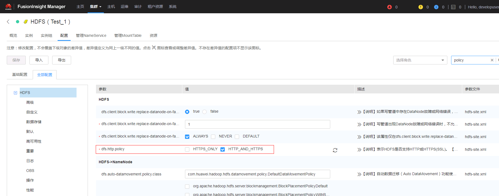

- 需要在logstash上安装gssapi插件做kerberos认证，此过程需要logstash部署主机能连外网，具体步骤为：

  - 使用命令`cd /opt/logstash/logstash-6.7.1`登陆logstash安装目录，然后使用命令`vendor/jruby/bin/jruby vendor/jruby/bin/gem install gssapi`在jruby下安装gssapi

    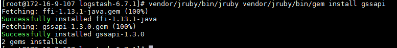

  - 使用命令`cd /opt/logstash/logstash-6.7.1`登陆logstash安装目录，然后使用命令`bin/logstash-plugin install --no-verify gssapi`安装gssapi plugin

    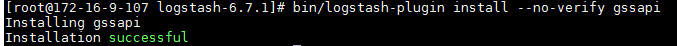

- 将认证所需要的的user.keytab文件放置在/opt路径下


### logstash webhdfs output用例

- 在logstash的config目录下创建配置文件`logstash-webhdfs.conf`,内容为：

  ```
  input { stdin{} }

  output {
    webhdfs {
      host => "172.16.4.123"
      port => 25002
      path => "/tmp/logstash/dt=%{+YYYY-MM-dd}/logstash-%{+HH}.log"
      user => "developuser"
      kerberos_keytab => "/opt/user.keytab"
      use_kerberos_auth => true
    }

  }
  ```
  其中172.16.4.123为对接集群HDFS的NameNode主节点

- 使用如下命令在logstash部署主机通过FusionInsight客户端做认证

  ```
  source /opt/125_hadoopclient/hadoopclient/bigdata_env
  kinit developuser
  ```

- 使用命令`bin/logstash -f config/logstash-webhdfs.conf` 启动logstash webhdfs output

  

  输入几条数据：

  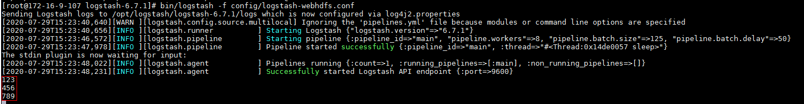  

- 登陆hdfs对应路径检查结果：

  


### HDFS对接 FAQ

问题1： 对接webhdfs

使用命令`bin/logstash -f config/logstash-webhdfs.conf`得到报错：

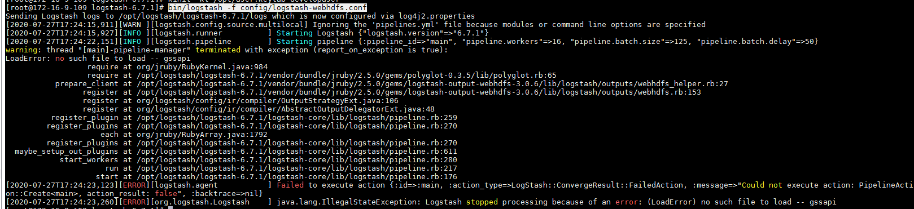
```
LoadError: no such file to load -- gssapi
```

没有装gssapi这个插件

解决办法：参考对接文档相关章节完成gssapi插件安装


问题2：对接webhdfs

使用命令`bin/logstash -f config/logstash-webhdfs.conf`得到报错：


`<title>Error 401 Authentication required</title></head><body><h2>HTTP ERROR 401</h2><p>Problem accessing /webhdfs/v1/. Reason:<pre>`

问题原因：`use_kerberos_auth => true`这个配置项没有加入到`logstash-webhdfs.conf`配置文件中

解决办法：增加上述配置项重启问题解决


问题3：对接webhdfs

使用命令`bin/logstash -f config/logstash-webhdfs.conf`得到报错：


```
[ERROR][logstash.outputs.webhdfs ] Webhdfs check request failed. (namenode: 172.16.4.123:25002, Exception: undefined method `read_uint32' for #<FFI::MemoryPointer address=0x7f8eb0059fa0 size=4>)
```

问题原因：启动时未使用`kinit developuser`获得缓存的认证票据

解决办法：参考对接文档相关章节加载对接环境变量以及kinit做认证获得缓存的票据在启动logstash


## kafka安全模式对接

kafka安全模式对接环境说明：

logstash主机：172.16.2.124

FI HD集群：172.16.10.131-133

### kafka安全模式对接认证相关配置

- 登陆集群manager下载认证用户的配置文件，user.keytab和krb5.conf并将这两个文件放到logstash安装主机的`/opt`路径下

- 准备认证的jaas.conf文件，放置在logstash安装主机的`/opt`路径下，内容为：
  ```
  KafkaClient {
  com.sun.security.auth.module.Krb5LoginModule required
  useKeyTab=true
  principal="developuser@HADOOP.COM"
  keyTab="/opt/user.keytab"
  useTicketCache=false
  serviceName="kafka"
  storeKey=true
  debug=true;
  };
  Client {
  com.sun.security.auth.module.Krb5LoginModule required
  useKeyTab=true
  principal="developuser@HADOOP.COM"
  keyTab="/opt/user.keytab"
  useTicketCache=false
  storeKey=true
  debug=true;
  };
  ```

- 登陆logstash安装主机`/opt/logstash/logstash-6.7.1/config`路径，编辑配置文件`jvm.options`

  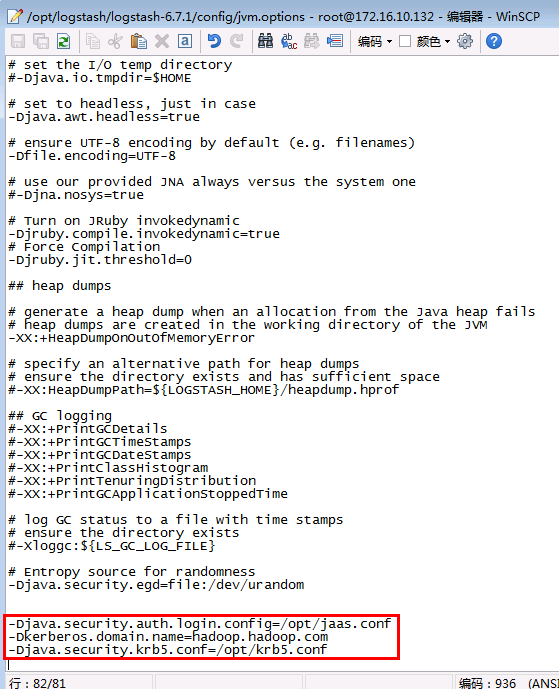

  如图增加配置项：
  ```
  -Djava.security.auth.login.config=/opt/jaas.conf
  -Dkerberos.domain.name=hadoop.hadoop.com
  -Djava.security.krb5.conf=/opt/krb5.conf
  ```

- 找到logstash安装路径下kafka相关jar包路径

  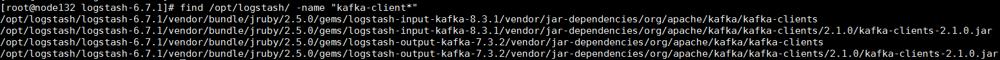

  按照上图：

  1. kafka input的jar包路径:`/opt/logstash/logstash-6.7.1/vendor/bundle/jruby/2.5.0/gems/logstash-input-kafka-8.3.1/vendor/jar-dependencies/org/apache/kafka/kafka-clients/2.1.0/`

  2. kafka output的jar包路径：`/opt/logstash/logstash-6.7.1/vendor/bundle/jruby/2.5.0/gems/logstash-output-kafka-7.3.2/vendor/jar-dependencies/org/apache/kafka/kafka-clients/2.1.0/`

  分别登陆到这两个路径下，将对应FI HD kafa客户端的 kafka-client jar包 `kafka-clients-1.1.0.jar`拷贝到input , output的路径下

  ```
  cp /opt/hadoopclient/Kafka/kafka/libs/kafka-clients-1.1.0.jar /opt/logstash/logstash-6.7.1/vendor/bundle/jruby/2.5.0/gems/logstash-input-kafka-8.3.1/vendor/jar-dependencies/org/apache/kafka/kafka-clients/2.1.0/

  cp /opt/hadoopclient/Kafka/kafka/libs/kafka-clients-1.1.0.jar /opt/logstash/logstash-6.7.1/vendor/bundle/jruby/2.5.0/gems/logstash-output-kafka-7.3.2/vendor/jar-dependencies/org/apache/kafka/kafka-clients/2.1.0/
  ```

  参考下图命令，将input,output路径下原来的jar包注释掉，并将拷贝过来的`kafka-clients-1.1.0.jar`名字修改为`kafka-clients-2.1.0.jar`,否则在启动logstash的时候会报错

  

  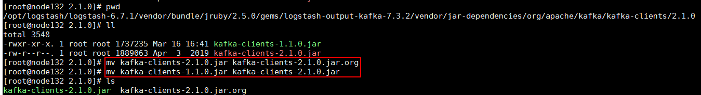


### logstash kafka input用例

- 在logsatash安装路径config下新建配置文件`logstash-21007input.conf`内容为：

```
  # Sample Logstash configuration for creating a simple
  # Beats -> Logstash -> Elasticsearch pipeline.


  input {
          kafka {
  	bootstrap_servers => "172.16.10.131:21007"
          codec => plain
          topics => "logstashtest21007input"
  	security_protocol => "SASL_PLAINTEXT"
  	sasl_mechanism => "GSSAPI"
  	sasl_kerberos_service_name => "kafka"
  	jaas_path  => "/opt/jaas.conf"
        }

  }


  output {

  stdout{ codec => plain }

  }
```

- 登陆集群kafka客户端，创建topic，名字为：`logstashtest21007input`

- 使用命令`bin/logstash -f config/logstash-21007input.conf`启动logstash kafka input任务

- 登陆kafka客户端，使用命令`./bin/kafka-console-producer.sh --broker-list 172.16.10.131:21007,172.16.10.132:21007,172.16.10.133:21007 --topic logstashtest21007input --producer.config config/producer.properties`起一个kafka生产者，并输入一些数据：

  

- 在logstash端检查结果：

  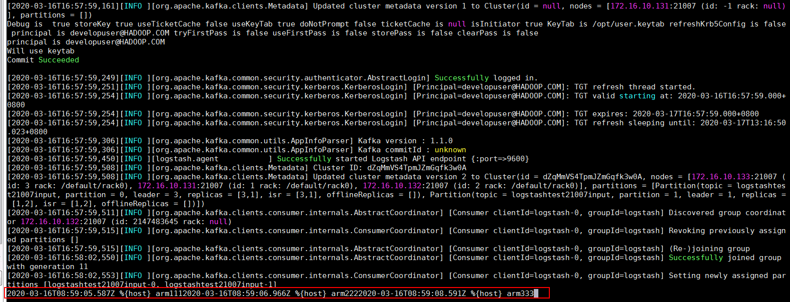


### logstash kafka output用例

- 在logsatash安装路径config下新建配置文件`logstash-21007output.conf`内容为：

```
# Sample Logstash configuration for creating a simple
# Beats -> Logstash -> Elasticsearch pipeline.

input { stdin{} }

output {
        kafka {
	bootstrap_servers => "172.16.10.131:21007"
        codec => json
        topic_id => "logstashtest21007"
	security_protocol => "SASL_PLAINTEXT"
	sasl_mechanism => "GSSAPI"
	sasl_kerberos_service_name => "kafka"
	jaas_path  => "/opt/jaas.conf"
      }

}

```

- 登陆集群kafka客户端，创建topic，名字为：`logstashtest21007`

- 使用命令`bin/logstash -f config/logstash-21007output.conf`启动logstash kafka output任务

- 登陆kafka客户端，使用如下命令起一个消费者：`bin/kafka-console-consumer.sh --topic logstashtest21007 --bootstrap-server 172.16.10.131:21007,172.16.10.132:21007,172.16.10.133:21007 --consumer.config config/consumer.properties`

- 在logstash端手动输入数据：

  

- 去kafka客户端检查结果：

  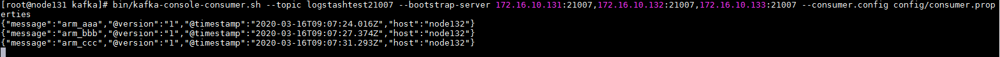


## 关于使用ARM服务器使用logstash遇到的问题

在使用arm服务器使用logstash的时候，使用命令`bin/logstash -f config/logstash-sample.conf`
尝试启动logstash的时候遇到问题：

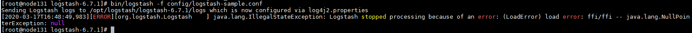


```
[ERROR][org.logstash.Logstash    ] java.lang.IllegalStateException: Logstash stopped processing because of an error: (LoadError) load error: ffi/ffi -- java.lang.NullPointerException: null
```

参考社区：
1. https://github.com/elastic/logstash/issues/10888
2. https://github.com/elastic/logstash/issues/10755
3. https://gist.github.com/alexalouit/a857a6de10dfdaf7485f7c0cccadb98c
4. https://github.com/mew2057/CAST/blob/6c7f7d514b7af3c512635ec145aa829c535467dc/csm_big_data/config-scripts/logstashFixupScript.sh

可以得知问题原因为：logstash启动的时候读取的相关jar包jruby-complete-9.2.6.0.jar（以logstash 6.7.1为例）有配置问题。具体为jar包编译的时候对应aarch64-linux路径下缺少配置文件platform.conf


解决办法：

说明：解决办法参考社区，将logstash安装路径里的jar包jruby-complete-9.2.6.0.jar里面的路径`META-INF/jruby.home/lib/ruby/stdlib/ffi/platform/aarch64-linux`下的配置文件`types.conf`内容复制并保存为新的文件名`platform.conf`。 具体操作步骤如下：

1. 首先先在logstash安装路径中找到相关jar包的位置，比如：`/opt/logstash/logstash-6.7.1/logstash-core/lib/jars/jruby-complete-9.2.6.0.jar`

2. 使用winSCP工具将该jar包导出到windows本地

3. 右键点击该jar包，选择使用winRAR工具打开

  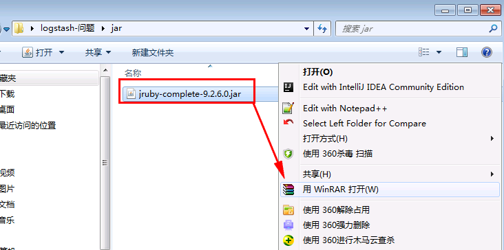

4. 首先登陆到路径`jruby-complete-9.2.6.0.jar\META-INF\jruby.home\lib\ruby\stdlib\ffi\platform`下

  

  登陆路径`x86-linux`,选中platform.conf文件使用`Ctrl + C`复制该配置文件

  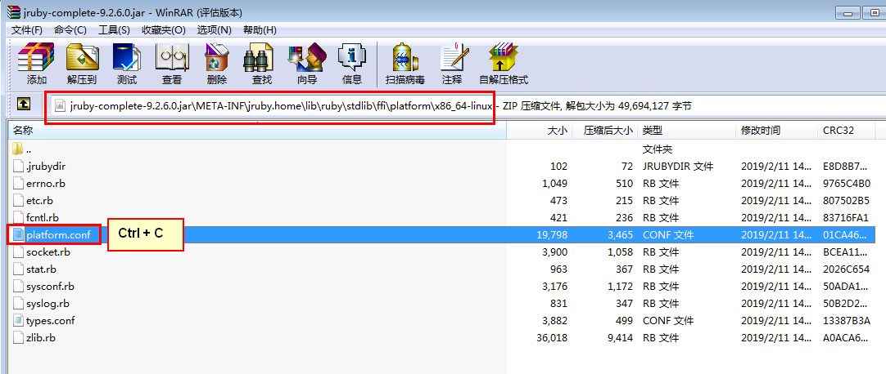

  登陆到路径`aarch64-linux`使用`Ctrl + V`将上一步复制的配置文件粘贴到该路径下

  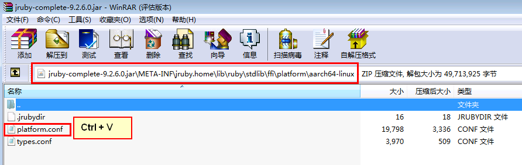

  双击`type.conf`文件，将该配置文件的内容复制，并替换到`platform.conf`文件中并保存，使得两个文件的内容一致

  

5. 将修改好的jar包使用winSCP工具重新导入到logstash的`/opt/logstash/logstash-6.7.1/logstash-core/lib/jars/`中，并替换之前的jar包

  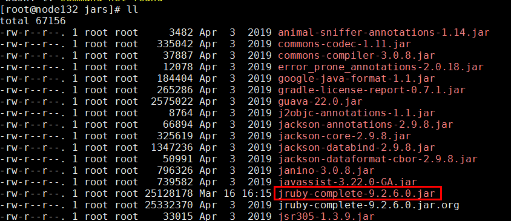

6. 重新使用命令`bin/logstash -f config/logstash-sample.conf`启动成功

  

  注意：可忽略该报错，因为没有填入有效es信息
