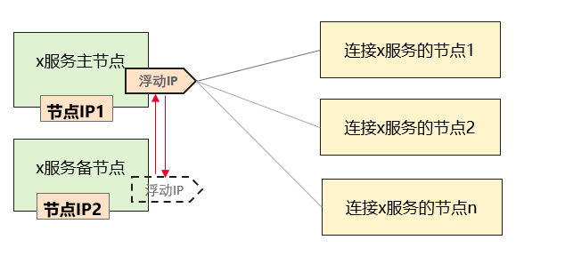
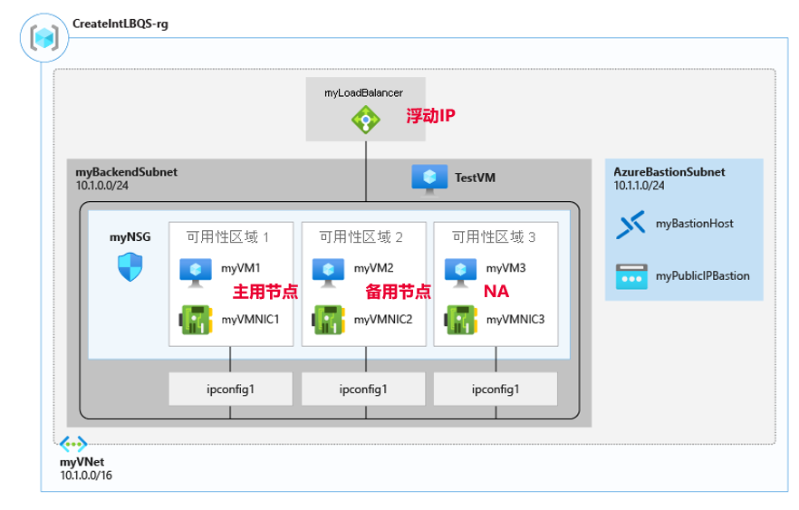
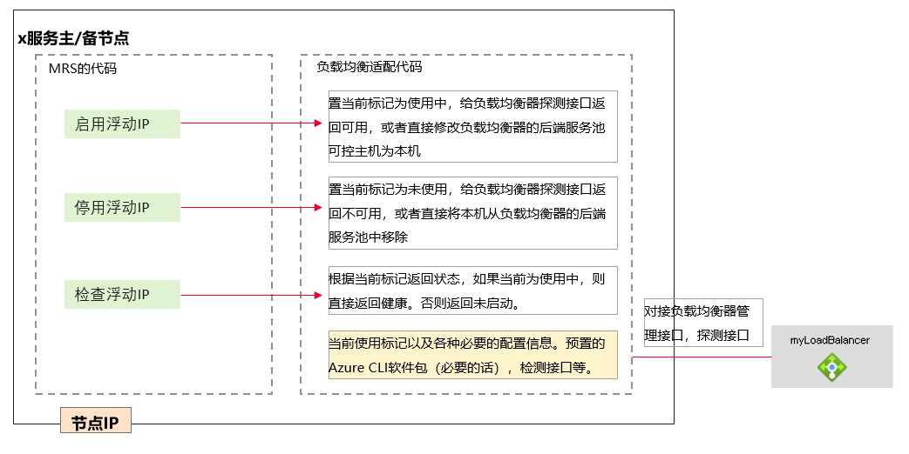
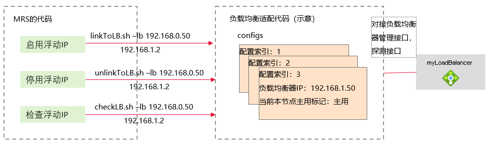

# 1 介绍

MRS部分服务需要使用浮动IP实现高可用，但对于某些场景，例如微软云场景，不支持浮动IP机制。此时部署MRS，需要使用负载均衡器来替代浮动IP。

本文档介绍使用负载均衡器替代浮动IP的原理，以及适配层的开发指导。

# 2 浮动IP原理

浮动IP是一种实现服务主备双机（热备、单活）的方法，访问服务时，无需关注当前服务是哪个节点主用，访问一个特定的IP地址即可。

原理示意如下：

在主备两个节点的HA逻辑中，与浮动IP相关的操作有：

-   启用：当节点作为主节点工作（升主）时，启动浮动IP，即将浮动IP地址配置到该节点。
-   停用：当节点作为备节点工作（降备）时，停用浮动IP，即将浮动IP地址取消配置。
-   检查：定期检查该IP地址是否符合绑定或非绑定的状态。

MRS当前需要使用到的浮动IP的组件有：OMS Server、OMS WebServer、DBService、Hue、Loader、Solr、Mapreduce、GraphBase。

# 3 使用负载均衡实现HA的基本原理

使用负载均衡器替代浮动IP，要点如下：

1.  负载均衡器上的公共IP作为浮动IP。
2.  使用该浮动IP的主备节点作为后端服务池。
3.  负载均衡器的可用性探测跟后端节点的主备关系建立关联，如果是备用状态，则判定为不可用（或者备用的节点暂时不加入可用资源池）。
4.  每个浮动IP，都要对应一个负载均衡器。
5.  负载均衡器不限制协议（TCP、http、RPC等）。
6.  MRS原监听浮动IP的进程，会改为监听本机固定IP，负载均衡器实现流量转发。

上述功能需要额外开发一个适配层来实现。

# 4 适配层总体结构

适配层同MRS以及负载均衡器的关系如下：

适配层功能要点：

1.  提前按需创建好均衡器，并将适配代码安装在“/opt/loadBalanceAdapt“目录（每个需要使用浮动IP的主机上）。
2.  在适配代码中提供三个脚本，实现三种操作。MRS在安装、启动和运行期，会调用这三个脚本。
3.  负载均衡器自身保证可靠性。

# 5 适配层接口说明

与MRS的接口列表:

1.  linkToLB.sh -lb \[_负载均衡器IP_\] \[_负载均衡器转发目标IP_（即本机IP）\]

    功能：将本节点设为主节点，或将本节点设为负载均衡器服务池的可控主机。

    调用：**linkToLB.sh -lb **\[_负载均衡器IP_\] \[_负载均衡器转发目标IP_（即本机IP）\]

    返回：0 启动成功、1 启动失败

    例如：

    **linkToLB.sh -lb 192.168.0.50 192.168.1.2**

2.  unLinkToLB.sh -lb \[_负载均衡器IP_\] \[_负载均衡器转发目标IP_（即本机IP）\]

    功能：将本节点设为备节点，或将本节点从负载均衡器服务池的可控主机中移除。

    调用：**unLinkToLB.sh -lb**  \[_负载均衡器IP_\] \[_负载均衡器转发目标IP_（即本机IP）\]

    返回：0 停止成功、1 停止失败

    例如：

    **unLinkToLB.sh -lb 192.168.0.50 192.168.1.2**

3.  checkLB.sh -lb \[_负载均衡器IP_\] \[_负载均衡器转发目标IP_（即本机IP）\]

    功能：查询本节点在负载均衡器中的当前状态

    调用：**checkLB.sh -lb **\[_负载均衡器IP_\] \[_负载均衡器转发目标IP_（即本机IP）\]

    返回：0 运行正常、1 运行异常、2 停止、3 状态未知

    例如：

    **checkLB.sh -lb 192.168.0.50 192.168.1.2**

> **说明：**
>1.  一个主机上可能出现多个浮动IP，所以负载均衡适配代码，需要按照浮动IP地址进行管理具有多资源管理能力。
>2.  其它用户（**omm**用户）需要有权限操作。
>3.  均衡器提前创建并配置好（在有需要的主机上），配置好初始状态（谁都不连）。
>4.  如果发生主备倒换或系统启动，主备节点上都会调用相应接口。如果绑定失败，后续通过状态检查发现异常并会主动修复，适配层只需实现功能接口即可。
>5.  记录详细日志方便问题定位定界。

# 6 MRS安装时要求

1.  安装MRS前，需提前按需创建并配置好负载均衡器。负载均衡器适配程序并安装在所有需要使用浮动IP的节点上。
2.  安装MRS时，需要在安装配置文件中，手工添加启用负载均衡方式的控制项。
3.  使用RTD产品，安装RTDDB服务时需同时安装python2和python3。
