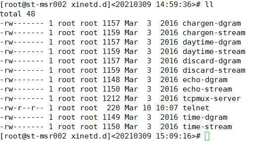
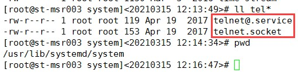
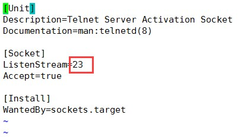
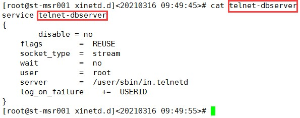
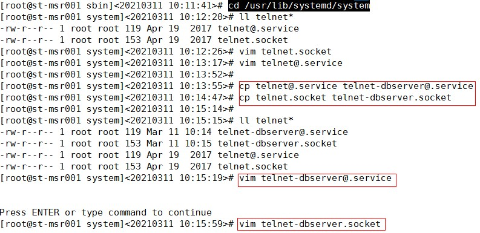
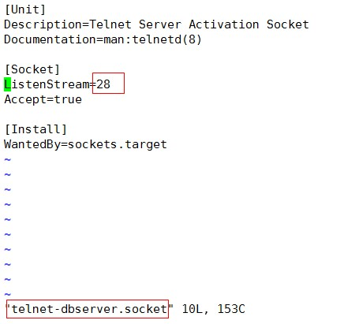
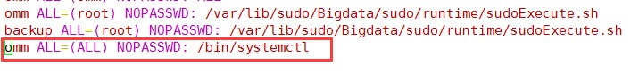
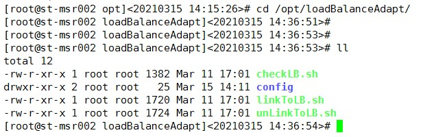
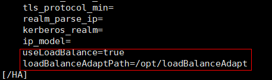
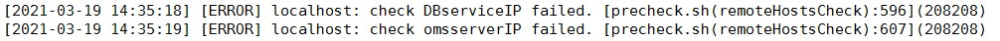

# 1 简介

本文档提供了基于微软云的负载均衡器替代浮动IP适配代码和安装指导，相关原理介绍参考文档《MRS使用负载均衡实现HA适配说明书》。

负载均衡器客户端适配代码参考附件“loadBalanceAdapt.rarM“。

本文档中出现的IP地址和端口号仅为举例，使用时请以现场实际情况为准。

以下步骤均在为MRS发放完虚拟机后进行操作。

# 2 负载均衡器创建

-   在安装MRS之前必须先创建负载均衡器，以下7种组件涉及浮动IP：OMS、DBService、Hue、Loader、Solr、Mapreduce、GraphBase。其中OMS均衡器、DBServer均衡器属于基础组件，安装时必选，其它5个组件的均衡器如果需要安装或对其有依赖，则也需要创建均衡器，否则不需要创建。
-   可能存在某个节点上需要创建多个负载均衡器，此时，同一节点上不同的负载均衡器之间的运行状况探测端口不能重复。
-   申请创建负载均衡器时需要规划好该组件实例部署的节点，以此作为均衡器的后端池主机，一般选择两个节点，分别用作主备节点。
-   telnet服务的默认端口号为23，为避免端口冲突优先使用默认的端口号，选择其他端口时需确保端口没有被其他服务使用。

    创建负载均衡器方法如下，创建后为每个均衡器绑定公共IP，并记录IP地址。

## 2.1 OMS均衡器（必选）MMM

### 2.1.1 添加运行状况探测

-   名称：probe-oms

- 协议：TCP

- 探测端口：23


### 2.1.2 添加后端池主机

-   名称：backendpool-oms
-   192.168.2.183（安装OMS的虚拟机）
-   192.168.2.184（安装OMS的虚拟机）

### 2.1.3 添加均衡器规则

-   后端池：选择[添加后端池主机](添加后端池主机.md)所配后端池\(backendpool-oms\)。
-   运行状况监测：选择[添加运行状况探测](添加运行状况探测.md)所配的探测\(probe-oms\)。
-   负载均衡器协议：UDP
-   前端端口与后端端口一一对应，分别如下：
    -   22
    -   123
    -   20000
    -   20008
    -   20009
    -   20010
    -   20011
    -   20012
    -   20014
    -   20018
    -   20025
    -   20026
    -   20027
    -   21201\~21232（范围之间所有端口）
    -   21405
    -   21750
    -   21820
    -   28443

## 2.2 DBService均衡器（必选）

### 2.2.1 添加运行状况探测

-   名称：probe-dbservice
-   协议：TCP
-   探测端口：28

### 2.2.2 添加后端池主机

-   名称：backendpool-dbservice
-   192.168.2.183（安装DBService的虚拟机）
-   192.168.2.184（安装DBService的虚拟机）

### 2.2.3 添加均衡器规则

-   后端池：选择[添加后端池主机](添加后端池主机-1.md)所配后端池\(backendpool-dbservice\)。
-   运行状况监测：选择[添加运行状况探测](添加运行状况探测-0.md)所配的探测\(probe-dbservice\)。
-   负载均衡器协议：UDP
-   前端端口与后端端口一一对应，分别如下：
    -   22
    -   20051

## 2.3 Mapreduce均衡器（使用或依赖此组件时必选）

### 2.3.1 添加运行状况探测

-   名称：probe-mapreduce
-   协议：TCP
-   探测端口：23

### 2.3.2 添加后端池主机

-   名称：backendpool-mapreduce
-   192.168.2.185（安装Mapreduce的虚拟机）
-   192.168.2.186（安装Mapreduce的虚拟机）

### 2.3.3 添加均衡器规则

-   后端池：选择[添加后端池主机](添加后端池主机-4.md)所配后端池\(backendpool-mapreduce\)。
-   运行状况监测：选择[添加运行状况探测](添加运行状况探测-3.md)所配的探测\(probe-mapreduce\)。
-   负载均衡器协议：UDP
-   前端端口与后端端口一一对应，分别如下：
    -   22
    -   26009
    -   26012
    -   26013
    -   26014
    -   26015

## 2.4 Solr均衡器（使用或依赖此组件时必选）

### 2.4.1 添加运行状况探测

-   名称：probe-solr
-   协议：TCP
-   探测端口：28

### 2.4.2 添加后端池主机

-   名称：backendpool-solr
-   192.168.2.185（安装SolrServerAdmin的虚拟机）
-   192.168.2.186（安装SolrServerAdmin的虚拟机）

### 2.4.3 添加均衡器规则

-   后端池：选择[添加后端池主机](添加后端池主机-7.md)所配后端池\(backendpool-solr\)。
-   运行状况监测：选择[添加运行状况探测](添加运行状况探测-6.md)所配的探测\(probe-solr\)。
-   负载均衡器协议：UDP
-   前端端口与后端端口一一对应，分别如下：
    -   22
    -   21100
    -   21101

## 2.5 GraphBase均衡器（使用或依赖此组件时必选）

### 2.5.1 添加运行状况探测

-   名称：probe-graphbase
-   协议：TCP
-   探测端口：23

## 2.5.2 添加后端池主机

-   名称：backendpool-graphbase
-   192.168.2.187（安装LoadBalancer的虚拟机）
-   192.168.2.188（安装LoadBalancer的虚拟机）

### 2.5.3 添加均衡器规则

-   后端池：选择[添加后端池主机](添加后端池主机-10.md)所配后端池\(backendpool-graphbase\)。
-   运行状况监测：选择[添加运行状况探测](添加运行状况探测-9.md)所配的探测\(probe-graphbase\)。
-   负载均衡器协议：UDP
-   前端端口与后端端口一一对应，分别如下：
    -   22
    -   22380
    -   22390
    -   22391

## 2.6 Loader均衡器（使用或依赖此组件时必选）

### 2.6.1 添加运行状况探测

-   名称：probe-loader
-   协议：TCP
-   探测端口：28

### 2.6.2 添加后端池主机

-   名称：backendpool-loader
-   192.168.2.187（安装Loader的虚拟机）
-   192.168.2.188（安装Loader的虚拟机）

### 2.6.3 添加均衡器规则

-   后端池：选择[添加后端池主机](添加后端池主机-13.md)所配后端池\(backendpool-loader\)。
-   运行状况监测：选择[添加运行状况探测](添加运行状况探测-12.md)所配的探测\(probe-loader\)。
-   负载均衡器协议：UDP
-   前端端口与后端端口一一对应，分别如下：
    -   22
    -   21351

## 2.7 Hue均衡器（使用或依赖此组件时必选）

### 2.7.1 添加运行状况探测

-   名称：probe-hue
-   协议：TCP
-   探测端口：29

### 2.7.2 添加后端池主机

-   名称：backendpool-hue
-   192.168.2.187（安装Hue的虚拟机）
-   192.168.2.188（安装Hue的虚拟机）

### 2.7.3 添加均衡器规则

-   后端池：选择[添加后端池主机](添加后端池主机-16.md)所配后端池\(backendpool-hue\)。
-   运行状况监测：选择[添加运行状况探测](添加运行状况探测-15.md)所配的探测\(probe-hue\)。
-   负载均衡器协议：UDP
-   前端端口与后端端口一一对应，分别如下：
    -   22
    -   21200

# 3 适配层部署

## 3.1 安装telnet服务

在每个负载均衡器的后端池所有节点都需要安装telnet服务，用于实现运行状况探测。通过客户端控制在节点上启动、停止端口，使得负载均衡器探测后端池主机时，只会有一个主机端口是启动的，其他主机端口都是不通的，因此负载均衡器将流量只会引流到一台主机上，从而实现主备的方式。在主备倒换时，MRS会在备节点启动端口，同时在主节点上停止端口。

以下指导以部署OMS均衡器、DBService均衡器为例，主备IP地址均为192.168.2.183、192.168.2.184。其他组件方法类似，请自行完成。

### 3.1.1 安装xinetd守护进程

安装：**yum -y install xinetd**

查看是否已经安装：**rpm -qa|grep xinetd**

每个负载均衡器的后端池所有节点都需要安装xinetd服务，如果同一节点上安装多个负载均衡器时，xinetd守护进程只需要安装一次。

### 3.1.2 安装telnet-server

查看是否已经安装：**rpm -qa|grep telnet**

telnet服务：**telnet-server-0.17-64.el7.x86\_64**（一般系统默认不会安装）

telnet客户端：**telnet-0.17-64.el7.x86\_64**（一般系统默认已经安装）

如果没有安装需要安装telnet-server：

**yum -y install telnet-server**

每个负载均衡器的后端池所有节点都需要安装telnet-server服务，如果同一节点上安装多个负载均衡器时，telnet-server只需要安装一次。

### 3.1.3 配置OMS的telnet服务

在OMS均衡器后端池的主备节点上

-   新建telnet文件并加入以下内容：

    **cd /etc/xinetd.d**

    **vim telnet**

    ```
    service telnet
    {
        flags        =  REUSE
        socket_type  =  stream
        wait         =  no
        user         =  root
        server       =  /user/sbin/in.telnetd
        log_on_failure    +=  USERID
        disable      =  no
    }
    ```

    

-   修改OMS的telnet服务监听端口号，必须与OMS均衡器中健康探测的端口号一致：

    **vim /etc/services**

    ```
    …
    telnet 23/tcp
    telnet 23/udp
    …
    ```

-   修改OMS的telnet启动配置,只需要修改端口号与上面保持一致：

    **cd /usr/lib/systemd/system**

    

    **vim telnet.socket**

    

-   重启守护进程：

    重启xinetd服务：**service xinetd restart**

    启动OMS的telnet服务命令：

    -   启动：**systemctl start telnet.socket**
    -   停止：**systemctl stop telnet.socket**


**验证测试**：

-   启动OMS telnet服务查看端口是否开启。

    **netstat -anp |grep :23**

    查看23端口是否已经开启，如果可以查到表示端口已经开启。


-   使用命令  **ssh 55.55.55.55**  查看是否连接到OMS的主节点，当主备倒换时，是否依然正确。

-   主备都按以上步骤验证完成后，先停掉telnet服务。

    **systemctl stop telnet.socket**（主节点）

    **systemctl stop telnet.socket**（备节点）

### 3.1.4 安装DBService的telnet服务

在DBService均衡器后端池的主备节点上配置，与[配置OMS的telnet服务](配置OMS的telnet服务.md)一样，只是服务名和端口号不一样。如果DBService的后端池节点与OMS的后端池节点相同，即同一个节点部署多个负载均衡器时，以此为例。

-   **cd /etc/xinetd.d**

    **vim telnet-dbserver**

    新建telnet-dbserver（名字自己起能区分开就可以）文件并加入以下内容：

    ```
    service telnet-dbserver
    {
    flags        =  REUSE
    socket_type  =  stream
    wait         =  no
    user         =  root
    server       =  /user/sbin/in.telnetd
    log_on_failure    +=  USERID
    disable      =  no
    }
    ```

    

-   修改DBServer的telnet服务监听端口号，必须与DBServer均衡器中健康探测的端口号一致：

    **vim /etc/services**

    ```
    …
    telnet-dbserver 28/tcp
    telnet-dbserver 28/udp
    …
    ```

-   修改DBServer的telnet启动配置,只需要修改端口号与上面保持一致：

    **cd /usr/lib/systemd/system**

    拷贝一份OMS的telnet启动配置,并重命名为telnet-dbserver，与xinet中定义的名字保持一致。

    **cp telnet@.service telnet-dbserver@.service**

    **cp telnet.socket telnet-dbserver.socket**

    

-   修改端口号：

    **vim telnet-dbserver.socket**

    

-   重启守护进程：

    重启xinetd服务：**service xinetd restart**

    启动DBServer的telnet服务命令：

    -   启动：**systemctl start telnet-dbserver.socket**
    -   停止：**systemctl stop telnet-dbserver.socket**


**验证测试**：

查看28端口是否已经开启，如果可以查到表示端口已经开启：

**netstat -anp |grep :28**

-   使用命令  **ssh 55.55.55.55（DBService均衡器IP）**  查看是否连接到DBService的主节点，当主备倒换时，是否依然正确

主备都按以上步骤验证完成后，先停掉telnet服务：

**systemctl stop telnet-dbserver.socket**（主节点）

**systemctl stop telnet-dbserver.socket**（备节点）

## 3.2 安装适配客户端

-   将适配程序loadBalanceAdapt（以实际发布包为准） 上传至所有安装有均衡器节点的“/opt”目录：

    修改权限：**chmod 655 -R /opt/loadBalanceAdapt/**    \(**loadBalanceAdapt**目录可配置，所有节点需一致\)

    dos2unix转换：**dos2unix /opt/loadBalanceAdapt/\***

    **vim /etc/sudoers**

    增加“omm ALL=\(ALL\) NOPASSWD: /bin/systemctl”

    

    


-   所有节点修改适配客户端配置

    **cd /opt/loadBalanceAdapt/config/**

    **vim balance.ini**

    ```
    balance1=oms,55.55.55.55,23,telnet.socket
    balance2=dbserver,55.55.55.56,28,telnet-dbserver.socket
    ```

    此节点部署了几个组件的均衡器就配置几行，balance1、balance2、…递增。

    每行的值包括4部分，以英文逗号分隔。

    -   oms：组件名（打印日志区分组件时用）
    -   55.55.55.55：对应均衡器的IP
    -   23：对应均衡器健康探测的端口号
    -   telnet.socket：telnet服务启动名

    日志文件：/var/log/Bigdata/loadBalanceAdapt/run.log

# 4 MRS部署

## 4.1 部署OMS

在使用LLD生成MRS安装配置文件时，在浮动IP页签OMSServer、OMWebService的浮动IP都需要填写负载均衡器的IP（申请创建后会分配一个IP）。

LLD完成规划后，在LLD生成的OMS安装配置文件\*.ini中（主备两个文件），添加启用负载均衡器的开关：

**vim 192.168.2.183.ini**

添加下面的两个配置项：

-   useLoadBalance：开关设置成true，表示使用负载均衡器模式。
-   loadBalanceAdaptPath：适配程序安装的目录，与[3.2安装适配客户端](安装适配客户端.md)中设置的目录一致。



1.  preinstall时在precheck过程中检查浮动IP由于ping不同导致会报错，不影响后续安装。

    

2.  检查所有节点下列目录的权限，如果后面带+号，则root用户执行

    ```
    chacl -B /var/log/
    chacl -B /var/log/*
    chacl -B /var/log/Bigdata/sudo/
    chacl -B /var/log/Bigdata/sudo/preset.log
    ```

    

3.  安装主节点OMS。

    与一般流程一样，参考产品文档。

4.  待主节点安装完成后再安装备节点OMS。

    与一般流程一样，参考产品文档。

## 4.2 部署组件

部署之前，需要装好组件依赖的负载均衡器和客户端适配程序，使用负载均衡器的实例只能安装在均衡器对应的后端池主机上，其他不变，参考产品文档。

[点击获取相关操作脚本](https://github.com/fusioninsight/ecosystem/tree/zh-hans/docs/Other/assets/figures1/loadBalanceAdapt)
