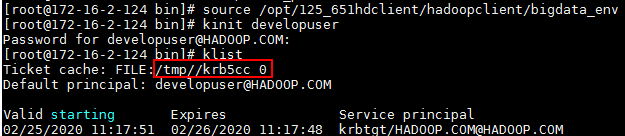
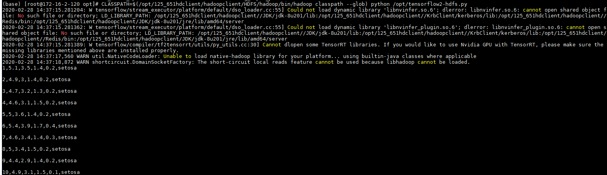

# Tensorflow对接FusionInsight

## 适用场景
> Tensorflow 1.15.0 <--> FusionInsight HD 6.5 (HDFS)

> Tensorflow 2.1.0 <--> FusionInsight HD 6.5 (HDFS)


## 测试环境描述

Apache Airflow安装主机： 172.16.2.124
对接FI HD集群： 172.16.4.121-123

## 安装anaconda

- 参考jupyternotebook或者jupyterhub文档，完成anaconda环境的安装。这里选用的是Python3版本的安装。

## 安装Tensorflow

- 登陆anaconda3的安装目录下找到bin目录，使用如下命令安装tensorflow指定版本:

  `./pip install tensorflow`

- 如果需要安装Tensorflow 1.15.1版本，使用如下命令安装：

  `./pip install tensorflow==1.15.0 --force-reinstall`

  注意：在安装tensorflow 1.15.0 过程中如果报相关版本匹配的问题可以使用如下命令重新安装指定版本

  ```
  ./pip install typed-ast==1.3.0 --force-reinstall
  ./pip install markdown==2.6.8 --force-reinstall
  ```


## 配置环境信息

- 使用命令`vi ~/.bash_profile`配置环境变量

  

  ```
  export LD_LIBRARY_PATH=$LD_LIBRARY_PATH:/opt/125_651hdclient/hadoopclient/JDK/jdk-8u201/jre/lib/amd64/server
  export KRB5CCNAME=/tmp/krb5cc_0
  ```

  注意：配置LD_LIBRARY_PATH时需根据安装客户端具体jdk路径位置来配置，配置KRB5CCNAME缓存票据要根据kinit认证后具体票据名字配置。

  

- 将对接集群获取的认证文件krb5.conf文件放置/etc/路径下面，系统默认从该路径下获取配置文件


## 运行tensorflow 2.1.0样例代码

- 准备tensorflow2-hdfs.py放置在/opt路径下

  ```
  import tensorflow as tf
  out1 = tf.io.gfile.GFile("hdfs://172.16.4.123:25000/tmp/iris.csv")
  for a in out1.readlines():
      print(a)
  ```

- 使用命令`su - root`重新加载环境变量

- 使用如下命令加载环境变量并且完成认证

  ```
  source /opt/125_651hdclient/hadoopclient/bigdata_env
  kinit developuser
  ```

- 使用如下命令加载anaconda3环境变量

  `source ~/.bashrc.anaconda3`

- 使用如下命令运行样例代码：

  `CLASSPATH=$(/opt/125_651hdclient/hadoopclient/HDFS/hadoop/bin/hadoop classpath --glob) python /opt/tensorflow2-hdfs.py`

  

  注意：其中涉及的hadoop路径为安装的集群客户端HDFS路径


## FAQ

问题1：在配置好之后，执行`CLASSPATH=$(/opt/125_651hdclient/hadoopclient/HDFS/hadoop/bin/hadoop classpath --glob) python /opt/tensorflow-hdfs.py`的时候遇到连接报错

```
Caused by: java.io.IOException: Couldn't setup connection for developuser@HADOOP.COM to host-172-16-4-123/172.16.4.123:25000
        at org.apache.hadoop.ipc.Client$Connection$1.run(Client.java:782)
        at java.security.AccessController.doPrivileged(Native Method)
        at javax.security.auth.Subject.doAs(Subject.java:422)
        at org.apache.hadoop.security.UserGroupInformation.doAs(UserGroupInformation.java:1729)
        at org.apache.hadoop.ipc.Client$Connection.handleSaslConnectionFailure(Client.java:753)
        at org.apache.hadoop.ipc.Client$Connection.setupIOstreams(Client.java:846)
        at org.apache.hadoop.ipc.Client$Connection.access$3700(Client.java:436)
        at org.apache.hadoop.ipc.Client.getConnection(Client.java:1613)
        at org.apache.hadoop.ipc.Client.call(Client.java:1444)
        ... 24 more
Caused by: org.apache.hadoop.ipc.RemoteException(javax.security.sasl.SaslException): GSS initiate failed
        at org.apache.hadoop.security.SaslRpcClient.saslConnect(SaslRpcClient.java:374)
        at org.apache.hadoop.ipc.Client$Connection.setupSaslConnection(Client.java:640)
        at org.apache.hadoop.ipc.Client$Connection.access$2400(Client.java:436)
        at org.apache.hadoop.ipc.Client$Connection$2.run(Client.java:833)
        at org.apache.hadoop.ipc.Client$Connection$2.run(Client.java:829)
        at java.security.AccessController.doPrivileged(Native Method)
        at javax.security.auth.Subject.doAs(Subject.java:422)
        at org.apache.hadoop.security.UserGroupInformation.doAs(UserGroupInformation.java:1729)
        at org.apache.hadoop.ipc.Client$Connection.setupIOstreams(Client.java:829)
        ... 27 more

```

解决办法：可使用`export JAVA_TOOL_OPTIONS="-Dsun.security.krb5.debug=true"` 打开认证日志排查问题，检查 /etc/krb5.conf文件是否为对接集群匹配的认证文件。更换正确认证文件后问题解决。
