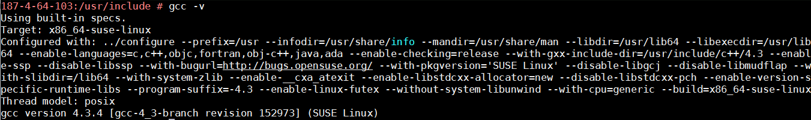
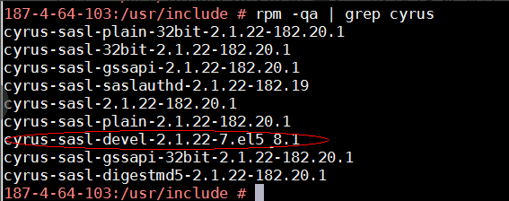
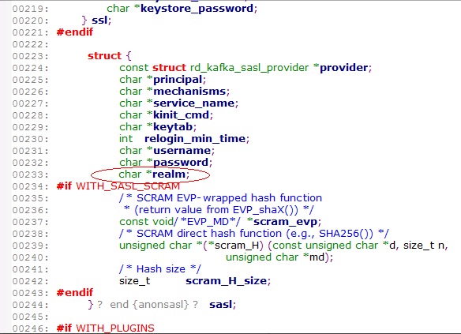
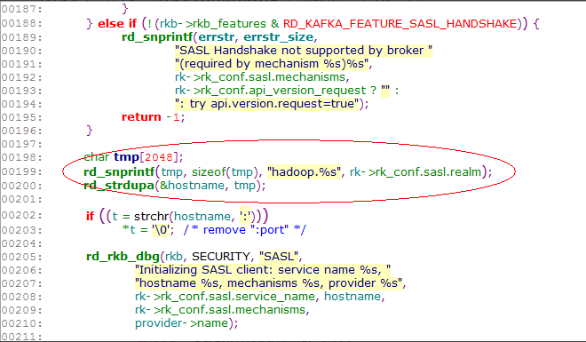

# 开源第三方librdkafka kerberos认证连接FI Kafka C及C++版指导书

## 适用场景

> librdkafka <--> FusionInsight HD 6.5 (Kafka)

## 1.1提前准备：

1. librdkafka开源代码： C/C++版开源网址：https://github.com/edenhill/librdkafka

2. 具有gcc编译环境的Linux操作系统，本文以Suse 11.3操作系统为例（下文中不做特殊说明均为Suse 11.3操作系统），一般情况下操作系统均会默认携带，可通过gcc -v命令进行验证。

  

3. 需要libsasl-dev依赖库，一般操作系统不会携带，需要从网上下载，可通过rpm -qa | grep cyrus进行查询。

  

  若不存在sasl-dev库，需要在网络上下载，Suse 11.3操作系统的次rpm包下载地址为
  http://ftp.riken.jp/Linux/cern/slc52/updates/x86_64/RPMS/cyrus-sasl-devel-2.1.22-7.el5_8.1.x86_64.rpm

  下载后，执行rpm -ihv cyrus-sasl-devel-2.1.22-7.el5_8.1.x86_64.rpm –nodep –force进行安装。
注意：若无sasl-plain、sasl-devel、sasl-gssapi包需要补齐。

4. 若需要SSL能力，需要下载libssl-dev依赖库，方法同上。


## 1.2修改源码部分：

说明：由于开源社区的域名不支持配置，因此需要对源码进行修改，此修改仅需修改一次，编译后服务端的域名变更，仅需要通过修改配置参数即可，无需再次编译。（一共需要修改三处，很简单）

- 第一处：

  修改文件：src/rdkafka_conf.h

  修改行号：223

  修改内容：在rd_kafka_conf_s的结构体内的sasl结构体中增加realm的字符串指针。
    `char *realm;`

  修改目的：增加realm的配置。

  修改示例：如图

  


- 第二处：

  修改文件：/src/rdkafka_conf.c

  修改行号：686-688（增加三行）

  修改内容：在结构体rd_kafka_properties中增加realm的定义、描述、默认值等。

  ```
  {_RK_GLOBAL, "sasl.kerberos.realm", _RK_C_STR,
  _RK(sasl.realm), "The realm of kafka cluster.",
  .sdef = "hadoop.com"},
  ```

  修改目的：增加realm的默认值。

  修改示例：如图

  

- 第三处：

  修改文件：/src/rdkafka_sasl.c

  修改行号：198-200（增加三行，删除一行）

  修改内容：在函数rd_kafka_sasl_client_new中变更hostname的赋值。

  ```
  char tmp[2048];
  rd_snprintf(tmp, sizeof(tmp), "hadoop.%s", rk->rk_conf.sasl.realm);
  rd_strdupa(&hostname, tmp);
  ```

  修改目的：修改hostname的赋值为域名。

  修改示例：如图

  


## 1.3编译：

1. 将修改后的代码打包成zip（例如librdkafka-master.zip）格式上传至编译机器目录，例如/opt/build

2. 使用unzip librdkafka-master.zip解压到/opt/build当前目录。

3. cd /opt/build/librdkafka-master

4. ./configure  

5. make  

6. make install  

编译完成后，examples文件夹内会生成很多可执行文件，其中rdkafka_example和rdkafka_example_cpp是我们所需要的，rdkafka_example对应的是C语言版本的例子，rdkafka_example_cpp对应的是C++版本的例子，二者使用时参数相同，调通C语言版本的，C++版本同样可以运行。

## 1.4使用：

1. 下载FusionInsight HD的客户端，并安装，假设安装路径为/opt/client目录

2. 下载具有Kafka权限的用户userA的keytab文件，并上传至环境，假设上传目录为/tmp/user.keytab

3. 先测试一下用户的keytab是否正确

    ```
    source /opt/client/bigdata_env
    kinit -k -t "/tmp/user.keytab" userA
    ```
4. 在刚才的编译环境上执行

  `./opt/build/librdkafka-master/examples/rdkafka_example -P -t zdtest -b 187.4.64.103:21007 -X sasl.kerberos.service.name=kafka -X sasl.kerberos.principal=userA -X sasl.kerberos.keytab=/tmp/user.keytab -X security.protocol=SASL_PLAINTEXT -X sasl.kerberos.kinit.cmd='/opt/client/KrbClient/kerberos/bin/kinit -k -t "/tmp/user.keytab" userA' –X sasl.kerberos.realm=hadoop.com`

  对应的参数讲解如下图所示：

  

  -P 对应的是Producer  -C对应的是Consumer

  187.4.64.103:21007为服务器的brokers地址

  -t zdtest为要写入的topic名称

  /tmp/user.keytab  为userA的keytab文件的路径

  sasl_plaintext 为安全认证的协议

  /opt/client/KrbClient/kerberos/bin/kinit -k -t "/tmp/user.keytab" userA为用户userA的登录命令

  sasl.kerberos.realm=hadoop.com为集群的域名，默认为hadoop.com可以不用指定，若Kafka集群域名发生变更，仅需变更次名称即可。

  以上运行的是producer ，如想运行customer，只需将-P修改为-C即可

## 1.5FAQ

遇到什么问题，可以在此补充完善。

## 1.6附录

### 1.6.1配置说明

C/P 含义：C = 生产者, P = 消费者, * = 二者都有

#### 全局配置属性

|    | 属性                                    | C/P   | 范围                                                                                        | 默认值                                                                                                             | 描述                                                                                                                                                                                                                                                                                                                                |
|---:|:----------------------------------------|:------|:--------------------------------------------------------------------------------------------|:-------------------------------------------------------------------------------------------------------------------|:------------------------------------------------------------------------------------------------------------------------------------------------------------------------------------------------------------------------------------------------------------------------------------------------------------------------------------|
|  1 | builtin.features                        | *     | nan                                                                                         | gzip, snappy, ssl, safsl, regex, lz4                                                                               | 标示该librdkafka的支持的内建特性。应用程序可以查看或设置这些值来检查是否支持这些特性。Type: CSV flags                                                                                                                                                                                                                               |
|  2 | client.id                               | *     | nan                                                                                         | rdkafka                                                                                                            | 客户端标示。Type: string                                                                                                                                                                                                                                                                                                            |
|  3 | metadata.broker.list                    | *     | nan                                                                                         | nan                                                                                                                | 初始化的broker列表。应用程序也可以使用 rd_kafka_brokers_add() 在运行时添加 broker。Type: string                                                                                                                                                                                                                                     |
|  4 | bootstrap.servers                       | *     | nan                                                                                         | nan                                                                                                                | 参考 metadata.broker.list                                                                                                                                                                                                                                                                                                           |
|  5 | message.max.bytes                       | *     | 1000 .. 1000000000                                                                          | 1000000                                                                                                            | 最大发送消息大小。Type: integer                                                                                                                                                                                                                                                                                                     |
|  6 | message.copy.max.bytes                  | *     | 0 .. 1000000000                                                                             | 65535                                                                                                              | 消息拷贝到缓存的最大大小。如果消息大于这个值，将会消耗更多的iovec而采用引用（零拷贝）方式。Type: integer                                                                                                                                                                                                                            |
|  7 | receive.message.max.bytes               | *     | 1000 .. 1000000000                                                                          | 100000000                                                                                                          | 最大接收消息大小。这是一个安全预防措施，防止协议饱和时内存耗尽。这个值至少为 fetch.message.max.bytes * 消费者分区数 + 消息头大小 (e.g. 200000 bytes). Type: integer                                                                                                                                                                 |
|  8 | max.in.flight.requests.per.connection   | *     | 1 .. 1000000                                                                                | 1000000                                                                                                            | 客户端保持的最大发送请求数。 该配置应用于每一个 broker 连接. Type: integer                                                                                                                                                                                                                                                          |
|  9 | metadata.request.timeout.ms             | *     | 10 .. 900000                                                                                | 60000                                                                                                              | 无数据请求超时时间，毫秒。 适用于 metadata 请求等。Type: integer                                                                                                                                                                                                                                                                    |
| 10 | topic.metadata.refresh.interval.ms      | *     | -1 .. 3600000                                                                               | 300000                                                                                                             | Topic metadata 刷新间隔，毫秒。metadata 自动刷新错误和连接。设置为 -1 关闭刷新间隔。 Type: integer                                                                                                                                                                                                                                  |
| 11 | metadata.max.age.ms                     | *     | nan                                                                                         | nan                                                                                                                | 参考 topic.metadata.refresh.interval.ms                                                                                                                                                                                                                                                                                             |
| 12 | topic.metadata.refresh.fast.cnt         | *     | 0 .. 1000                                                                                   | 10                                                                                                                 | 当 topic 丢失 leader， metadata 请求的发送次数，发送间隔是 topic.metadata.refresh.fast.interval.ms 而不是 topic.metadata.refresh.interval.ms。 该配置用于快速修复broker leader。Type: integer                                                                                                                                       |
| 13 | topic.metadata.refresh.fast.interval.ms | *     | 1 .. 60000                                                                                  | 250                                                                                                                | 参考 topic.metadata.refresh.fast.cnt。Type: integer                                                                                                                                                                                                                                                                                 |
| 14 | topic.metadata.refresh.sparse           | *     | true, false                                                                                 | TRUE                                                                                                               | 极少的 metadata 请求 (消费者的网络带宽很小) Type: boolean                                                                                                                                                                                                                                                                           |
| 15 | topic.blacklist                         | *     | nan                                                                                         | nan                                                                                                                | Topic 黑名单，逗号分隔的正则表达式列表，匹配topic名字，匹配到的 topic 如果不存在，就在 broker metadata 信息中忽略。Type: pattern list                                                                                                                                                                                               |
| 16 | debug                                   | *     | generic, broker, topic, metadata, queue, msg, protocol, cgrp, security, fetch, feature, all | nan                                                                                                                | 逗号分隔的列表，控制 debug 上下文。调试生产者：broker,topic,msg。调试消费者：cgrp,topic,fetch Type: CSV flags                                                                                                                                                                                                                       |
| 17 | socket.timeout.ms                       | *     | 10 .. 300000                                                                                | 60000                                                                                                              | 网络请求超时时间。Type: integer                                                                                                                                                                                                                                                                                                     |
| 18 | socket.blocking.max.ms                  | *     | 1 .. 60000                                                                                  | 100                                                                                                                | broker 在 socket 操作时最大阻塞时间。值越低，响应越快，但会略微提高CPU使用率。Type: integer                                                                                                                                                                                                                                         |
| 19 | socket.send.buffer.bytes                | *     | 0 .. 100000000                                                                              | 0                                                                                                                  | Broker socket 发送缓冲大小。系统默认为 0。Type: integer                                                                                                                                                                                                                                                                             |
| 20 | socket.receive.buffer.bytes             | *     | 0 .. 100000000                                                                              | 0                                                                                                                  | Broker socket 接收缓冲大小。系统默认为 0。Type: integer                                                                                                                                                                                                                                                                             |
| 21 | socket.keepalive.enable                 | *     | true, false                                                                                 | FALSE                                                                                                              | Broker sockets 允许 TCP 保持活力 (SO_KEEPALIVE)。Type: boolean                                                                                                                                                                                                                                                                      |
| 22 | socket.max.fails                        | *     | 0 .. 1000000                                                                                | 3                                                                                                                  | Broker 关闭连接的最大错误次数(e.g., timed out requests)。0不关闭。提示：连接自动重新建立。Type: integer                                                                                                                                                                                                                             |
| 23 | broker.address.ttl                      | *     | 0 .. 86400000                                                                               | 1000                                                                                                               | 保存 broker 地址响应结果的时间 (毫秒)。Type: integer                                                                                                                                                                                                                                                                                |
| 24 | broker.address.family                   | *     | any, v4, v6                                                                                 | any                                                                                                                | 允许的 broker IP 地址族：any, v4, v6。Type: enum value                                                                                                                                                                                                                                                                              |
| 25 | reconnect.backoff.jitter.ms             | *     | 0 .. 3600000                                                                                | 500                                                                                                                | 通过这个值调节 broker 重连尝试 +-50%。Type: integer                                                                                                                                                                                                                                                                                 |
| 26 | statistics.interval.ms                  | *     | 0 .. 86400000                                                                               | 0                                                                                                                  | librdkafka 统计间隔。应用程序需要通过 rd_kafka_conf_set_stats_cb()设置统计的回调函数。粒度是 1000ms. 0 关闭统计。Type: integer                                                                                                                                                                                                      |
| 27 | enabled_events                          | *     | 0 .. 2147483647                                                                             | 0                                                                                                                  | 参考 rd_kafka_conf_set_events()。Type: integer                                                                                                                                                                                                                                                                                      |
| 28 | error_cb                                | *     | nan                                                                                         | nan                                                                                                                | 错误回调函数 (参考 rd_kafka_conf_set_error_cb()) Type: pointer                                                                                                                                                                                                                                                                      |
| 29 | throttle_cb                             | *     | nan                                                                                         | nan                                                                                                                | 调节回调函数 (参考 rd_kafka_conf_set_throttle_cb()) Type: pointer                                                                                                                                                                                                                                                                   |
| 30 | stats_cb                                | *     | nan                                                                                         | nan                                                                                                                | 统计回调函数 (参考 rd_kafka_conf_set_stats_cb()) Type: pointer                                                                                                                                                                                                                                                                      |
| 31 | log_cb                                  | *     | nan                                                                                         | nan                                                                                                                | 日志回调函数 (参考 rd_kafka_conf_set_log_cb()) Type: pointer                                                                                                                                                                                                                                                                        |
| 32 | log_level                               | *     | 0 .. 7                                                                                      | 6                                                                                                                  | 日志界别 (syslog(3) levels) Type: integer                                                                                                                                                                                                                                                                                           |
| 33 | log.thread.name                         | *     | true, false                                                                                 | FALSE                                                                                                              | 在日志消息中打印内部线程名。(useful for debugging librdkafka internals) Type: boolean                                                                                                                                                                                                                                               |
| 34 | log.connection.close                    | *     | true, false                                                                                 | TRUE                                                                                                               | 记录 broker 断开连接。由于受 0.9 版本 broker 的 connection.max.idle.ms 的影响，最好关闭。Type: boolean                                                                                                                                                                                                                              |
| 35 | socket_cb                               | *     | nan                                                                                         | nan                                                                                                                | 为Socket创建回调函数提供无缝 CLOEXEC Type: pointer                                                                                                                                                                                                                                                                                  |
| 36 | open_cb                                 | *     | nan                                                                                         | nan                                                                                                                | 为文件打开回调函数提供无缝 CLOEXEC Type: pointer                                                                                                                                                                                                                                                                                    |
| 37 | opaque                                  | *     | nan                                                                                         | nan                                                                                                                | 对应用程序不开放 (set with rd_kafka_conf_set_opaque()) Type: pointer                                                                                                                                                                                                                                                                |
| 38 | default_topic_conf                      | *     | nan                                                                                         | nan                                                                                                                | 默认 topic 配置，用于自动订阅 topics Type: pointer                                                                                                                                                                                                                                                                                  |
| 39 | internal.termination.signal             | *     | 0 .. 128                                                                                    | 0                                                                                                                  | 用于 librdkafka 调用 rd_kafka_destroy() 快速终止的信号。如果没有设置信号， 终止过程会延迟直到所有内部线程的系统调用超时返回，且 rd_kafka_wait_destroyed() 返回 true。如果设置了信号，延迟会最小化。应用程序需要屏蔽该信号，而作为内部信号句柄。Type: integer                                                                        |
| 40 | api.version.request                     | *     | true, false                                                                                 | FALSE                                                                                                              | 请求 broker 支持的API版本，调整可用协议特性的功能。如果设置为false，将使用 broker.version.fallback设置的回退版本。 提示: 依赖的 broker 版本 >=0.10.0。如果 broker（老版本）不支持该请求，使用 broker.version.fallback设置的回退版本。Type: boolean                                                                                  |
| 41 | api.version.fallback.ms                 | *     | 0 .. 604800000                                                                              | 1200000                                                                                                            | 配置 ApiVersionRequest 失败多长时间后，使用 broker.version.fallback 回退版本。提示: ApiVersionRequest 只用新的 broker 能使用。Type: integer                                                                                                                                                                                         |
| 42 | broker.version.fallback                 | *     | nan                                                                                         | 0.9.0                                                                                                              | 老版本的 broker（<0.10.0）不支持客户端查询支持协议特性(ApiVersionRequest, see api.version.request)，所以要客户端不知道什么特性可以使用。 用户使用本属性指示 broker 版本，如果 ApiVersionRequest 失败（或不可用），客户端据此属性自动调整特性。与 api.version.fallback.ms 配合使用。有效值：0.9.0, 0.8.2, 0.8.1, 0.8.0. Type: string |
| 43 | security.protocol                       | *     | plaintext, ssl, sasl_plaintext, sasl_ssl                                                    | plaintext                                                                                                          | 与 broker 通讯的协议。Type: enum value                                                                                                                                                                                                                                                                                              |
| 44 | ssl.cipher.suites                       | *     | nan                                                                                         | nan                                                                                                                | 密码套件是个组合体，包括鉴权，加密，认证和秘钥交换程序，用于网络连接的安全设置交换，使用 TLS 或 SSL 网络协议。查看手册 ciphers(1) 和 `SSL_CTX_set_cipher_list(3)。 Type: string                                                                                                                                                     |
| 45 | ssl.key.location                        | *     | nan                                                                                         | nan                                                                                                                | 客户端的私钥(PEM)路径，用于鉴权。Type: string                                                                                                                                                                                                                                                                                       |
| 46 | ssl.key.password                        | *     | nan                                                                                         | nan                                                                                                                | 私钥密码。Type: string                                                                                                                                                                                                                                                                                                              |
| 47 | ssl.certificate.location                | *     | nan                                                                                         | nan                                                                                                                | 客户端的公钥(PEM)路径，用于鉴权。Type: string                                                                                                                                                                                                                                                                                       |
| 48 | ssl.ca.location                         | *     | nan                                                                                         | nan                                                                                                                | CA 证书文件或路径，用于校验 broker key。Type: string                                                                                                                                                                                                                                                                                |
| 49 | ssl.crl.location                        | *     | nan                                                                                         | nan                                                                                                                | CRL 路径，用于 broker 的证书校验。Type: string                                                                                                                                                                                                                                                                                      |
| 50 | sasl.mechanisms                         | *     | GSSAPI, PLAIN                                                                               | GSSAPI                                                                                                             | 使用 SASL 机制鉴权。 支持：GSSAPI, PLAIN. 提示: 只能配置一种机制名。Type: string                                                                                                                                                                                                                                                    |
| 51 | sasl.kerberos.service.name              | *     | nan                                                                                         | kafka                                                                                                              | Kafka 运行的 Kerberos 首要名。Type: string                                                                                                                                                                                                                                                                                          |
| 52 | sasl.kerberos.principal                 | *     | nan                                                                                         | kafkaclient                                                                                                        | 客户端的 Kerberos 首要名。Type: string                                                                                                                                                                                                                                                                                              |
| 53 | sasl.kerberos.kinit.cmd                 | *     | nan                                                                                         | kinit -S “%{sasl.kerberos.service.name}/%{broker.name}” -k -t “%{sasl.kerberos.keytab}” %{sasl.kerberos.principal} | 完整的 kerberos kinit 命令串，%{config.prop.name} 替换为与配置对象一直的值，%{broker.name} broker 的主机名。Type: string                                                                                                                                                                                                            |
| 54 | sasl.kerberos.keytab                    | *     | nan                                                                                         | nan                                                                                                                | Kerberos keytab 文件的路径。如果不设置，则使用系统默认的。提示：不会自动使用，必须在 sasl.kerberos.kinit.cmd 中添加到模板，如 ... -t %{sasl.kerberos.keytab}。 Type: string                                                                                                                                                         |
| 55 | sasl.kerberos.realm                     | *     | nan                                                                                         | hadoop.com                                                                                                         | 华为大数据产品（FusionInsight HD）中的集群域名                                                                                                                                                                                                                                                                                      |
| 56 | sasl.kerberos.min.time.before.relogin   | *     | 1 .. 86400000                                                                               | 60000                                                                                                              | Key 恢复尝试的最小时间，毫秒。Type: integer                                                                                                                                                                                                                                                                                         |
| 57 | sasl.username                           | *     | nan                                                                                         | nan                                                                                                                | 使用 PLAIN 机制时，SASL 用户名。Type: string                                                                                                                                                                                                                                                                                        |
| 58 | sasl.password                           | *     | nan                                                                                         | nan                                                                                                                | 使用 PLAIN 机制时，SASL 密码。Type: string                                                                                                                                                                                                                                                                                          |
| 59 | group.id                                | *     | nan                                                                                         | nan                                                                                                                | 客户端分组字符串。同组的客户端使用相同的 group.id。Type: string                                                                                                                                                                                                                                                                     |
| 60 | partition.assignment.strategy           | *     | nan                                                                                         | range,roundrobin                                                                                                   | partition 分配策略，当选举组 leader 时，分配 partition 给组成员的策略。Type: string                                                                                                                                                                                                                                                 |
| 61 | session.timeout.ms                      | *     | 1 .. 3600000                                                                                | 30000                                                                                                              | 客户端组会话探测失败超市时间。Type: integer                                                                                                                                                                                                                                                                                         |
| 62 | heartbeat.interval.ms                   | *     | 1 .. 3600000                                                                                | 1000                                                                                                               | 组会话保活心跳间隔。Type: integer                                                                                                                                                                                                                                                                                                   |
| 63 | group.protocol.type                     | *     | nan                                                                                         | consumer                                                                                                           | 组协议类型。Type: string                                                                                                                                                                                                                                                                                                            |
| 64 | coordinator.query.interval.ms           | *     | 1 .. 3600000                                                                                | 600000                                                                                                             | 多久查询一次当前的客户端组协调人。如果当前的分配协调人挂了，为了更快的恢复协调人，探测时间间隔会除以 10。Type: integer                                                                                                                                                                                                              |
| 65 | enable.auto.commit                      | C     | true, false                                                                                 | TRUE                                                                                                               | 在后台周期性的自动提交偏移量。Type: boolean                                                                                                                                                                                                                                                                                         |
| 66 | auto.commit.interval.ms                 | C     | 0 .. 86400000                                                                               | 5000                                                                                                               | 消费者偏移量提交（写入）到存储的频率，毫秒。(0 = 不可用) Type: integer                                                                                                                                                                                                                                                              |
| 67 | enable.auto.offset.store                | C     | true, false                                                                                 | TRUE                                                                                                               | 为应用程序自动保存最后消息的偏移量。Type: boolean                                                                                                                                                                                                                                                                                   |
| 68 | queued.min.messages                     | C     | 1 .. 10000000                                                                               | 100000                                                                                                             | 每一个 topic+partition，本地消费者队列的最小消息数。Type: integer                                                                                                                                                                                                                                                                   |
| 69 | queued.max.messages.kbytes              | C     | 1 .. 1000000000                                                                             | 1000000                                                                                                            | 每一个 topic+partition，本地消费者队列的最大大小，单位kilobytes。该值应该大于 fetch.message.max.bytes。Type: integer                                                                                                                                                                                                                |
| 70 | fetch.wait.max.ms                       | C     | 0 .. 300000                                                                                 | 100                                                                                                                | 为写满fetch.min.bytes，broker 的最大等待时间。Type: integer                                                                                                                                                                                                                                                                         |
| 71 | fetch.message.max.bytes                 | C     | 1 .. 1000000000                                                                             | 1048576                                                                                                            | 每一个 topic+partition 初始化的最大大小（bytes）用于从 broker 读消息。如果客户端遇到消息大于这个值，会逐步扩大直到塞下这个消息。Type: integer                                                                                                                                                                                       |
| 72 | max.partition.fetch.bytes               | C     | nan                                                                                         | nan                                                                                                                | 参考 fetch.message.max.bytes                                                                                                                                                                                                                                                                                                        |
| 73 | fetch.min.bytes                         | C     | 1 .. 100000000                                                                              | 1                                                                                                                  | broker 请求的最小数据大小，单位bytes。如果达到 fetch.wait.max.ms 时间，则不管这个配置，将已收到的数据发送给客户端。Type: integer                                                                                                                                                                                                    |
| 74 | fetch.error.backoff.ms                  | C     | 0 .. 300000                                                                                 | 500                                                                                                                | 对于 topic+partition，如果接受错误，下一个接受请求间隔多长时间。Type: integer                                                                                                                                                                                                                                                       |
| 75 | offset.store.method                     | C     | none, file, broker                                                                          | broker                                                                                                             | 偏移量存储方式：’file’ - 本地文件存储 (offset.store.path, et.al), ‘broker’ - 在 broker 上提交存储 (要求 Apache Kafka 0.8.2 或以后版本)。Type: enum value                                                                                                                                                                            |
| 76 | consume_cb                              | C     | nan                                                                                         | nan                                                                                                                | 消息消费回调函数 (参考 rd_kafka_conf_set_consume_cb()) Type: pointer                                                                                                                                                                                                                                                                |
| 77 | rebalance_cb                            | C     | nan                                                                                         | nan                                                                                                                | 消费者组重新分配后调用 (参考 rd_kafka_conf_set_rebalance_cb()) Type: pointer                                                                                                                                                                                                                                                        |
| 78 | offset_commit_cb                        | C     | nan                                                                                         | nan                                                                                                                | 偏移量提交结果回调函数 (参考 rd_kafka_conf_set_offset_commit_cb()) Type: pointer                                                                                                                                                                                                                                                    |
| 79 | enable.partition.eof                    | C     | true, false                                                                                 | TRUE                                                                                                               | 当消费者到达分区结尾，发送 RD_KAFKA_RESP_ERR__PARTITION_EOF 事件。Type: boolean                                                                                                                                                                                                                                                     |
| 80 | queue.buffering.max.messages            | P     | 1 .. 10000000                                                                               | 100000                                                                                                             | 生产者队列允许的最大消息数。Type: integer                                                                                                                                                                                                                                                                                           |
| 81 | queue.buffering.max.kbytes              | P     | 1 .. 2147483647                                                                             | 4000000                                                                                                            | 生产者队列允许的最大大小，单位kb。Type: integer                                                                                                                                                                                                                                                                                     |
| 82 | queue.buffering.max.ms                  | P     | 1 .. 900000                                                                                 | 1000                                                                                                               | 生产者队列缓存数据的最大时间，毫秒。Type: integer                                                                                                                                                                                                                                                                                   |
| 83 | message.send.max.retries                | P     | 0 .. 10000000                                                                               | 2                                                                                                                  | 消息集发送失败重试次数。提示 重试会导致重排。Type: integer                                                                                                                                                                                                                                                                          |
| 84 | retries                                 | P     | nan                                                                                         | nan                                                                                                                | 参考 message.send.max.retries                                                                                                                                                                                                                                                                                                       |
| 85 | retry.backoff.ms                        | P     | 1 .. 300000                                                                                 | 100                                                                                                                | 重试消息发送前的补偿时间。Type: integer                                                                                                                                                                                                                                                                                             |
| 86 | compression.codec                       | P     | none, gzip, snappy, lz4                                                                     | none                                                                                                               | 压缩消息集使用的压缩编解码器。这里配置的是所有 topic 的默认值，可能会被 topic 上的 compression.codec 属性覆盖。Type: enum value                                                                                                                                                                                                     |
| 87 | batch.num.messages                      | P     | 1 .. 1000000                                                                                | 10000                                                                                                              | 一个消息集最大打包消息数量。整个消息集的大小仍受限于 message.max.bytes。 Type: integer                                                                                                                                                                                                                                              |
| 88 | delivery.report.only.error              | P     | true, false                                                                                 | FALSE                                                                                                              | 只对失败的消息提供分发报告。Type: boolean                                                                                                                                                                                                                                                                                           |
| 89 | dr_cb                                   | P     | nan                                                                                         | nan                                                                                                                | 分发报告回调函数 (参考 rd_kafka_conf_set_dr_cb()) Type: pointer                                                                                                                                                                                                                                                                     |
| 90 | dr_msg_cb                               | P     | nan                                                                                         | nan                                                                                                                | 分发报告回调函数 (参考 rd_kafka_conf_set_dr_msg_cb()) Type: pointer                                                                                                                                                                                                                                                                 |

#### Topic配置属性

|    | 属性                          | C/P   | 范围                                                       | 默认值   | 描述                                                                                                                                                                                                                                                                                                                                                                                                       |
|---:|:------------------------------|:------|:-----------------------------------------------------------|:---------|:-----------------------------------------------------------------------------------------------------------------------------------------------------------------------------------------------------------------------------------------------------------------------------------------------------------------------------------------------------------------------------------------------------------|
|  1 | request.required.acks         | P     | -1 .. 1000                                                 | 1        | 这个字段标示 leader broker 要从 ISR broker 接收多少个 ack，然后才确认发送请求：0=不发送任何 response/ack 给客户端, 1=只有 leader broker 需要 ack 消息, -1 or all=broker 阻塞直到所有的同步备份(ISRs)或in.sync.replicas设置的备份返回消息提交的确认应答。Type: integer                                                                                                                                      |
|  2 | acks                          | P     | nan                                                        | nan      | 参考 request.required.acks                                                                                                                                                                                                                                                                                                                                                                                 |
|  3 | request.timeout.ms            | P     | 1 .. 900000                                                | 5000     | 生产者请求等待应答的超时时间，毫秒。这个值仅在 broker 上强制执行。参考 request.required.acks，不能等于 0. Type: integer                                                                                                                                                                                                                                                                                    |
|  4 | message.timeout.ms            | P     | 0 .. 900000                                                | 300000   | 本地消息超时时间。这个值仅在本地强制执行，限制生产的消息等待被成功发送的等待时间，0 是不限制。Type: integer                                                                                                                                                                                                                                                                                                |
|  5 | produce.offset.report         | P     | true, false                                                | FALSE    | 报告生产消息的偏移量给应用程序。应用程序必须使用 dr_msg_cb从 rd_kafka_message_t.offset 中获取偏移量。Type: boolean                                                                                                                                                                                                                                                                                         |
|  6 | partitioner_cb                | P     | nan                                                        | nan      | 分区方法回调函数 (参考 rd_kafka_topic_conf_set_partitioner_cb()) Type: pointer                                                                                                                                                                                                                                                                                                                             |
|  7 | opaque                        | *     | nan                                                        | nan      | 应用程序不可见 (参考 rd_kafka_topic_conf_set_opaque()) Type: pointer                                                                                                                                                                                                                                                                                                                                       |
|  8 | compression.codec             | P     | none, gzip, snappy, lz4, inherit                           | inherit  | 压缩消息集的压缩编解码器。Type: enum value                                                                                                                                                                                                                                                                                                                                                                 |
|  9 | auto.commit.enable            | C     | true, false                                                | TRUE     | 如果是 true，周期性的提交最后一个消息的偏移量。用于当程序重启时抛弃不用的消息。如果是 false，应用程序需要调用 rd_kafka_offset_store() 保存偏移量 (可选). 提示 这个属性时能用于简单消费者，high-level KafkaConsumer 会被全局的 enable.auto.commit属性替代。提示 目前没有整合 zookeeper，根据 offset.store.method 的配置 偏移量将写入 broker 或本地文件 file according to offset.store.method. Type: boolean |
| 10 | enable.auto.commit            | C     | nan                                                        | nan      | 参考 auto.commit.enable                                                                                                                                                                                                                                                                                                                                                                                    |
| 11 | auto.commit.interval.ms       | C     | 10 .. 86400000                                             | 60000    | 消费者偏移量提交（写入）到存储的频率，毫秒。Type: integer                                                                                                                                                                                                                                                                                                                                                  |
| 12 | auto.offset.reset             | C     | smallest, earliest, beginning, largest, latest, end, error | largest  | 如果偏移量存储还没有初始化或偏移量超过范围时的处理方式：Action to take when there is no initial offset in offset store or the desired offset is out of range: ‘smallest’,’earliest’ - 自动重设偏移量为最小偏移量，’largest’,’latest’ - 自动重设偏移量为最大偏移量，’error’ - 通过消费消息触发一个错误，请检查 message->err。 Type: enum value                                                              |
| 13 | offset.store.path             | C     | nan                                                        | .        | 存储偏移量的本地文件路径。如果路径是个目录，在目录下自动创建基于 topic 和 partition 的文件名。Type: string                                                                                                                                                                                                                                                                                                 |
| 14 | offset.store.sync.interval.ms | C     | -1 .. 86400000                                             | -1       | 偏移量文件 fsync() 的间隔，毫秒。-1 不同步，0 每次写入后立即同步。Type: integer                                                                                                                                                                                                                                                                                                                            |
| 15 | offset.store.method           | C     | file, broker                                               | broker   | 偏移量存储方式：’file’ - 本地文件存储 (offset.store.path, et.al), ‘broker’ - 在 broker 上提交存储 (要求 Apache Kafka 0.8.2 或以后版本)。Type: enum value                                                                                                                                                                                                                                                   |
| 16 | consume.callback.max.messages | C     | 0 .. 1000000                                               | 0        | 一次 rd_kafka_consume_callback*() 调配的最大消息数 (0 = 无限制) Type: integer                                                                                                                                                                                                                                                                                                                              |
