# Apache Livy对接FusionInsight

## 适用场景

>Apache Livy 0.7.1<--> FusionInsight HD 8.1(Spark2x)

#livy简介
livy是一个提供rest接口和spark集群交互的服务，它可以提交spark job或者spark一段代码，同步或者异步的返回结果;简化了spark与应用服务的交互，允许通过web/mobile与spark的使用交互。
# 安装Livy

## 操作场景
安装 Apache Livy 0.7.1-incubating。

# 前提条件
已完成FusionInsight HD和客户端的安装。（安装livy之前需要先安装hadoop和spark）
# 操作步骤
安装Apache Livy 0.7.1-incubating，在网址 https://livy.incubator.apache.org/download/ 下载安装包，导入主机节点并用 unzip apache-livy-0.7.1-incubating-bin.zip解压生成apache-livy-0.7.1-incubating-bin目录
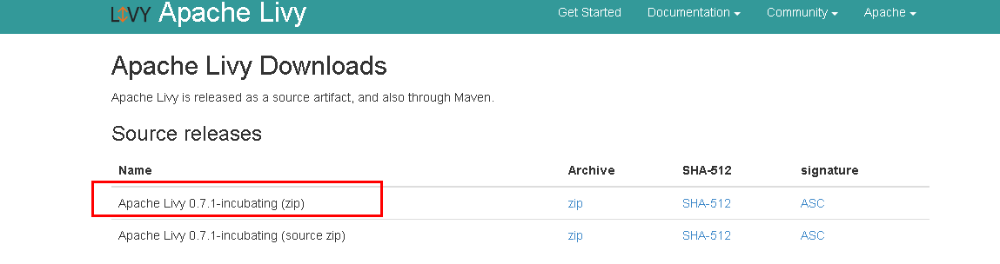


执行source命令到客户端进行认证

```
source /opt/mrsclient/hadoopclient/bigdata_env       
echo $JAVA_HOME
```


根据产品文档创建用户developuser，并赋予足够权限，下载用户developuser的keytab文件user.keytab，上传至/opt/developuser目录下，使用kinit developuser命令检查认证是否成功

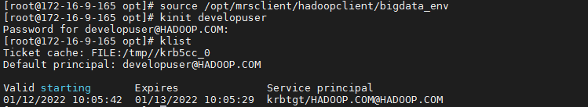


配置Livy环境变量，在profile文件中加入如下变量

```
vi /etc/profile
export LIVY_HOME=/opt/livy/apche-livy-0.7.1-incubating-bin
export PATH=$LIVY_HOME/bin:$PATH  
```
编辑livy.conf文件，位置/opt/livy/apache-livy-0.7.1-incubating-bin/conf

```
cd /opt/livy/apache-livy-0.7.1-incubating-bin/conf
cp livy.conf.template livy.conf
vi livy.conf
```
加入如下内容：

```
livy.spark.master = yarn
livy.spark.deploy-mode = client
livy.server.session.timeout = 1h
livy.impersonation.enabled = true
livy.repl.enable-hive-context = true
livy.server.launch.kerberos.keytab=/opt/user.keytab
livy.server.launch.kerberos.principal=developuser@HADOOP.COM
```
编辑livy-client.conf文件，位置/opt/livy/apache-livy-0.7.1-incubating-bin/conf
```
cd /opt/livy/apache-livy-0.7.1-incubating-bin/conf
cp livy-client.conf.template livy-client.conf
vi livy-client.conf
```
加入如本机ip地址：


`livy.rsc.rpc.server.address =172.16.9.165`

编辑livy-env.sh文件，位置/opt/livy/apache-livy-0.7.1-incubating-bin/conf
```
cd /opt/livy/apache-livy-0.7.1-incubating-bin/conf
cp livy-env.sh.template livy-env.sh
vi livy-env.sh
```
加入如下内容：
```
export JAVA_HOME=/opt/mrsclient/hadoopclient/JDK/jdk1.8.0_272
export SPARK_HOME=/opt/mrsclient/hadoopclient/Spark2x/spark
export SPARK_CONF_DIR=/opt/mrsclient/hadoopclient/Spark2x/spark/conf
export HADOOP_CONF_DIR=/opt/mrsclient/hadoopclient/HDFS/hadoop/etc/hadoop
export LIVY_SERVER_JAVA_OPTS="-Djava.security.krb5.conf=/opt/krb5.conf -Djava.security.auth.login.config=/opt/livy/apache-livy-0.7.1-incubating-bin/conf/jaas.conf -Dzookeeper.server.principal=zookeeper/hadoop.hadoop.com -Dzookeeper.request.timeout=12000"
export SPARK_LOCAL_IP=172.16.9.165
```
其中HADOOP_CONF_DIR一定要添加，否则创建会话的时候，会话里面没有appId和appInfo信息
编辑spark-blacklist.conf文件，位置/opt/livy/apache-livy-0.7.1-incubating-bin/conf

```
cd /opt/livy/apache-livy-0.7.1-incubating-bin/conf
cp spark-blacklist.conf.template spark-blacklist.conf
vi spark-blacklist.conf
```
注销掉如下内容：

```
spark.master
spark.submit.deployMode
```

启动和停止Livy，在路径/opt/livy/apache-livy-0.7.1-incubating-bin下

`bin/livy-server start`
`bin/livy-server stop`

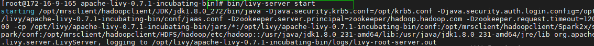

一旦livy开始运行，可以通过8998端口去连接
启动成功后可以在http://172.16.9.165:8998 访问到Livy服务器：


- 安装对接FI HD集群客户端

- 检查客户端时间与对接FI HD集群时间小于5分钟

### Livy服务端配置

- 安装对接FI HD集群客户端

- 检查Livy服务端时间与对接FI HD集群时间小于5分钟

- 检查livy.conf文件配置

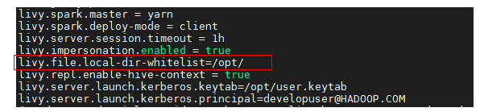

  需要特别注意的是：

    livy.file.local-dir-whitelist=/opt/ 配置参数是使用livy batch方式本地提交任务时，需要将本地路径打开白名单

###  使用Livy session方式提交任务
  livy session方式对应spark console交互方式，通过提交具体的代码的方式来提交，运行spark任务
##### 由于livy0.7.1版本与spark3不兼容，任务无法正常运行
###  使用Livy Batch方式提交任务

#### batch方式提交任务样例1:
Livy batch方式对应spark-submit交互方式，通过提交一个编译好的jar包，或者是写好的py文件等来提交，运行spark任务

本样例为使用yarn client模式本地提交一个jar包计算pi值

登录客户端(172.16.9.165)使用 kinit developuser 输入密码获取票据，做过可不用再做

在FI HD客户端中找到测试jar包spark-examples_2.12-3.1.1-hw-ei-311006.jar并传到livy服务端/opt/路径下

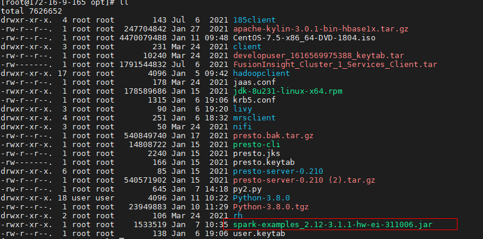

在客户端(172.16.9.165)使用如下命令提交spark任务

`curl -X POST --data '{"file": "file:/opt/spark-examples_2.12-3.1.1-hw-ei-311006.jar", "className": "org.apache.spark.examples.SparkPi", "args": ["100"]}' -H "Content-Type: application/json" http://172.16.9.165:8998/batches`


登录对接集群的yarn查看结果：

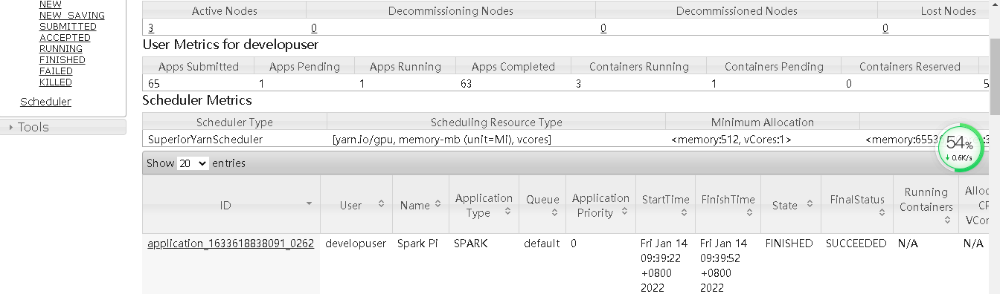


#### batch方式提交任务样例2:
本样例为使用yarn client模式本地提交一个py文件计算pi值

登录客户端(172.169.165)使用 kinit developuser 输入密码获取票据，做过可不用再做

创建py2.py文件，并上传至Livy服务端/opt/路径下，具体内容如下：


```
import sys
from random import random
from operator import add
from pyspark.sql import SparkSession
if __name__ == "__main__":
    """
        Usage: pi [partitions]
    """
    spark = SparkSession\
        .builder\
        .appName("PythonPi")\
        .getOrCreate()

    partitions = int(sys.argv[1]) if len(sys.argv) > 1 else 2
    n = 100000 * partitions
    def f(_):
        x = random() * 2 - 1
        y = random() * 2 - 1
        return 1 if x ** 2 + y ** 2 <= 1 else 0
    count = spark.sparkContext.parallelize(range(1, n + 1), partitions).map(f).reduce(add)
    print("Pi is roughly %f" % (4.0 * count / n))
    spark.stop()
```


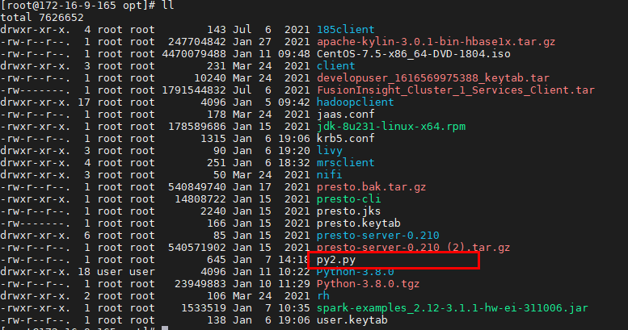


    在客户端(172.16.2.119)使用如下命令提交spark任务

`curl  -X POST --data '{"file": "file:/opt/py2.py" }' -H "Content-Type: application/json" http://172.16.9.165:8998/batches`


#### batch方式提交任务样例3:
登录客户端使用  hdfs dfs -put /opt/spark-examples_2.12-3.1.1-hw-ei-311006.jar /tmp/ 将jar包上传到hdfs下的tmp目录

` hdfs dfs -put /opt/spark-examples_2.12-3.1.1-hw-ei-311006.jar /tmp/ `


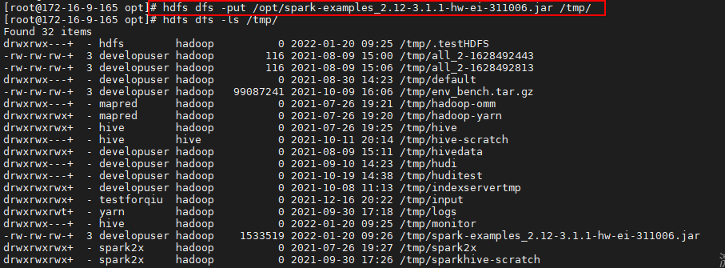

  在客户端(172.16.2.119)使用如下命令提交spark任务，这里的file指的是hdfs上的路径，className是要运行的类名

`curl -X POST --data '{"file": "/tmp/spark-examples_2.12-3.1.1-hw-ei-311006.jar", "className": "org.apache.spark.examples.SparkPi", "args": ["100"]}' -H "Content-Type: application/json" http://172.16.9.165:8998/batches`

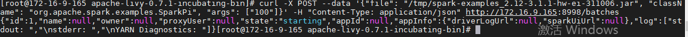

登录对接集群的yarn查看batches执行状态

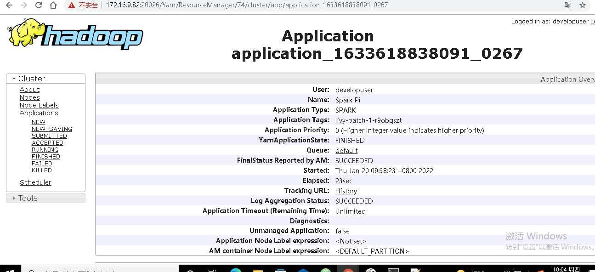

#### batch方式提交任务样例4:

本样例为使用yarn cluster模式在集群本地路径下提交jar包并运行，计算pi值

登录客户端(172.16.9.165)使用 kinit developuser 输入密码获取票据，做过可不用再做

因为使用yarn cluster本地提交jar包模式，事先并不知道worker在哪个集群节点，所以将jar包spark-examples_2.11-2.1.0.jar分别放到各集群节点的/home路径下：


本样例为使用yarn cluster模式在集群本地路径下提交jar包并运行，计算pi值

登录客户端(172.16.2.119)使用 kinit developuser 输入密码获取票据，做过可不用再做

因为使用yarn cluster本地提交jar包模式，事先并不知道worker在哪个集群节点，所以将jar包spark-examples_2.11-2.1.0.jar分别放到各集群节点的/home路径下：

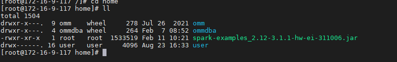

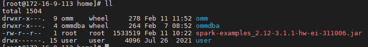

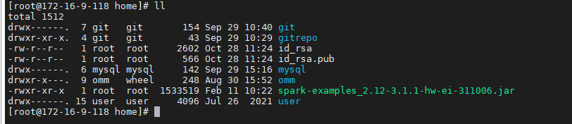

在客户端(172.16.9.165)使用如下命令提交spark任务
`curl -X POST --data '{"file": "local:/home/spark-examples_2.12-3.1.1-hw-ei-311006.jar", "className": "org.apache.spark.examples.SparkPi", "args": ["100"]}' -H "Content-Type: application/json" http://172.16.9.165:8998/batches`
登录对接集群的yarn查看结果：

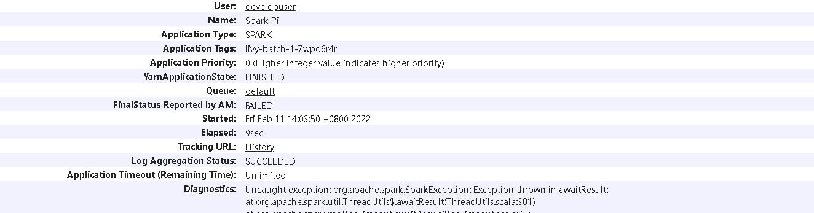
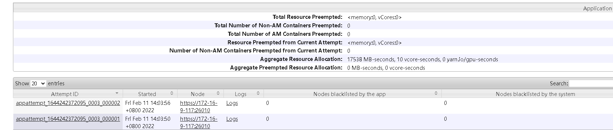
