# Apache Dril对接FusionInsight

## 适用场景

> Apache Drill 1.15.0 <--> FusionInsight HD V100R002C80SPC200 (HDFS/Hive/HBase/Kafka)

## 说明

Apache Drill安装主机：172.16.2.123

FI HD V100R002C80SPC200集群： 172.16.6.10-12

## 安装Apache Drill

- 下载Apache Drill

  `wget http://apache.mirrors.hoobly.com/drill/drill-1.15.0/apache-drill-1.15.0.tar.gz`

  或者从官网下载:

  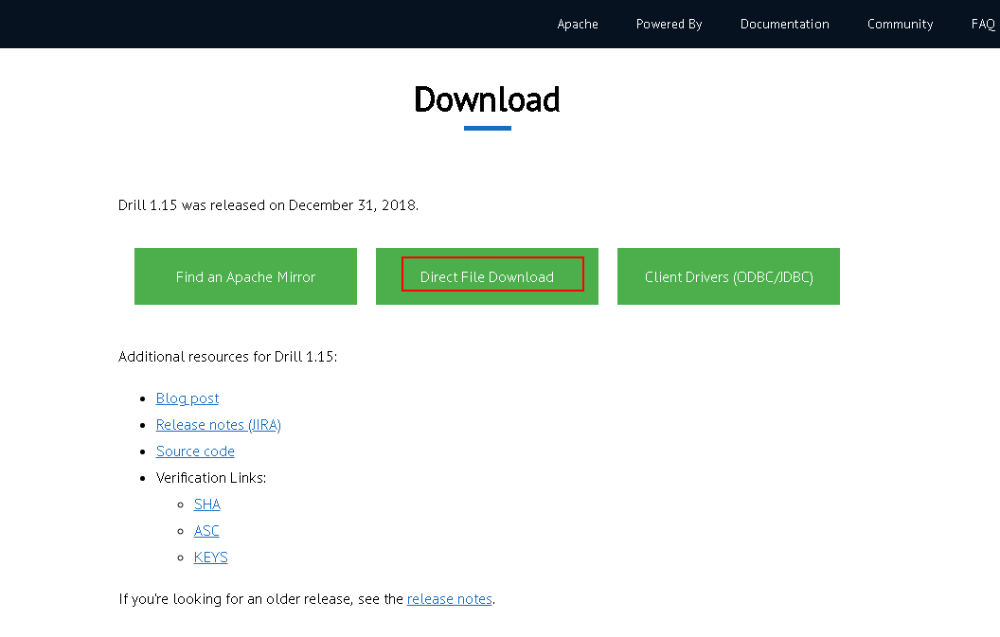

- 安装drill

  将安装包导入/opt/drill路径下，使用命令`tar -xvf apache-drill-1.15.0.tar.gz`解压压缩包

- 启动drill
  ```
  cd /opt/drill/apache-drill-1.15.0
  bin/drill-embedded
  ```

  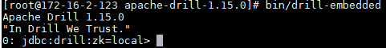

  同时可以登录 `172.16.2.123:8047` 来查看webUI界面

  

## 对接HDFS

- 确保Apache Drill主机与对接集群时间差异小于5分钟

- 登陆drill webUI 界面，选择Storage,创建新的huaweihdfs

  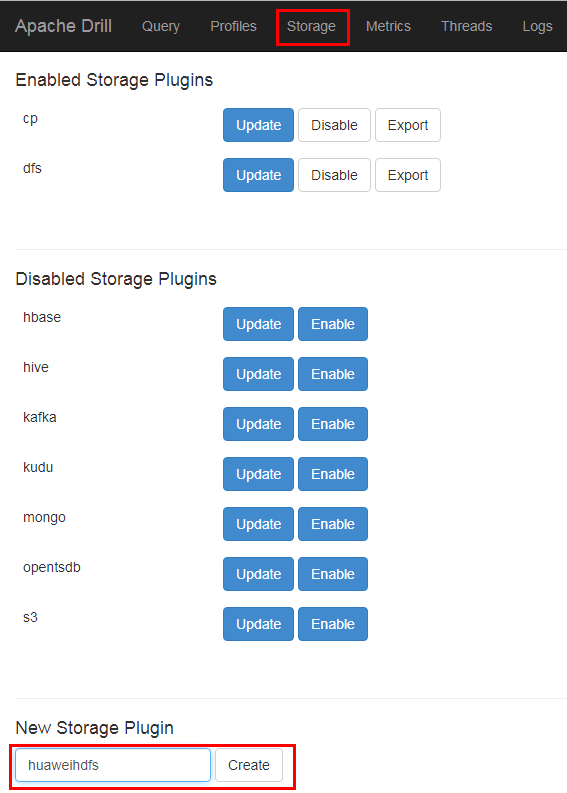

  内容如下：
  ```
  {
    "type": "file",
    "connection": "hdfs://172.16.6.12:25000/",
    "config": null,
    "workspaces": {
      "tmp": {
        "location": "/tmp",
        "writable": true,
        "defaultInputFormat": null,
        "allowAccessOutsideWorkspace": false
      }
    },
    "formats": {
      "json": {
        "type": "json",
        "extensions": [
          "json"
        ]
      }
    },
    "enabled": true
  }
  ```

  
  
  其中172.16.6.12为集群namenode主节点
  
- 准备认证相关配置文件

  登陆对接集群主节点172.16.6.10:/opt路径,使用命令`find /opt -name hdfs.keytab`查找hdfs认证相关keytab文件

  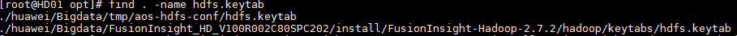

  将hdfs.keytab文件scp拷贝到apachedrill主机/opt路径下

  准备对接集群相关的krb5.conf文件（可从manager下载），复制到apachedrill主机/etc路径下并覆盖，apachedrill默认从/etc/路径下读取krb5.conf文件

- 在客户端中找到HDFS相关core-site.xml配置文件，拷贝到drill安装路径下的conf目录下，并对配置文件做如下修改：

  1.  找到参数项fs.defaultFS,将值改为namenode主节点ip+25000的形式：

  


  保存修改


- 修改drill conf路径下的配置文件drill-override.conf，做如下修改并保存:
  ```
  security.auth.principal: "hdfs/hadoop.hadoop.com@HADOOP.COM"
  security.auth.keytab: "/opt/hdfs.keytab"
  ```
  

- 在对接集群的/tmp路径下创建json格式的测试数据test.json

  

  内容如下：
  ```
  { "_id" : "5968dd23fc13ae04d9000001", "product_name" : "sildenafil citrate", "supplier" : "Wisozk Inc", "quantity" : 261, "unit_cost" : "$10.47" }
  { "_id" : "5968dd23fc13ae04d9000002", "product_name" : "Mountain Juniperus ashei", "supplier" : "Keebler-Hilpert", "quantity" : 292, "unit_cost" : "$8.74" }
  { "_id" : "5968dd23fc13ae04d9000003", "product_name" : "Dextromathorphan HBr", "supplier" : "Schmitt-Weissnat", "quantity" : 211, "unit_cost" : "$20.53" }
  ```

- 使用命令`!quit`停止drill,再重启drill

  在命令行使用命令`show databases;`检查数据库：

  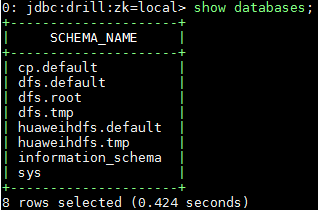

  使用命令```select * from huaweihdfs.`tmp`.`test.json`;```查找数据：

  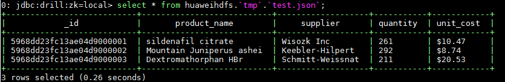


## 对接HIVE

说明：apache drill 1.15版本的hive版本为2.3.2, FI HD V100R002C80SPC200版本hive版本为1.3.0，版本不匹配，不能对接成功，需要使用drill 1.12.0版本，故本节所述使用的drill版本都为1.12.0

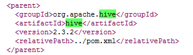

- ApacheDrill 1.12.0对接 FI HD V100R002C80SPC200 Hive服务前提条件：
  1.  下载ApacheDrill 1.12.0的安装包apache-drill-1.12.0.tar.gz， 参考上述《安装Apache Drill》章节完成drill安装
  2.  参考上述《对接HDFS》章节完成对接drill 1.12.0版本与FI HD的对接，因为对接hdfs是连接hive的基础，所以需要完成此步骤


- 由于drill 1.12.0版本支持对接ha模式的大数据集群，为减少依赖相关错误发生，更改对接FI HD集群HDFS服务中dfs.client.failover.proxy.provider.hacluster配置项的值为org.apache.hadoop.hdfs.server.namenode.ha.ConfiguredFailoverProxyProvider，并点击保存配置，重启相关服务

  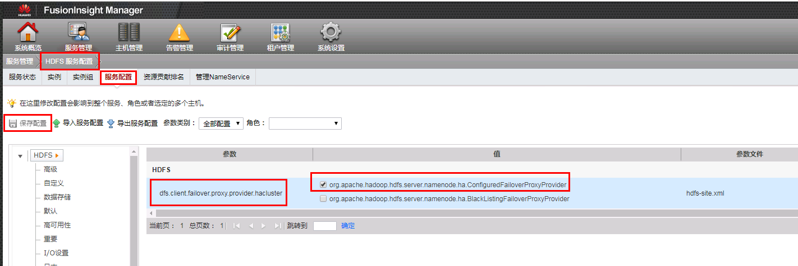

  完成后重新下载集群配置文件
  
  注意：此步骤为更改集群HDFS配置，属于高危操作。如果不能更改集群配置则相应的规避方式如下（只改对接需要使用的配置文件hdfs-site.xml而不对集群配置做实际更改）:
  
  修改配置文件hdfs-site.xml文件中的配置项dfs.client.failover.proxy.provider.hacluster的值改成org.apache.hadoop.hdfs.server.namenode.ha.ConfiguredFailoverProxyProvider

- 在对接集群的配置文件找到hdfs-site.xml以及yarn-site.xml文件导入到drill安装路径/conf目录下：

  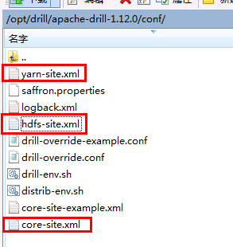
  
  其中core-site.xml配置文件在对接HDFS的时候已经导入，并且修改过fs.defaultFS配置项， hdfs-site.xml文件的dfs.client.failover.proxy.provider.hacluster 配置项做相应更改，改成org.apache.hadoop.hdfs.server.namenode.ha.ConfiguredFailoverProxyProvider
  
- 到drill安装路径/jars下使用命令`mkdir hd_jars`新建一个名为hd_jars的路径

  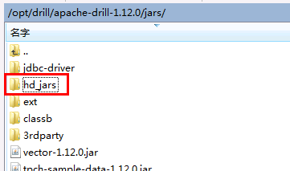

  到FI HD客户端下找到Jar包 hadoop-yarn-api-2.7.2.jar， 并将此jar包拷贝到hd_jars路径下
  `cp /opt/hadoopclient/HDFS/hadoop/share/hadoop/yarn/hadoop-yarn-api-2.7.2.jar /opt/drill/apache-drill-1.12.0/jars/hd_jars/`

  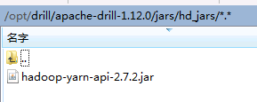

- 修改drill安装路径/bin/drill-config.sh文件如下：  

  在 3rdparty路径导入前加入一行：

  `CP="$CP:$DRILL_HOME/jars/hd_jars/*"`

  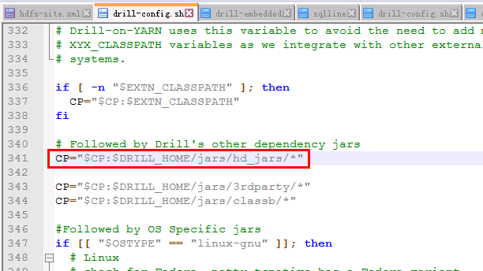


- 登陆对接FI HD集群172.16.2.11， 使用如下命令找到对接hive相关认证keytab文件hive.keytab并把此文件传至drill主机/opt路径下：

  ```
  find /opt -name hive.keytab
  scp /opt/huawei/Bigdata/components/FusionInsight_HD_V100R002C80SPC200/Hive/hive.keytab root@172.16.2.123:/opt
  ```
  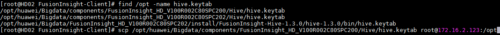

- 登陆drill主机，准备对接集群相关的krb5.conf文件（可从manager下载），复制到drill主机/etc路径下并覆盖，apachedrill默认从/etc/路径下读取krb5.conf文件，如果此步之前做过可以不做

- 修改drill安装路径/conf/drill-override.conf配置文件如下：
  ```
  drill.exec: {
    cluster-id: "drillbits1",
    zk.connect: "localhost:2181"
    security.auth.principal: "hive/hadoop.hadoop.com@HADOOP.COM"
    security.auth.keytab: "/opt/hive.keytab"
    sys.store.provider.local.path = "/home/drill"
  }
  ```
  

- 重启drill,登陆drill WebUI,创建新的storage名字为huaweihive并enable，内容如下：

  ```
  {
    "type": "hive",
    "enabled": true,
    "configProps": {
      "hive.metastore.uris": "thrift://172.16.6.10:21088,thrift://172.16.6.11:21088",
      "hive.metastore.kerberos.principal": "hive/hadoop.hadoop.com@HADOOP.COM",
      "hive.metastore.sasl.enabled": "true",
      "fs.default.name": "hdfs://172.16.6.12:25000",
      "inputDirectories": "hdfs://172.16.6.12:25000"
    }
  }
  ```

  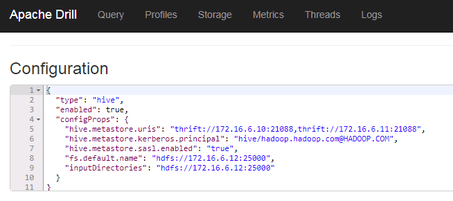

  其中hive.metastore.uris可在集群hive-site.xml文件中查到

- 后台登陆drill，使用`show databases`命令查看数据库：

  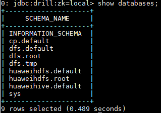

  使用命令`use huaweihive;`使用hive连接：

  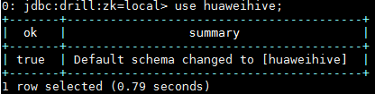

  使用命令`show tables;`查看hive表：

  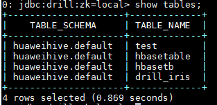

  使用查询命令查询hive表：

  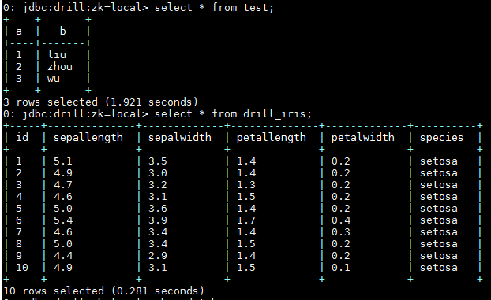


## 对接kafka

对接参考drill官方文档：https://drill.apache.org/docs/kafka-storage-plugin/
可以知道支持的kafka读取数据结构只能为json：

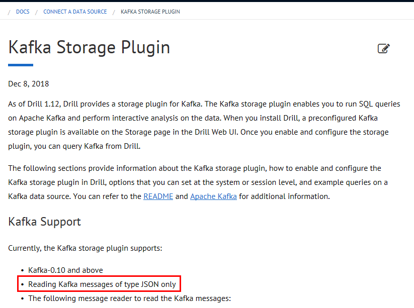

- 准备topic

  登陆对接集群kafka客户端，使用如下命令创建一个新的topic：

  `bin/kafka-topics.sh --create --zookeeper 172.16.6.10:24002,172.16.6.11:24002,172.16.6.12:24002/kafka --partitions 1 --replication-factor 1 --topic druidkafka`

  使用如下命令生产数据：

  `bin/kafka-console-producer.sh --broker-list 172.16.6.10:21007,172.16.6.11:21007,172.16.6.12:21007 --topic druidkafka --producer.config config/producer.properties`

  输入三条测试数据：
  ```
  { "_id" : "5968dd23fc13ae04d9000001", "product_name" : "sildenafil citrate", "supplier" : "Wisozk Inc", "quantity" : 261, "unit_cost" : "$10.47" }
  { "_id" : "5968dd23fc13ae04d9000002", "product_name" : "Mountain Juniperus ashei", "supplier" : "Keebler-Hilpert", "quantity" : 292, "unit_cost" : "$8.74" }
  { "_id" : "5968dd23fc13ae04d9000003", "product_name" : "Dextromathorphan HBr", "supplier" : "Schmitt-Weissnat", "quantity" : 211, "unit_cost" : "$20.53" }
  ```

  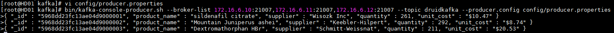

- 启动apachedrill,登陆webUI,点击Storage创建huaweikafka,点击enable，内容如下：

  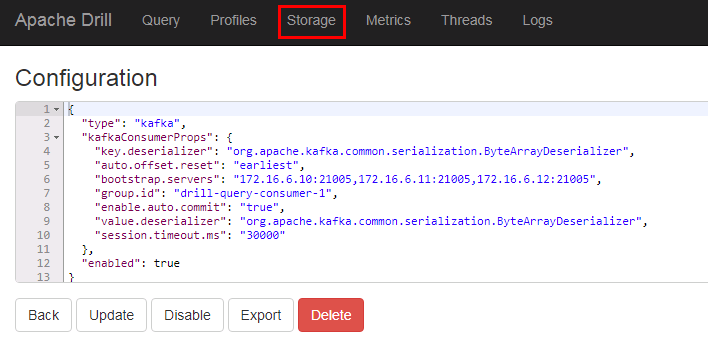

  ```
  {
    "type": "kafka",
    "kafkaConsumerProps": {
      "key.deserializer": "org.apache.kafka.common.serialization.ByteArrayDeserializer",
      "auto.offset.reset": "earliest",
      "bootstrap.servers": "172.16.6.10:21005,172.16.6.11:21005,172.16.6.12:21005",
      "group.id": "drill-query-consumer-1",
      "enable.auto.commit": "true",
      "value.deserializer": "org.apache.kafka.common.serialization.ByteArrayDeserializer",
      "session.timeout.ms": "30000"
    },
    "enabled": true
  }
  ```

- 后台命令行输入`show databases;`检查数据库

  

  输入命令`use huaweikafka;`使用数据库

  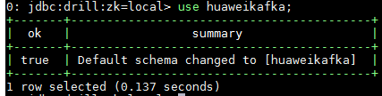

  输入命令`show tables;`查看topic

  

  输入命令`select * from druidkafka;`查询刚刚创建的kafka topic

  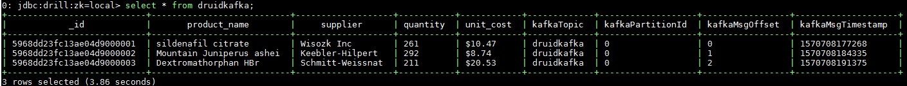


## 对接HBase

- 停止正在运行的drill

- 参考前文《对接HDFS》,《对接HIVE》章节，成功配置好对接hdfs,hive组件

- 找到drill安装目录下./jar/ext/路径，将drill自带的zookeeper-3.4.12.jar重命名为zookeeper-3.4.12.jar.org注释掉，并将FI HD客户端中zookeeper相关jar包 zookeeper-3.5.1.jar拷贝到该路径下。这一步的目的是，drill自带的zookeeper-3.4.12.jar版本太旧，其内部没有定义send4LetterWord方法，该方法是向FI HD zookeeper服务自动获取连接zookeeper的service principal (zookeeper/hadoop.hadoop.com@HADOOP.COM)

  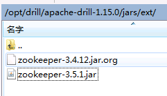

- 在/opt路径下准备jass.conf文件，内容如下，其中/opt/user.keytab为用户developuser的认证文件：
  ```
  Client {
  com.sun.security.auth.module.Krb5LoginModule required
  useKeyTab=true
  principal="developuser@HADOOP.COM"
  keyTab="/opt/user.keytab"
  useTicketCache=false
  storeKey=true
  debug=true;
  };
  ```


- 启动drill之前使用如下命令加载进必要的JVM参数：

  ```
  source /opt/hadoopclient/bigdata_env
  export JAVA_TOOL_OPTIONS="-Xmx512m -Xms64m -Djava.security.auth.login.config=/opt/jaas.conf -Dkerberos.domain.name=hadoop.hadoop.com -Djava.security.krb5.conf=/etc/krb5.conf -Dzookeeper.server.principal=zookeeper/hadoop.hadoop.com"
  ```

  完成之后使用命令`java -version`检查是否加载成功：

  

- 将HBase客户端包含的配置文件hbase-site.xml拷贝到drill安装路径下的conf目录下

- 启动drill，登陆drill webUI，添加Storage名字为huaweihbase并enable,内容如下：

  ```
  {
    "type": "hbase",
    "config": {
      "hbase.zookeeper.quorum": "172.16.6.10,172.16.6.11,172.16.6.12",
      "hbase.zookeeper.property.clientPort": "24002"
    },
    "size.calculator.enabled": false,
    "enabled": true
  }
  ```
  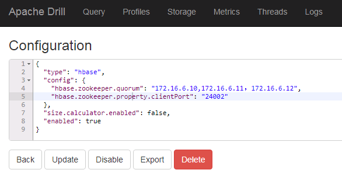

- 登陆drill后台，使用命令`use huaweihbase;`使用数据库：

  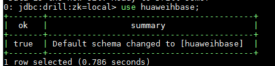

  使用命令`show tables;`查看hbase表：

  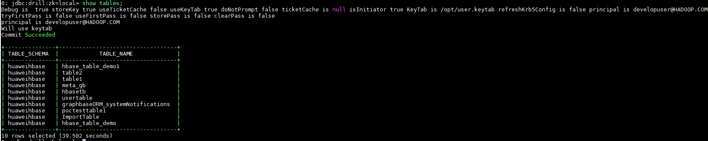

  使用命令`select * from ImportTable;`查看hbase表：

  
