# Apache Kylin3.1.1对接FusionInsight HD

## 适用场景

> Apache Kylin 2.3.1 <-> FusionInsight HD V100R002C80SPC100
> Apache Kylin 3.0.1 <-> FusionInsight HD 6.5 (HDFS/Hive/HBase/Kafka/Spark)
> Apache Kylin 3.1.1 <-> FusionInsight MRS 8.0 (HDFS/Hive/HBase/Kafka/Spark)

## 说明

Apache Kylin™是一个开源的分布式分析引擎，提供Hadoop之上的SQL查询接口及多维分析（OLAP）能力以支持超大规模数据，最初由eBay Inc. 开发并贡献至开源社区。它能在亚秒内查询巨大的Hive表。

Apache Kylin主要与FusionInsight的Hive和HBase进行对接


## 环境准备

说明：Kylin3.1.1主机： 172.16.9.109  MRS8.0集群： 172.16.4.111-113

* 修改/etc/hosts

  添加本机主机名解析
  ```
  172.16.9.109 kylin
  ```

* 配置NTP服务(若kylin主机与集群时间在5min之内此步骤可选)

  使用vi /etc/ntp.conf增加NTP服务的配置,时间与FusionInsight集群同步
  ```
  server 172.18.0.18 nomodify notrap nopeer noquery
  ```

  启动NTP服务
  ```
  service ntpd start
  chkconfig ntpd on
  ```

* 参考FusionInsight产品文档在Kylin节点安装FusionInsight客户端

  在FusionInsight Manager服务管理页面下载客户端，上传到kylin节点安装FusionInsight客户端到`/opt/115_hadoopclient`目录
  ```
  ./install.sh /opt/115_hadoopclient/hadoopclient
  ```

* 安装JDK1.8
  ```
  rpm -Uvh jdk-8u231-linux-x64.rpm
  ```
  说明：启动kylin不能使用FusionInsight客户端的jdk

## 下载Kylin

Fusioninsight MRS 8.0 配套的HBase是2.2.3，Apache Kylin可直接下载apache-kylin-3.1.1-bin-hadoop3.tar.gz主版本二进制包，无需编译Apache kylin

### 下载解压Kylin

* 下载Kylin-3.1.1基于 Hadoop 3 版本的二进制包:
  https://www.apache.org/dyn/closer.cgi/kylin/apache-kylin-3.1.1/apache-kylin-3.1.1-bin-hadoop3.tar.gz

  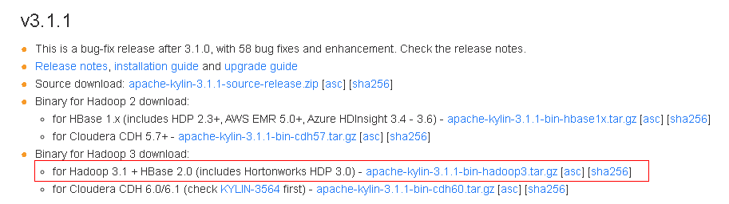

  对应的开源代码（分支为:master-hadoop3）：https://github.com/apache/kylin/tree/master-hadoop3

* 上传apache-kylin-3.1.1-bin-hadoop3.tar.gz到Apache kylin节点的`/opt/kylin`目录

* 解压上一步骤的安装包
  ```
  cd /opt/kylin
  tar -xvf apache-kylin-3.1.1-bin-hadoop3.tar.gz
  ```

## 配置Kylin

### 配置环境变量

* 配置环境变量：`vi /etc/profile`，增加以下配置
  ```
  export KYLIN_HOME=/opt/kylin/apache-kylin-3.1.1-bin-hadoop3

  export JAVA_HOME=/usr/java/jdk1.8.0_231-amd64
  export CLASSPATH=$CLASSPATH:$JAVA_HOME/lib:$JAVA_HOME/jre/lib
  export PATH=$JAVA_HOME/bin:$PATH

  ```

* Kylin启动还需要配置HIVE_CONF、HCAT_HOME，使用如下命令
  ```
  export HIVE_CONF=/opt/115_hadoopclient/hadoopclient/Hive/config
  export HCAT_HOME=/opt/115_hadoopclient/hadoopclient/Hive/HCatalog
  ```

* 修改`/opt/kylin/apache-kylin-3.1.1-bin-hadoop3/bin/find-hive-dependency.sh`

  

  `hive_exec_path=/opt/115_hadoopclient/hadoopclient/Hive/Beeline/lib`

* 修改`/opt/kylin/apache-kylin-3.1.1-bin-hadoop3/bin/find-hbase-dependency.sh`

  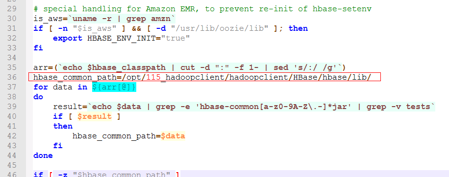

  `hbase_common_path=/opt/115_hadoopclient/hadoopclient/HBase/hbase/lib/`

* 修改`/opt/kylin/apache-kylin-3.1.1-bin-hadoop3/bin/find-spark-dependency.sh`

  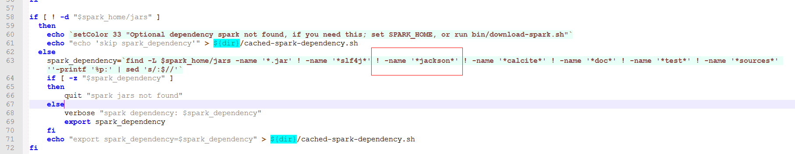

  `! -name '*jackson*' !`

* 如果已经启动，要提前删除`rm cached-*`

  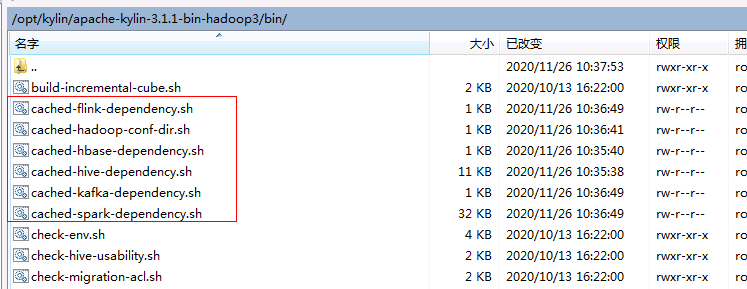

* 导入环境变量
  ```
  source /opt/115_hadoopclient/hadoopclient/bigdata_env
  ```

* 进行kerberos认证
  ```
  kinit developuser
  ```

* 导入环境变量
  ```
  source /etc/profile
  ```
  说明：kinit认证后要使用配置的jdk

* Kylin检查环境设置：
  ```
  cd /opt/kylin/apache-kylin-3.1.1-bin-hadoop3/bin
  ./check-env.sh
  ```

### 修改FusionInsight的Hive配置项

* 在hive.security.authorization.sqlstd.confwhitelist.append参数最后追加一下参数配置，保存配置，重启影响的服务

  ```
  |mapreduce\.job\..*|dfs\..*|mapred\..*
  ```

  

### 修改Kylin配置

* 获取Hive的JDBC字符串

  执行Beeline查看Hive的JDBC字符串

  ```
  source bigdata_env
  kinit developuser
  beeline
  ```

  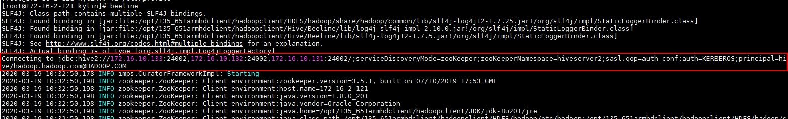

* 修改kylin.properties： `vi /opt/kylin/apache-kylin-3.1.1-bin-hadoop3/conf/kylin.properties`

  配置Hive client使用beeline：
  ```
  kylin.source.hive.client=beeline
  kylin.source.hive.beeline-shell=beeline
  kylin.source.hive.beeline-params=-n root -u 'jdbc:hive2://172.16.4.111:24002,172.16.4.112:24002,172.16.4.113:24002/;serviceDiscoveryMode=zooKeeper;zooKeeperNamespace=hiveserver2;sasl.qop=auth-conf;auth=KERBEROS;principal=hive/hadoop.hadoop.com@HADOOP.COM'
  ```
  JDBC字符串使用上一步骤获取的字符串

  

  > 注意：kylin.source.hive.beeline-params参数里面原有的 ``--hiveconf hive.security.authorization.sqlstd.confwhitelist.append='mapreduce.job.*|dfs.*'`` 要去掉

* 修改Hive/HBase配置

  将/opt/115_hadoopclient/hadoopclient/Hive/config/hivemetastore-site.xml中的配置合并到hive-site.xml

  (重要)修改/opt/115_hadoopclient/hadoopclient/HBase/hbase/conf/hbase-site.xml

  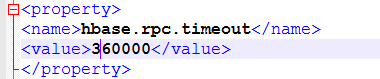

  修改hbase.rpc.timeout值为360000


### 启动Kylin

* 使用`./kylin.sh start`启动Kylin

  

  

  输入默认用户名密码：ADMIN/KYLIN登陆

  

## Demo测试

### 导入Demo数据

* 执行以下命令导入sample数据
  ```
  cd /opt/kylin/apache-kylin-3.1.1-bin-hadoop3/bin
  ./sample.sh
  ```

  

  选择菜单 **System** -> **Actions** -> **Reload Metadata**

  

  选择菜单 **System** -> **Model**

  

### 构建Cube

* 构建默认的kylin_sales_cube

  

* 选择End Data（Exclude）时间：

  

* 点击Monitor可以查看build状态：

  

* Build完成：

  

* Cube构建成功，状态变为READY

  

### 查询表数据

* 在Insight页面执行查询

  


## Streaming Sample用例，Kafka普通模式

参考官方网站http://kylin.apache.org/docs30/tutorial/kylin_sample.html

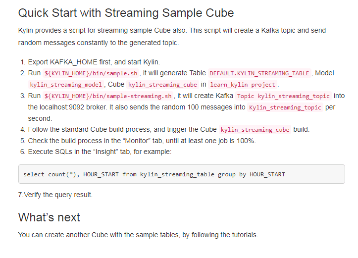

- （重要）首先下载集群认证文件krb5.conf， 登陆对接集群节点，将下载下来有效的krb5.conf文件放置到集群各个节点的/etc/路径下，完成后使用命令`export JAVA_TOOL_OPTIONS="-Djava.security.krb5.conf=/etc/krb5.conf"`加载认证参数

  下图以其中一个节点为例，其余各节点参考相同命令

  

- 停止之前运行的Kylin任务，使用如下命令引入已安装的各组件客户端位置

  ```
  export HIVE_CONF=/opt/115_hadoopclient/hadoopclient/Hive/config
  export HCAT_HOME=/opt/115_hadoopclient/hadoopclient/Hive/HCatalog
  export KAFKA_HOME=/opt/115_hadoopclient/hadoopclient/Kafka/kafka
  ````

- 到kylin webUI的Model -> Data Source -> 选中表KYLIN_STREAMING_TABLE -> 选择Streaming Cluster -> 点击Edit

  

- 填写对应集群kafka连接信息，点击save保存后，在点击submit

  


- 登陆kylin安装主机后台，修改bin目录下的sample-streaming.sh文件

  

- 登陆后台使用命令`bin/sample-streaming.sh`启动任务

  

- 回到Model，选择kylin_streaming_cube，点击Build

  

- 登陆Monitor界面检查

  

- 登陆Model界面检查

  

- 登陆Insight界面输入SQL语句查询

  


## 用spark构建cube用例

参考Kylin官方文档：http://kylin.apache.org/docs30/tutorial/cube_spark.html

- 停止之前运行的Kylin任务，使用如下命令引入已安装的各组件客户端位置

  ```
  export HIVE_CONF=/opt/115_hadoopclient/hadoopclient/Hive/config
  export HCAT_HOME=/opt/115_hadoopclient/hadoopclient/Hive/HCatalog
  export KAFKA_HOME=/opt/115_hadoopclient/hadoopclient/Kafka/kafka
  export SPARK_HOME=/opt/115_hadoopclient/hadoopclient/Spark2x/spark
  ````

- 修改配置文件`/opt/kylin/apache-kylin-3.1.1-bin-hadoop3/conf/kylin.properties`

  增加两个配置

  ```
  kylin.engine.spark-conf.spark.master=yarn
  kylin.engine.spark-conf.spark.submit.deployMode=cluster
  ```

- 新建路径`/opt/kylin/apache-kylin-3.1.1-bin-hadoop3/spark/jars`，使用如下命令将已安装的Spark2x客户端的jar包拷贝到该路径下，并且删除hadoop开头的jar包

  ```
  cp /opt/115_hadoopclient/hadoopclient/Spark2x/spark/jars/*.jar /opt/kylin/apache-kylin-3.1.1-bin-hadoop3/spark/jars/
  rm -rf hadoop-*
  ```
- 删除/opt/kylin/apache-kylin-3.1.1-bin-hadoop3/bin下的cached配置文件，重启kylin

  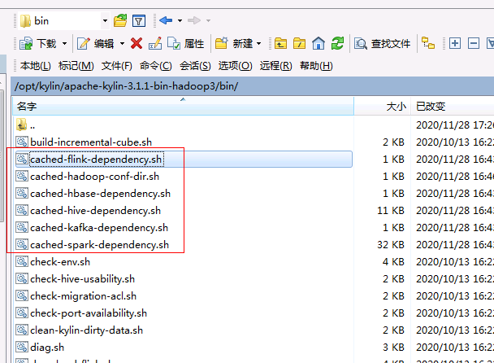

- 启动Kylin，登陆web UI

- 选择kylin_sales_cube点Clone, 将新的cube重命名为kylin_sales_cube_clone_Spark2x

  

- 选择kylin_sales_cube_clone_Spark2x，在Actions下选择Edit

  在Advanced Setting下将Cube Engine选成Spark

  

  在Configuration Overwrites检查参数

  

  保存

- Build新创建的kylin_sales_cube_clone_Spark2x

- 在Monitor下检查作业情况

  

- 可登陆对接集群yarn查看作业情况：

  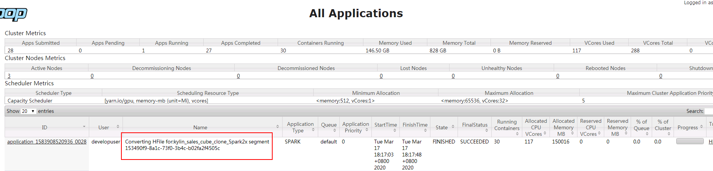

  

- 登陆Model界面检查

  


- 登陆Insight界面输入SQL语句查询

  


### FAQ

问题1： 在做bin/sample.sh之后再build cube的时候，第一步遇到报错：


问题原因：权限没加够，参考之前的在hive加权限：


增加`|mapred\..*`,同步该配置后重启hive服务问题解决


问题2： 在《用spark构建cube用例》这一节中，build作业之后在Monitor查看任务失败

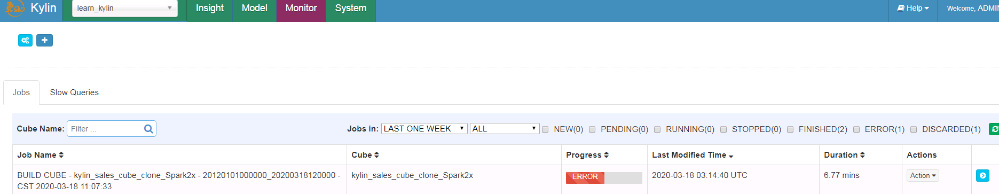

错误卡在第7步


登陆对接集群YARN查看失败任务日志：


在container下查看具体报错日志日志：

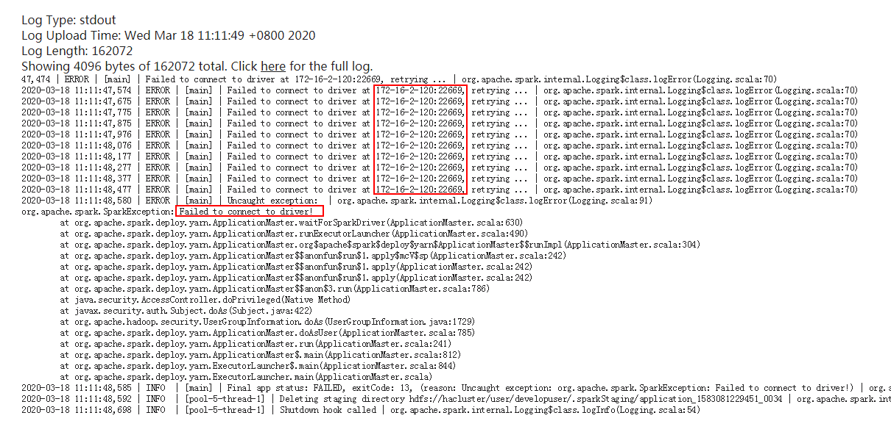

解决办法：将Kylin主机名 172-16-2-120增加到对接集群的/etc/hosts配置文件下重新运行该任务问题解决


问题3：在做kylin自带的kylin_streaming_cube的时候，build的时候


一直在第15步这个Build Cube In-Mem遇到报错：


错误主要是在yarn上执行一个mr任务报的:


如果只看application的logs -> syslog 会发现错误不明显，也不知道是什么错误


错误不明显，如下图


要点tracking URL的History

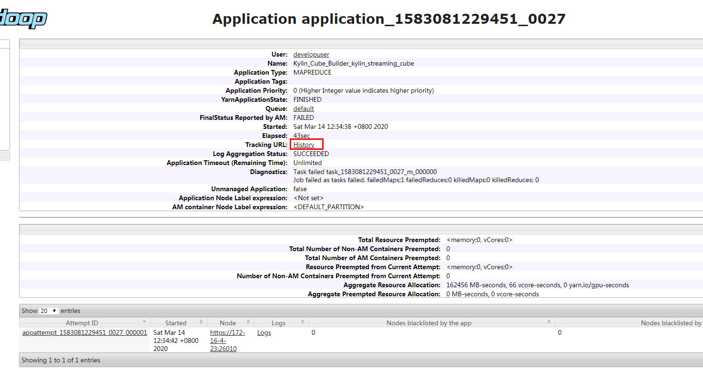

然后点报错的map


点Logs


看syslog

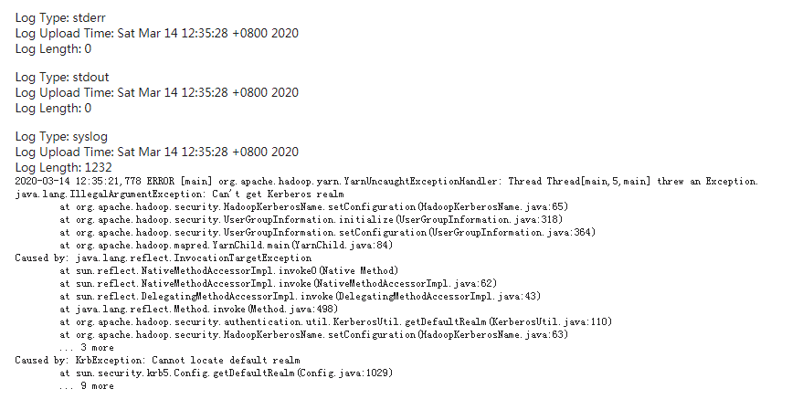

就可以知道是认证的错误，这个时候要把Krb5.conf文件加进去，又因为Map的运行在集群的三个节点上，所以我才用的方法是使用命令`export JAVA_TOOL_OPTIONS="-Djava.security.krb5.conf=/etc/krb5.conf"`把认证文件指进去，要注意这里要确保krb5.conf文件是对的，然后我再重新build kylin的cube就成功了

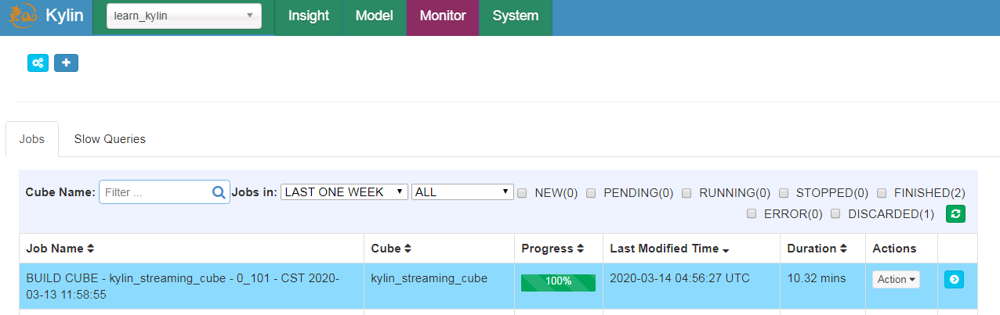

备注：换了其他集群尝试了一下，发现那个syslog有的时候是没有报错的：


但是还是尝试这个解决办法，是可以解决问题的。


问题4. 启动Kylin的时候会遇到报错：

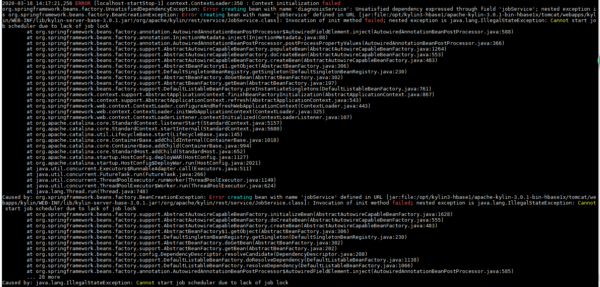

解决办法：重新执行以下启动命令可解决

问题5. 查询KYLIN_SALES, KYLIN_STREAMING_TABLE表的时候


```
Caused by: java.lang.RuntimeException: org.apache.hadoop.hbase.DoNotRetryIOException: org.apache.hadoop.hbase.DoNotRetryIOException: Coprocessor passed deadline! Maybe server is overloaded
        at org.apache.kylin.storage.hbase.cube.v2.coprocessor.endpoint.CubeVisitService.checkDeadline(CubeVisitService.java:228)
```

解决办法：修改对接集群的hbase-site.xml文件配置项

```
<property>
<name>hbase.rpc.timeout</name>
<value>360000</value>
</property>
```

删除/opt/kylin/apache-kylin-3.1.1-bin-hadoop3/bin下的cached配置文件，重启kylin


问题6. 启动kylin报错：

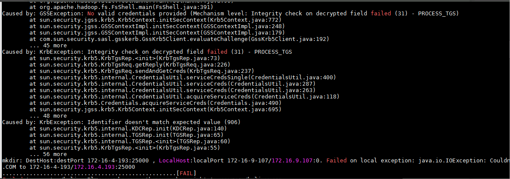

`Integrity check on decrypted failed`

解决办法：不要使用huawei客户端的jdk启动kylin

问题7. 启动kyling报错：

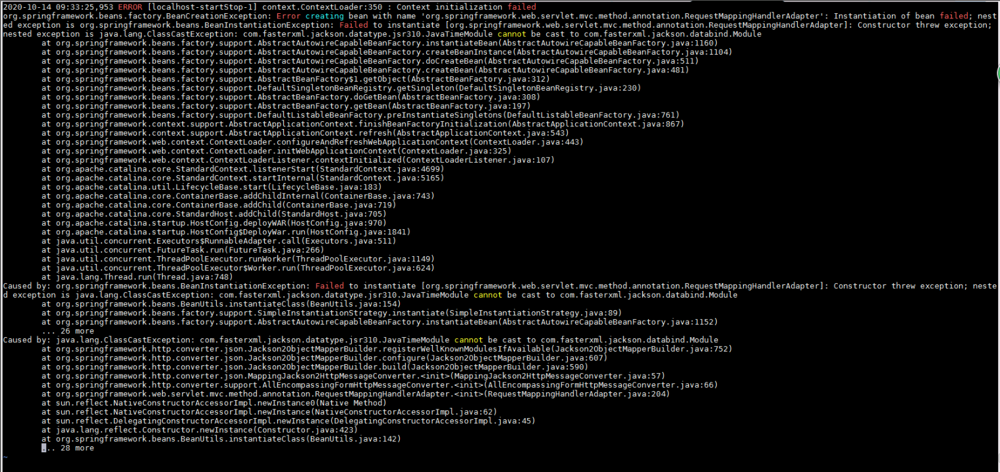

```
2020-10-14 09:33:25,953 ERROR [localhost-startStop-1] context.ContextLoader:350 : Context initialization failed
org.springframework.beans.factory.BeanCreationException: Error creating bean with name 'org.springframework.web.servlet.mvc.method.annotation.RequestMappingHandlerAdapter': Instantiation of bean failed; nested exception is org.springframework.beans.BeanInstantiationException: Failed to instantiate [org.springframework.web.servlet.mvc.method.annotation.RequestMappingHandlerAdapter]: Constructor threw exception; nested exception is java.lang.ClassCastException: com.fasterxml.jackson.datatype.jsr310.JavaTimeModule cannot be cast to com.fasterxml.jackson.databind.Module
        at org.springframework.beans.factory.support.AbstractAutowireCapableBeanFactory.instantiateBean(AbstractAutowireCapableBeanFactory.java:1160)
```

解决办法：参考文档修改find-spark-dependency.sh

添加:`! -name '*jackson*' !`

删除/opt/kylin/apache-kylin-3.1.1-bin-hadoop3/bin下的cached配置文件，重启kylin


