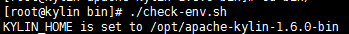

# Apache Kylin对接FusionInsight HD

## 适用场景

> Apache Kylin 1.6.0 <--> FusionInsight HD V100R002C60U20 (HBase/Hive)

## 说明

Apache Kylin™是一个开源的分布式分析引擎，提供Hadoop之上的SQL查询接口及多维分析（OLAP）能力以支持超大规模数据，最初由eBay Inc. 开发并贡献至开源社区。它能在亚秒内查询巨大的Hive表。

Apache Kylin主要与FusionInsight的Hive和HBase进行对接


## 环境准备

* 修改/etc/hosts

  添加本机主机名解析
  ```
  162.1.115.89 kylin
  ```

* 配置NTP服务

  使用vi /etc/ntp.conf增加NTP服务的配置
  ```
  server 162.2.200.200 nomodify notrap nopeer noquery
  ```

  启动NTP服务
  ```
  service ntpd start
  chkconfig ntpd on
  ```

* 安装Hadoop client

  在FusionInsight Manager服务管理页面下载客户端，上传到kylin安装主机，解压
  ```
  cd FusionInsight_V100R002C60U20_Services_ClientConfig/
  ./install.sh /opt/hadoopclient
  ```

* 安装JDK
  ```
  rpm -Uvh jdk-8u112-linux-x64.rpm
  ```

## 编译Kylin

可直接下载的二进制文件的Kylin-1.6.0主版本是基于HBase1.1.1编译的，而FusionInsight使用的HBase版本是1.0.2，这两个版本部分类和方法不兼容，需要配套1.0.2的HBase重新编译Kylin。

* 下载Kylin-1.6.0基于HBase1.0.2版本的源码[https://github.com/apache/kylin/tree/yang21-hbase102](https://github.com/apache/kylin/tree/yang21-hbase102)得到kylin-yang21-hbase102.zip

* 安装编译工具

  安装maven：
  ```
  wget http://apache.osuosl.org/maven/maven-3/3.3.9/binaries/apache-maven-3.3.9-bin.tar.gz
  tar -xzvf apache-maven-3.3.9-bin.tar.gz -C /opt/
  ```

  修改profile文件`vi /etc/profile`,增加以下配置
  ```
  export PATH=$PATH:/opt/apache-maven-3.3.9/bin
  ```

  导入环境变量
  ```
  source /etc/profile
  ```

  执行`mvn -v`

  

* 安装git

  ```
  yum install -y git
  ```

* 安装nodejs：

  ```
  wget https://nodejs.org/dist/v6.10.0/node-v6.10.0-linux-x64.tar.xz --no-check-certificate
  tar -xvf node-v6.10.0-linux-x64.tar.xz -C /opt/
  ```

  修改profile文件`vi /etc/profile`,增加以下配置
  ```
  export PATH=$PATH:/opt/apache-maven-3.3.9/bin:/opt/node-v6.10.0-linux-x64/bin
  ```

  导入环境变量
  ```
  source /etc/profile
  ```

  执行`npm -v`

  

* 编译打包
  ```
  unzip kylin-yang21-hbase102.zip
  cd kylin-yang21-hbase102/
  sed -i "s/1.6.0-SNAPSHOT/1.6.0/g" `grep 1.6.0-SNAPSHOT -rl *`
  sh build/script/package.sh
  ```

  

  等待编译完成，得到Kylin二进制安装包

  

## 启动Kylin

### 解压二进制包

* 解压上一步骤生成的安装包
  ```
  tar -xzvf apache-kylin-1.6.0-bin.tar.gz -C /opt
  ```

### 配置环境变量

* 配置环境变量：`vi /etc/profile`，增加以下配置
  ```
  export KYLIN_HOME=/opt/apache-kylin-1.6.0-bin
  ```

* 导入环境变量
  ```
  source /etc/profile
  ```

* Kylin启动还需要配置HIVE_CONF、HCAT_HOME，使用`vi /opt/hadoopclient/Hive/component_env`，在文件最后增加
  ```
  export HIVE_CONF=/opt/hadoopclient/Hive/config
  export HCAT_HOME=/opt/hadoopclient/Hive/HCatalog
  ```

* 导入环境变量
  ```
  source /opt/hadoopclient/bigdata_env
  ```

* 进行kerberos认证
  ```
  kinit test_cn
  ```

  

* Kylin检查环境设置：
  ```
  cd /opt/apache-kylin-1.6.0-bin/bin
  ./check-env.sh
  ```

  

### 修改Kylin配置

* 修改kylin.properties： `vi /opt/apache-kylin-1.6.0-bin/conf/kylin.properties`

  配置Hive client使用beeline：
  ```
  kylin.hive.client=beeline
  kylin.hive.beeline.params=-n root -u 'jdbc:hive2://162.1.93.103:24002,162.1.93.102:24002,162.1.93.101:24002/;serviceDiscoveryMode=zooKeeper;zooKeeperNamespace=hiveserver2;sasl.qop=auth-conf;auth=KERBEROS;principal=hive/hadoop.hadoop.com@HADOOP.COM'
  ```

  配置获取任务状态时使用kerberos 鉴权：
  ```
  kylin.job.status.with.kerberos=true
  ```

* 去掉不允许修改的配置

  FusionInsight不允许修改dfs.replication, mapreduce.job.split.metainfo.maxsize的参数，需要注释掉Kylin所有配置文件中的相关参数，否则构建Cube时会报如下错误：

  

  修改以下文件：

  * kylin_hive_conf.xml
  * kylin_job_conf_inmem.xml
  * kylin_job_conf.xml

* Hive/HBase配置

  将/opt/hadoopclient/Hive/config/hivemetastore-site.xml中的配置合并到hive-site.xml

  将/opt/hadoopclient/HBase/hbase/conf/hbase-site.xml中的配置合并到/opt/apache-kylin-1.6.0-bin/conf/kylin_job_conf.xml

* Hive lib路径

  kylin的find-hive-dependency.sh默认Hive lib路径为大数据集群中Hive的安装路径，若Kylin安装在集群节点上不会有问题，否则需要修改为客户端路径。

  编辑find-hive-dependency.sh：`vi /opt/apache-kylin-1.6.0-bin/bin/find-hive-dependency.sh`
  ```
  hive_lib=`find -L "$(dirname $HCAT_HOME)" -name '*.jar' ! -name '*calcite*' -printf '%p:' | sed 's/:$//'`
  ```

  

### 启动Kylin

* 使用`./kylin.sh start`启动Kylin

  

  

  输入默认用户名密码：ADMIN/KYLIN登陆

  

## Demo测试

### 导入Demo数据

* 执行以下命令导入sample数据
  ```
  cd /opt/apache-kylin-1.6.0-bin/bin
  ./sample.sh
  ```

  选择菜单 **System** -> **Actions** -> **Reload Metadata**

  

### 构建Cube

* 选择learn_kylin工程，构建默认的kylin_sales_cube

  

* Cube构建成功，状态变为READY

  

### 查询表数据

* 在Insight页面执行查询

  

  
