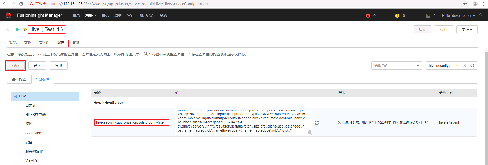
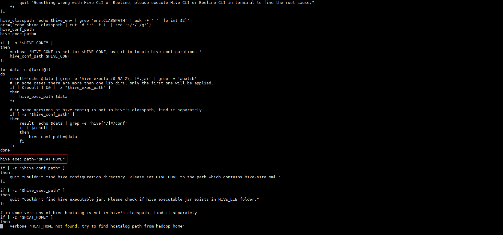
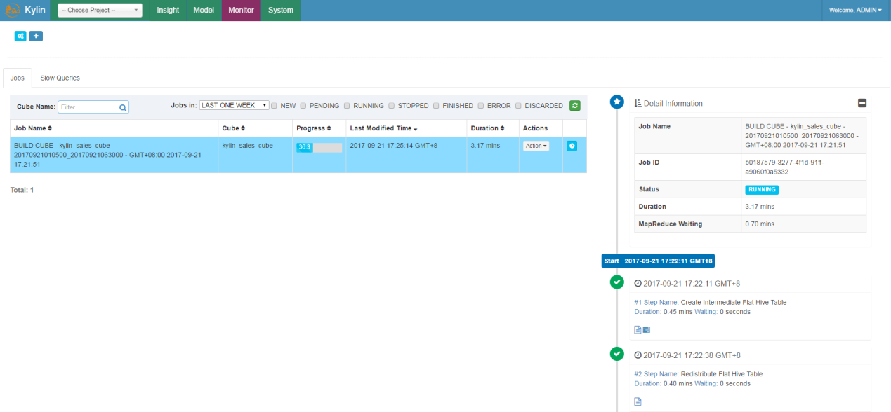
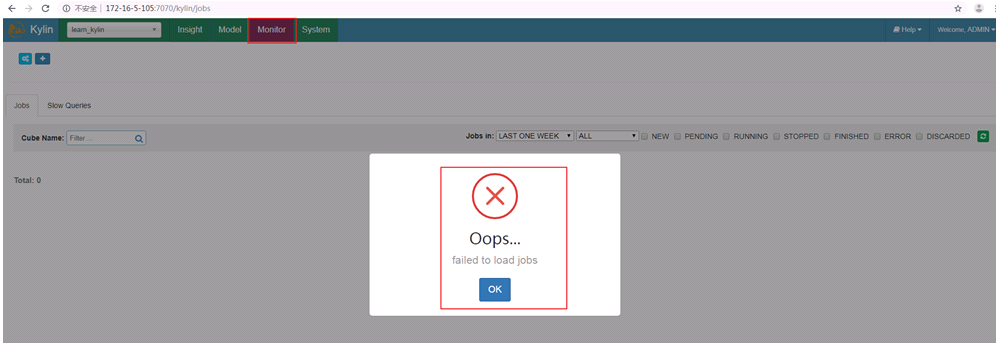

# Apache Kylin2.6.1对接FusionInsight HD

## 适用场景

> Apache Kylin 2.6.1 <--> FusionInsight HD 6.5 (HBase/Hive)

## 说明

Apache Kylin™是一个开源的分布式分析引擎，提供Hadoop之上的SQL查询接口及多维分析（OLAP）能力以支持超大规模数据，最初由eBay Inc. 开发并贡献至开源社区。它能在亚秒内查询巨大的Hive表。

Apache Kylin主要与FusionInsight的Hive和HBase进行对接


## 环境准备

* 配置NTP服务

  使用vi /etc/ntp.conf增加NTP服务的配置，时间与FusionInsight集群同步。
  ```
  server 172.21.3.101 nomodify notrap nopeer noquery
  ```
  >说明：172.21.3.101为FusionInsight HD其中一个集群的IP。

  重启NTP服务，并同步本机和集群的时间。
  ```
  systemctl restart ntpd
  systemctl stop ntpd
  ntpdate 172.16.4.21
  ```

  >说明：需要先停止ntpd服务后，再执行ntpdate同步时间，否则会返回错误“the NTP socket is in use, exiting”。另外172.16.4.21集群的nptd服务必须是启动的。

* 参考FusionInsight产品文档在Kylin节点安装FusionInsight客户端

  在FusionInsight Manager服务管理页面下载客户端，上传到kylin节点安装FusionInsight客户端到`/opt/hadoopclient`目录。
  ```
  ./install.sh /opt/hadoopclient
  ```


## 下载Kylin

Fusioninsight配套的HBase是1.3.0，Apache Kylin可直接下载apache-kylin-\**-hbase1x-bin.tar.gz主版本二进制包，例如apache-kylin-2.6.1-hbase1x-bin.tar.gz，无需编译Apache kylin。

### 下载解压Kylin

* 下载Kylin基于HBase1.x版本的二进制包。例如Kylin-2.6.1下载路径为
  <https://www.apache.org/dyn/closer.cgi/kylin/apache-kylin-2.6.1/apache-kylin-2.6.1-bin-hbase1x.tar.gz>。其他版本下载路径类同。

* 上传安装包到Apache kylin节点的`/opt`目录

* 解压上一步骤的安装包
  ```
  cd /opt
  tar -zxvf apache-kylin-2.6.1-hbase1x-bin.tar.gz
  ```

## 配置Kylin

### 配置环境变量

* 配置环境变量：`vi /etc/profile`，增加以下配置
  ```
  export KYLIN_HOME=/opt/apache-kylin-2.6.1-bin-hbase1x
  ```

* 导入环境变量
  ```
  source /etc/profile
  ```

* Kylin启动还需要配置HIVE_CONF、HCAT_HOME，使用`vi /opt/hadoopclient/Hive/component_env`，在文件最后增加
  ```
  export HIVE_CONF=/opt/hadoopclient/Hive/config
  export HCAT_HOME=/opt/hadoopclient/Hive/HCatalog
  ```

* 导入环境变量
  ```
  source /opt/hadoopclient/bigdata_env
  ```

* 进行kerberos认证
  ```
  kinit developuser
  ```

* Kylin检查环境设置：
  ```
  cd /opt/apache-kylin-2.6.1-bin-hbase1x/bin
  ./check-env.sh
  ```

  

### 修改FusionInsight的Hive配置项

* 在hive.security.authorization.sqlstd.confwhitelist.append参数最后追加以下参数配置，保存配置并重启Hive服务以及受影响的服务。

  ```
  |mapreduce\.job\..*|dfs\..*
  ```

  

### 修改Kylin配置

* 获取Hive的JDBC字符串

  执行Beeline查看Hive的JDBC字符串

  ```
  source bigdata_env
  kinit test
  beeline
  ```

  

* 修改kylin.properties，配置Hive client使用beeline：

  `vi /opt/apache-kylin-2.3.1-bin/conf/kylin.properties`

  ```
  kylin.source.hive.client=beeline
  kylin.source.hive.beeline-shell=beeline
  kylin.source.hive.beeline-params=-n root -u 'jdbc:hive2://172.21.3.101:24002,172.21.3.102:24002,172.21.3.103:24002/;serviceDiscoveryMode=zooKeeper;zooKeeperNamespace=hiveserver2;sasl.qop=auth-conf;auth=KERBEROS;principal=hive/hadoop.hadoop.com@HADOOP.COM'
  ```
  JDBC字符串使用上一步骤获取的字符串
  

  > 注意：kylin.source.hive.beeline-params参数里面原有的 ``--hiveconf hive.security.authorization.sqlstd.confwhitelist.append='mapreduce.job.*|dfs.*'`` 要去掉。

* 修改Hive/HBase配置

  将/opt/hadoopclient/Hive/config/hivemetastore-site.xml中的配置合并到hive-site.xml

  将/opt/hadoopclient/HBase/hbase/conf/hbase-site.xml中的配置合并到/opt/apache-kylin-2.3.1-bin/conf/kylin_job_conf.xml

* Hive lib路径

  kylin的/opt/apache-kylin-2.3.1-bin/bin/find-hive-dependency.sh默认hive_exec_path为大数据集群中Hive的安装路径`/opt/huawei/Bigdata/`，需要修改为客户端路径。

  `vi find-hive-dependency.sh`

  

  >说明：在给hive_exec_path赋值之后，使用之前，增加`hive_exec_path="$HCAT_HOME"`。否则执行./kylin.sh start启动kylin时返回错误"Couldn't find hive executable jar. Please check if hive executable jar exists in HIVE_LIB folder."

  

### 启动Kylin

* 使用`./kylin.sh start`启动Kylin

  

  

  

  输入默认用户名密码：ADMIN/KYLIN登陆

  

## Demo测试

### 导入Demo数据

* 执行以下命令导入sample数据
  ```
  cd /opt/apache-kylin-2.3.1-bin/bin
  ./sample.sh
  ```

  

  选择菜单 **System** -> **Actions** -> **Reload Metadata**

  

  选择菜单 **Model**

  

### 构建Cube

* 构建默认的kylin_sales_cube

  

* 选择End Data（Exclude）时间：

  

* 点击Monitor可以查看build状态：

  

* Build完成：

  

* Cube构建成功，状态变为READY

  

### 查询表数据

* 在Insight页面执行查询

  

## FAQ

* **点击Monitor查看build状态时返回错误failed to load jobs**

  **【问题描述】**

  构建Cube后，点击Monitor查看build状态时返回错误failed to load jobs。

  

  查看日志/opt/apache-kylin-2.6.3-bin-hbase1x/logs/kylin.log错误如下：

  ```
  2019-08-20 21:19:07,958 INFO  [http-bio-7070-exec-7] ipc.RpcClientImpl:824 : RPC Server Kerberos principal name for service=ClientService is hbase/hadoop.hadoop.com@HADOOP.COM
  2019-08-20 21:19:07,979 DEBUG [http-bio-7070-exec-7] badquery.BadQueryHistoryManager:65 : Loaded 0 Bad Query(s)
  2019-08-20 21:19:08,016 ERROR [http-bio-7070-exec-8] controller.BasicController:63 :
  org.springframework.web.util.NestedServletException: Handler dispatch failed; nested exception is java.lang.NoClassDefFoundError: org/apache/directory/api/util/Strings
          at org.springframework.web.servlet.DispatcherServlet.doDispatch(DispatcherServlet.java:982)
          at org.springframework.web.servlet.DispatcherServlet.doService(DispatcherServlet.java:901)
          at org.springframework.web.servlet.FrameworkServlet.processRequest(FrameworkServlet.java:970)
  ...
  ...
  Caused by: java.lang.ClassNotFoundException: org.apache.directory.api.util.Strings
          at org.apache.catalina.loader.WebappClassLoaderBase.loadClass(WebappClassLoaderBase.java:1928)
          at org.apache.catalina.loader.WebappClassLoaderBase.loadClass(WebappClassLoaderBase.java:1771)
          ... 89 more
  ```

  **【解决方法】**

  问题原因：缺少包含org.apache.directory.api.util.Strings的jar包。

    * 从<http://www.java2s.com/Code/JarDownload/api-util/api-util-1.0.0-m18.jar.zip>下载包含org.apache.directory.api.util.Strings的jar包，并放到/opt/apache-kylin-2.6.3-bin-hbase1x/lib目录下。

    

    * 重启kylin。

    ```
    cd /opt/apache-kylin-2.6.3-bin-hbase1x/bin
    ./kylin.sh stop
    ./kylin.sh start
    ```
