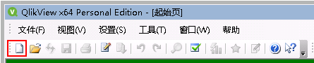
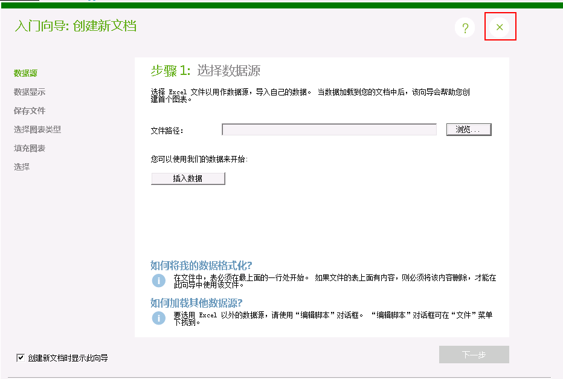
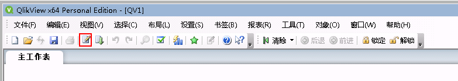
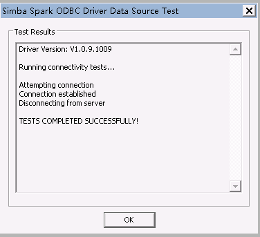
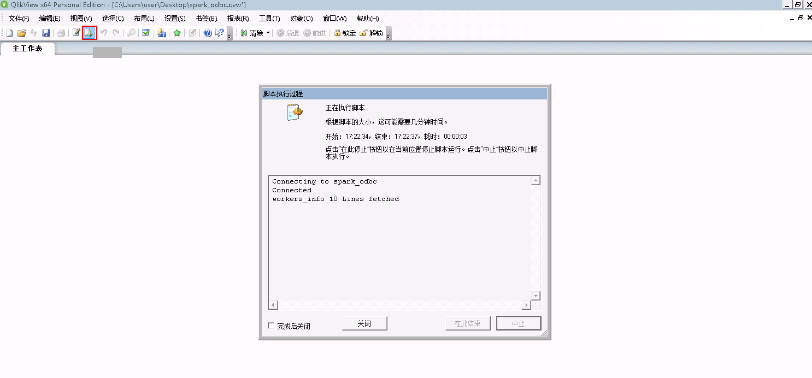

# QlikView and FusionInsight Instruction

## Case

> QlikView 12 <-> FusionInsight HD V100R002C60U20
>
> QlikView 12 <-> FusionInsight HD V100R002C70SPC200
>
> QlikView 12 <-> FusionInsight HD V100R002C80SPC100

## Configuring kerberos authentication for Windows

* Download and install MIT Kerberos at: <http://web.mit.edu/kerberos/dist/#kfw-4.0>

* The version is consistent with the number of operating system bits. This article is version kfw-4.1-amd64.msi.

* Verify that the time of the client machine is the same as that of the FusionInsight HD cluster. The time difference is less than 5 minutes.

* Set the Kerberos configuration file

  Create a role and machine user on the FusionInsight Manager. For details, see the chapter "Creating Users" in the FusionInsight HD Administrator Guide. The role needs to grant Hive access rights based on business needs and add users to the role. For example, create the user "sparkdemo" and download the corresponding keytab file user.keytab and krb5.conf file, rename the krb5.conf file to krb5.ini, and put it in the C:\ProgramData\MIT\Kerberos5 directory.

* Set the cache file for the Kerberos ticket

  * Create a directory to store the tickets, such as `C:\temp`.

  * Set the system environment variable of Windows, the variable name is "KRB5CCNAME", and the variable value is `C:\temp\krb5cache`

    

  * Restart the machine.

* Authenticate on Windows

  * Use the command line to go to the MIT Kerberos installation path and find the executable kinit.exe. For example, the path to this article is: `C:\Program Files\MIT\Kerberos\bin`

  * Execute the following command:
    ```
    kinit -k -t /path_to_userkeytab/user.keytab UserName
    ```


Path_to_userkeytab is the path where the user keytab file is stored, user.keytab is the user's keytab, and UserName is the user name.


## Configuring a Hive data source

Hive data source in QlikView, docking Hive's ODBC interface

### Download and install the Hive ODBC driver

  Download the driver from the following address and select the corresponding ODBC version according to the operating system type, download and install: [address](http://www.cloudera.com/content/cloudera/en/downloads/connectors/hive/odbc/hive-odbc-v2-5-15.html)

### Configuring user DSN

*
On the User DSN tab of the OBDC Data Source Manager page, click Add to configure the user data source.

  

* On the **Create Data Source** page, find the **Cloudera ODBC Driver for Apache Hive**, select it and click **Finish**.

  

* Configure the Hive data source.

    * Data Source Name: is a custom parameter
    * Host(s): HiveServer business ip
    * Port: Hive Service port, 21066
    * Mechanism: Kerberos
    * Host FQDN: hadoop.hadoop.com
    * Service Name: hive
    * Realm: Leave blank


    

* Click **Test** If the connection is successful, the configuration is successful. Click **OK**

    

### Connect to the Hive data source

* Open QlikView 12, **New** a document

  

* Close the pop-up wizard

  

* Open the **Edit Script** button in the toolbar

  

*
In the pop-up **Edit Script** page, click the **Data** tab, find **OCBC** in the drop-down bar of **Database**, click **Connect**;

  

* On the **Connect to Data Source** page, select the data source hive_odbc configured above, then click **OK**;

  

* On the **Data** tab of the **Edit Script** page, click the **Select** button

  

*
In the **Create Select statement** page, select the **Database table** you want to import, select * in the ** field**, import the full table, import the corresponding table into the corresponding table, and click * *OK** (select * in the example);

  

* Go back to the **Edit Script** page and click **OK**

  

* Go back to the QlikView worksheet page and click **Reload** to import the database table into QlikView.

  

* The data can then be processed by cartographic tabulation analysis. For specific steps, please refer to the QlikView official website.

  


## Configuring a Spark data source

Configure the Spark data source in QlivView and connect to the thrift interface of SparkSQL.

### Download and install Spark's ODBC driver

* Download the Spark ODBC driver on Simba's official website, select 32bit or 64bit according to the user's own operating system, and select Spark for Data Source.
    SQL, address: <http://www.tableau.com/support/drivers>

*
Install the client as prompted by the install client.

### Configuring user DSN

* On the **OBDC Data Source Manager** page, on the **User DSN** tab, click **Add** to configure the user data source.

  

* On the **Create Data Source** page, find **Simba Spark ODBC Driver**, select it and click **Finish**.

  

* Configure the Spark data source on the **Simba Spark ODBC Driver DSN Setup** page.

    * Data Source Name： Custom
    * Mechanism： Kerberos
    * Host FQDN： hadoop.hadoop.com
    * Service Name： spark
    * Realm：  Leave blank,
    * Host(s)： JDBCServer (main) service ip,
    * Port： SparkThriftServer client port number 23040.

    

* After setting, click **Advanced Options**, in the pop-up **Advanced Options** page, check **Use Native Query** and **Get Tables With Query**, then click **OK**

    

* Go back to the **Simba Spark ODBC Driver DSN Setup**, click **Test** to connect successfully, click **OK** to exit the page, otherwise a failure dialog will pop up.

  

* Go back to the **Simba Spark ODBC Driver DSN Setup** page, click **OK**, go back to the **ODBC Data Source Manager** page, click **OK** to complete and exit the configuration.

  

### Connect to a Spark data source

* Open QlikView 12, **New** a document

  

* Close the pop-up wizard

  

* Open the **Edit Script** button in the toolbar

  

* In the pop-up **Edit Script** page, click the **Data** tab, find **OCBC** in the drop-down bar of **Database**, click **Connect**;

  

* On the **Connect to Data Sources** page, select the data source spark_odbc configured above, then click **OK**;

  

* On the **Data** tab of the **Edit Script** page, click the **Select** button

  

* In the **Create Select statement** page, select the **Database table** you want to import, select * in the ** field**, import the full table, import the corresponding table into the corresponding table, and click * *OK** (select * in the example);

  

* Go back to the **Edit Script** page and click **OK**

  

* Go back to the QlikView worksheet page and click **Reload** to import the database table into QlikView.

  

* The data can then be processed by cartographic tabulation analysis. For specific steps, please refer to the QlikView official website.

  


## FAQ

* Cannot find C:\ProgramData\MIT\Kerberos5 folder

  C:\ProgramData is generally a hidden folder, setting the folder to be hidden or using the search function to solve the problem.

* Connection succeeded without database permissions

  The user used for the connection needs to have the permissions of the database, otherwise the ODBC connection will succeed but the database content cannot be read.

* ODBC connection failed

  The common situation is that the input data of **Host(s)**, **Port**, **Host FQDN** is incorrect. Please enter according to the actual situation.
