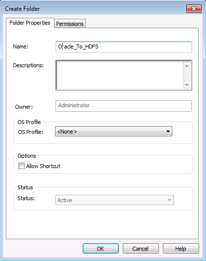
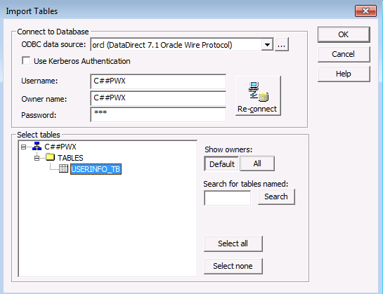
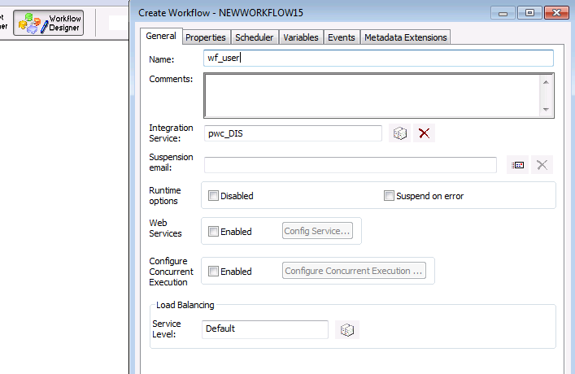
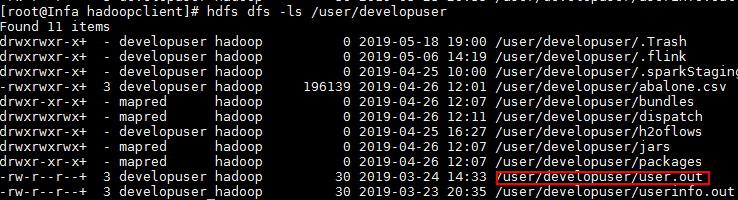

# Connection Instruction Between Informatica PowerCenter and FusionInsight HD

## Succeeded Case

> Informatica PowerCenter 10.2.0 <--> FusionInsight HD 6.5

## Environment Information

* Informatica Server 10.2.0 Linux
* Informatica PowerCenter Client 10.2.0
* Oracle database 11g
* FusionInsight HD client

## Architecture
* One Linux machine, installed with Informatica Server and FusionInsight HD client
* One Windows machine, installed with Informatica PowerCenter Client


### Install and config FusionInsight HD client
  * Install the FusionInsight client，installation path is `/opt/hadoopclient`

  * Create a user from FusionInsight HD manager，refer to <FusionInsight HD Administrator Guide>. For example, create a user named developuser，and assign him all rights for HDFS and Hive. Download the keytab file, put krb5.conf file to the `/opt/` path of client node.

### Install Oracle database and Informatica Server

  * create user oracle，install oracle database
  * create user infa,login to oracle use `sqlplus / as sysdba`, run the following sql
    ```sql
    create tablespace rep_data datafile '/u01/app/oracle/oradata/orcl/rep_data_01.dbf' size 512m ;
    create user pwc_user identified by pwc_user default tablespace rep_data temporary tablespace temp;
    create user mdl_user identified by mdl_user default tablespace rep_data temporary tablespace temp;
    create user domain_user identified by domain_user default tablespace rep_data temporary tablespace temp;
    grant dba to  domain_user,pwc_user,mdl_user;
    ```
  * Get Informatica Server installation package and upload to server node, run`./install.sh` as user infa, the installation path is `/home/infa/Informatica/10.2.0`.
  * Visit ip:6008 in a browser, open the Administrator tool, input the user name and password.

### Informatica Server configuration
  * Create PowerCenter Repository Service
    - In Services and Nodes, right click domain, Create a PowerCenter Repository Service

      
    - Set Name and node, next

      
    - Set database information, finish

      

    - Enable the Repository Service,and create contents

      

    - In repository Properties, set the Operating Mode to Mormal, and recycle the service

      

  * Create PowerCenter Integration Service
    - In Services and Nodes, right click domain, Create a PowerCenter Integration Service

      
    - Set Name and node, next

      
    - Set Repository information, finish，enable the service

      

  * Create developuser in infa server
    - InSecurity tab, create a user, named as developuser，the same as user in Hadoop cluster

      

    - Edit the user privileges and groups

      

      

  * Infa Server configuration for Hadoop
    - Copy `krb5.conf` file in `/opt` to `/etc` and `${INFA_HOME}java/jre/lib/security/`, and give the read right to user infa.
    - Login to node as user infa, create a directory for the configuration file, such as`/opt/pwx-hadoop/conf`
    - Get the follwoing configuration fie from FusionInsight HD client, put them into `/opt/pwx-hadoop/conf` and change the file right to 775

      
    - Do Kerberos authentication, and set cache,the infa user should have read and write rights for the cache file
      ```
      source /opt/hadoopclient/bigdata_env
      kinit -c /home/infa/krb5cc_developuser developuser
      ```
    - Edit the `core-site.xml` file in `/opt/pwx-hadoop/conf` add the following property
      ```
      <property>
      <name>hadoop.security.kerberos.ticket.cache.path</name>
      <value>home/infa/krb5cc_developuser</value>
      <description>Path to the Kerberos ticket cache. </description>
      </property>
      ```
    - In Administrator tool, add an Environment variable for `pwc_DIS`, recycle the service

      

    - delete jar files related to hive in
      `/home/infa/Informatica/10.2.0/services/shared/hadoop/hortonworks_2.5/lib/`and copy jar files related to hive in`/opt/hadoopclient/Hive/Beeline/lib`to the path, change the file rights

      ```
        rm -f /home/infa/Informatica/10.2.0/services/shared/hadoop/hortonworks_2.5/lib/hive*
        cp /home/infa/Informatica/10.2.0/services/shared/hadoop/hortonworks_2.5/lib/hive* /home/infa/Informatica/10.2.0/services/shared/hadoop/hortonworks_2.5/lib
        chown infa:oinstall /home/infa/Informatica/10.2.0/services/shared/hadoop/hortonworks_2.5/lib/hive*
      ```

## PowerCenter Client configuration
### PowerCenter Repository Manager configuration
  - Get PowerCenter Client installation package,install PowerCenter Client,start PowerCenter Repository Manager, in tool bar, choose `Repository->Configure domain`,input the domain information, then we can see the repository created before.

      

      

  - Double click the repository, input user name and password, connect

      

  - In folder, create a folder

      

      

### PowerCenter Designer configuration
  - Open PowerCenter Designer, right click the folder, click open

      
  - Click tool bar, Sources->import from databases，create a system DSN in ODBC source,choose Oracle Driver,input database information.

      

      

      

      
    - Choose the data source created just now, input database user name and password, connect, get the table in the database

      
    - Choose target designer，drag in the table in sources

      
    - Double click the table, set database type to Flat File

      

    - In mapping configuration, create a new mapping, drag in the source and target table and link them

      

### PowerCenter Workflow Manager
  - In tool bar Task, create a new task,name it and choose the mapping created just now

      

      

  - Create a workflow, drag in the task, link them

      

      

  - In tool bar connection, create a application connection, choose Hadoop HDFS Connection

      

      ```
      HDFS Connection URI：hdfs://namenodeip:25000
      Hive URL : jdbc:hive2://172.16.4.21:21066/default;sasl.qop=auth-conf;auth=KERBEROS;principal=hive/hadoop.hadoop.com@HADOOP.COM;user.keytab=/opt/user.keytab;user.principal=developuser
      Hive User Name: developuser
      ```

      

  - Double click the task created, in mapping tab, click `Targets`, set the Writers to `HDFS Flat Write`, set connection value to the connection created just now

      

  - In properties, config as following

      

  - Save the workflow, right click, start the workflow

      

  - Open PowerCenter Workflow Monitor, the run information is shown.

      

  - In HDFS, check if the data is uploaded.

       

  - In the task properties, choose `Generate And Load Hive Table`,`Overwrite Hive Table`,input the table created in hive, start workflow

       

  - Open PowerCenter Workflow Monitor, the run information is shown.

      

  - In Hive, check if the data is loaded into the table

      
