# Kettle对接FusionInsight

## 适用场景

> Kettle 6.1  <--> FusionInsight HD V100R002C60U10
>
> Kettle 6.1  <--> FusionInsight HD V100R002C60U10
>
> Kettle 6.1  <--> FusionInsight HD V100R002C60U10


## 环境准备

###Linux平台

* 安装操作系统

  * 安装CentOS6.5 Desktop

  * 禁用防火墙，SELinux

  * 添加本地主机名解析

  * 使用`vi /etc/hosts`添加本地主机名解析
    ```
    162.1.115.89 kettle
    ```

* 安装FusionInsight HD客户端

  * 下载完整客户端，安装至目录`/opt/hadoopclient`

  * 使用`vi /etc/profile`编辑以下内容插入到文件末尾
    ```
    source /opt/hadoopclient/bigdata_env
    ```

  * 将krb5.conf放在/etc目录下
    ```
    cp /opt/hadoopclient/KrbClient/kerberos/var/krb5kdc/krb5.conf /etc/
    ```

### Windows平台

* 安装JDK8

  

* 配置系统环境变量
  ```
  JAVA_HOME= C:\\Program Files\\Java\\jdk1.8.0_112
  ```

* 在PATH环境变量添加 `%JAVA_HOME%\bin;%JAVA_HOME%\jre\bin;`

* 获取Kerberos配置文件

  在FI管理界面下载用户的认证凭据

  解压后得到Kerberos配置文件krb5.conf和用户密钥文件user.keytab

* 将krb5.conf文件复制`C:\Windows`目录下，重命名为krb5.ini

* 添加系统环境变量KRB5_CONFIG（可选步骤）
  ```
  KRB5_CONFIG=C:\Windows
  ```

## 配置并启动Kettle

* 从以下地址  [https://sourceforge.net/projects/pentaho/files/Data%20Integration/](https://sourceforge.net/projects/pentaho/files/Data%20Integration/) 下载Kettle6.1版本

* 解压得到data-integration目录

* 替换pentaho-big-data-plugin下的配置文件

  * 下载FusionInsightHD客户端并解压

  * 用解压目录下`Hive/jdbc-examples/conf/core-site.xml`文件

  * 替换`data-integration/plugins/pentaho-big-data-plugin/hadoop-configurations/hdp23`目录下的core-site.xml文件


* 替换Hive相关jar包

  将`data-integration/plugins/pentaho-big-data-plugin/hadoop-configurations/hdp23/lib`下的hive相关的jar包

  

  替换成Hive客户端下jdbc-examples/lib目录下的以下jar包

  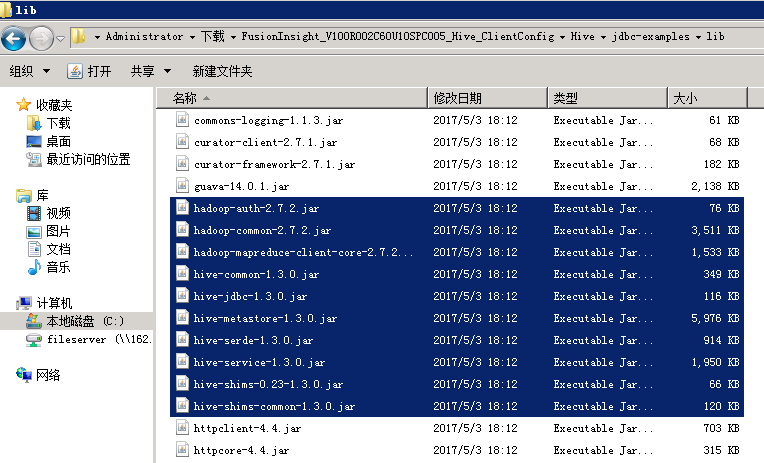

* 获取用户keytab文件

  * 在FI管理界面下载用户的keytab文件到本地


* Kerberos认证（可选步骤）

  在对接Hive时，可以使用本地缓存的认证票据，或者在jdbc URL中指定principal和keytab文件进行认证（对接HDFS时，只能使用本地缓存的票据）

  如果使用本地缓存的票据，需要在启动kettle前先完成认证。

  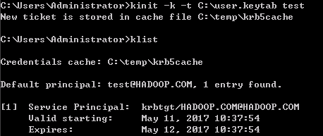

  > 使用本地缓存票据存在以下问题：kettle只在启动时读取一次票据，而不是连接时实时读取当前票据信息，所以当kettle启动时获取的票据过期以后，连接Hive会失败，必须重启kettle。

* 启动kettle

  * Linux平台

    VNC登录CentOS桌面，打开Terminal
    ```
    cd /opt/data-integration/
    ./spoon.sh
    ```

  * Windows平台

    双击data-integration目录下的Spoon.bat

## 对接Hive

### 创建Hive连接

* 选择 **文件** -> **新建** -> **转换**

* 点击 **主对象树** 页签，在页签中选择 **转换** -> **DB连接**，右键选择 **新建**

  

* 连接类型选择Hive 2，填写主机名、端口号、数据库名

  

* 点击左侧 **选项**，如果使用本地缓存票据，填写以下参数：

  

* 如果要在连接Hive时使用keytab文件认证，增加user.principal和user.keytab两个参数：

  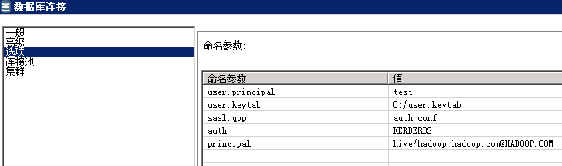

* 测试连接时，Hadoop版本选用HDP2.3

  

  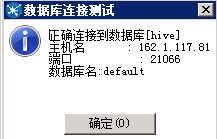

* 连接测试成功后，点击 **确认** 保存连接

### 读取Hive数据

以hive -> postgresql为例

* 将上面创建的转换保存为hive2postgres.ktr

* 创建postgresql连接

  

* 添加转换步骤

  在 **核心对象** 页签下，拖动 **输入** -> **表输入**，和 **输出** -> **表输出** 两个步骤到工作区，并连接这两个步骤。

  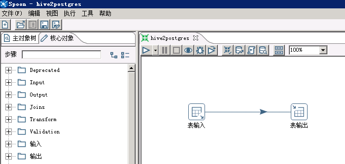

* 修改Hive表输入配置

  双击 **表输入** 步骤， **数据库连接** 选择前面创建的hive连接，点击 **获取SQL查询语句** ，选择需要导入的hive表

  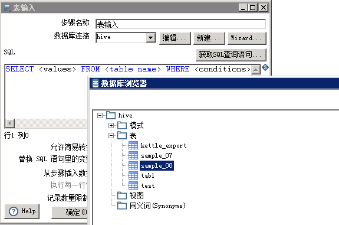

* 修改postgresql表输出配置

  双击 **表输出** 步骤，**数据库连接中** 选择前面创建的postgresql连接，点击 **获取目标表配置** 如下（需要先在postgresql数据库创建目标表）

  

* 运行转换

* 保存配置，点击 **执行** 按钮，选择 **本地执行**

  

  执行结果：

  

  postgresql数据库查看：

  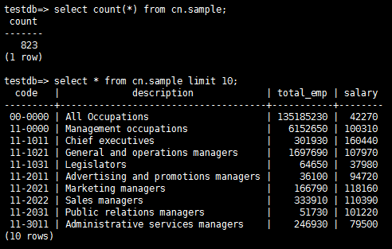

### 写入Hive数据

以oracle -> hive为例

* 添加Oracle JDBC Driver

  从[http://www.oracle.com/technetwork/database/features/jdbc/index-091264.html](http://www.oracle.com/technetwork/database/features/jdbc/index-091264.html)
  下载对应版本的jdbc Driver，放到`data-integration/lib`目录下，重启kettle

* 新建转换，保存为oracle2hive.ktr

* 创建Oracle连接

  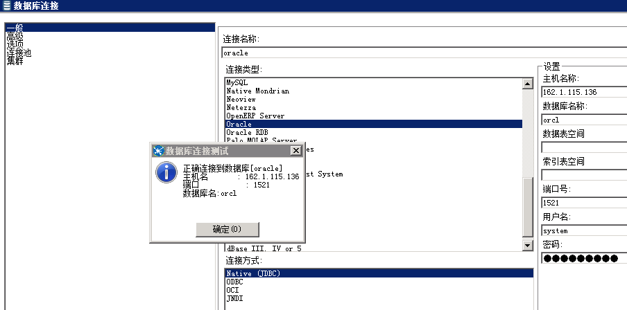

* 参考上面章节创建hive连接

* 创建待导入的Hive表
  ```sql
  CREATE TABLE IF NOT EXISTS kettle_export (
    id int,
    name string
  );
  ```

* 添加转换步骤

  

* 修改步骤配置

* Oracle表输入配置

  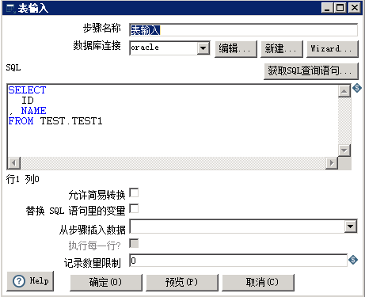

* Hive表输出配置

  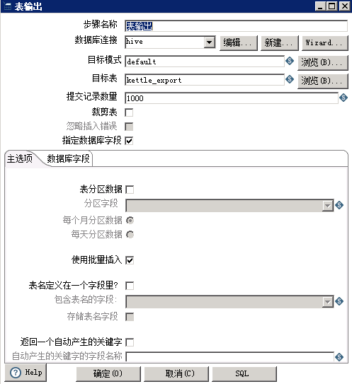

  

* 运行转换

  保存配置，点击 **执行** 按钮，选择 **本地执行**

  执行结果：向Hive表写入13条数据，用时4min+

  

  查看Hive表数据：

  

  

  > 说明：向Hive表中写入数据，每插入一条数据会起一个MR任务，所以效率特别低，不推荐用这种方式，可以将数据写入HDFS文件

## 对接HDFS

### 创建Hadoop Cluster

* 选择 **文件** -> **新建** -> **转换**，点击 **主对象树** 页签，在 **Hadoop
Clusters** 右键选择 **New Cluster**

  HDFS的Hostname填写NameNode主节点的IP，端口号是25000，如果NaneNode发生主备切换，需要修改IP

  JobTracker的Hostname 填写 Yarn ResourceManager主节点的IP，端口号是26004，如果ResourceManager发生主备切换，需要修改IP。

  

  点击 **测试**

  

  > kettle6.1不支持HDFS NameNode和Yarn ResourceManager的HA配置

### 导入HDFS文件

以postgresql -> HDFS为例

* 将上面创建的转换保存为postgres2hdfs.ktr

* 参考前面章节创建postgresql连接

* 添加转换步骤

  在 核心对象 页签下，拖动 **输入** -> **表输入** ，和 **Big Data** -> **Hadoop File Output** 两个步骤到工作区，并连接这两个步骤。

  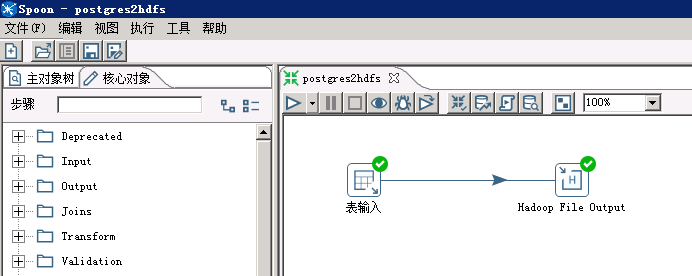

* 创建待导入的Hive表
  ```sql
    CREATE TABLE IF NOT EXISTS sample_kettle_hdfs_test (
    code string,
    description string,
    total_emp int,
    salary int
  )
  ROW FORMAT SERDE
  'org.apache.hadoop.hive.contrib.serde2.MultiDelimitSerDe' WITH
  SERDEPROPERTIES ("field.delim"="[,]")
  STORED AS TEXTFILE;
  ```

  > 如果数据中含有”,”，列分隔符不可以使用默认的”,”，本样例使用多字节分隔符”[,]”

* 修改postgresql表输入配置

  双击 **表输入** 步骤，**数据库连接** 选择前面创建的postgresql连接，点击 **获取SQL查询语句**，选择需要导入的表

  

* 修改Hadoop File Output配置

  双击 **Hadoop File Output** 步骤，在 **文件** 页签下，**Hadoop Cluster** 选择前面创建的集群，**Folder/File** 选择到hive表对应的hdfs目录，文件名可以任意指定

  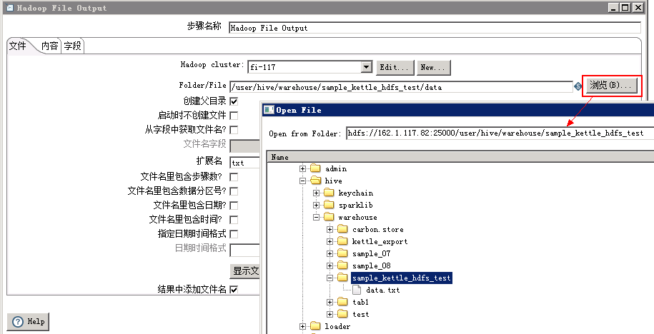

* 点击 **内容** 页签，分隔符设置与前面创建的Hive表相同，勾选 **快速数据存储（无格式）**（否则保存的文件中会按字段长度填充空格）

  

* 点击 **字段** 页签，获取字段

  

* 运行转换

  保存配置，点击 **执行** 按钮，选择 **本地执行** 。

* 执行结果：

  

* 查看导入的HDFS文件：

  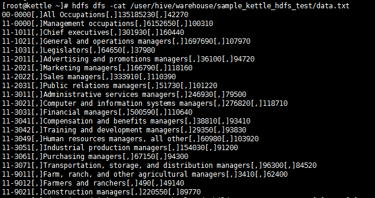

* 查看Hive表数据：

  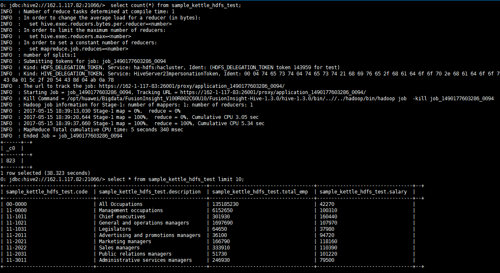

### 读取HDFS文件
以HDFS -> Excel为例

* 新建转换，保存为hdfs2excel.ktr

* 添加转换步骤

  在 **核心对象** 页签下，拖动 **Big Data** -> **Hadoop File Input**
  和 **输出** -> **Microsoft Excel 输出**，两个步骤到工作区，并连接这两个步骤。

  

* 修改 Hadoop File Input配置

  双击 **Hadoop File Input** 步骤，**文件** 页签，选择待导出的文件，文件类型支持CSV（txt也可以）和Fixed（固定列宽）

  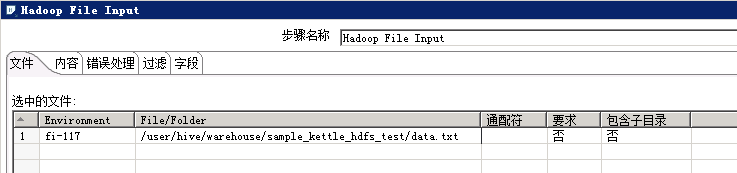

  点击 **内容** 页签，选择文件类型、分隔符、编码方式等

  

  点击 **字段** 页签，获取字段

  

  kettle会自动扫描文件中的字段类型和长度

  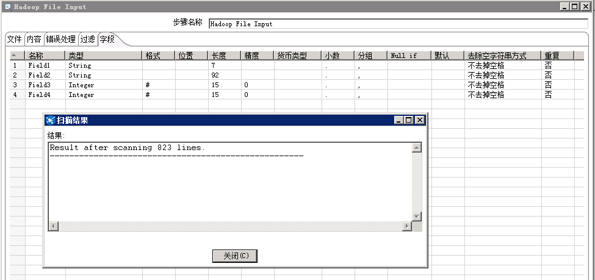

  可以手动修改字段名称和长度

  

  点击 **确定** 按钮，保存配置

* 修改Microsoft Excel输出配置

  双击 **Microsoft Excel 输出** 步骤，选择文件保存位置和文件名

  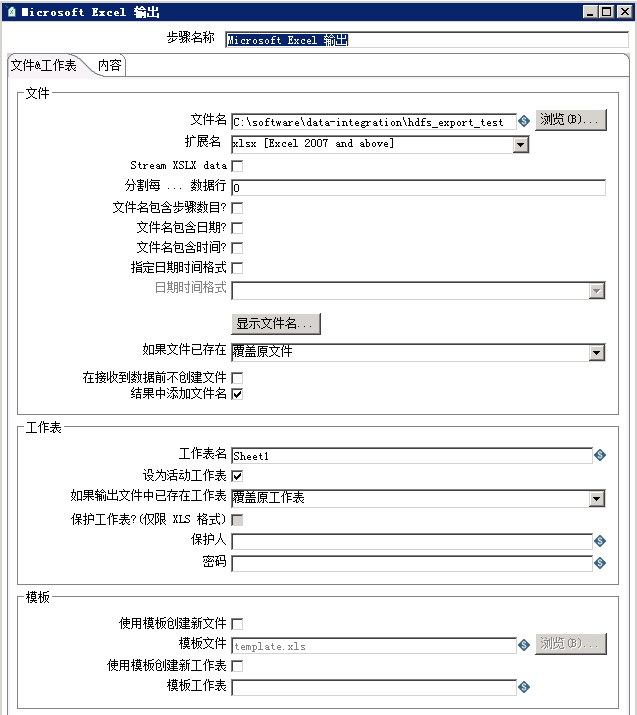

  点击 **内容** 页签，获取字段

  

* 运行转换

  保存配置，点击 **执行** 按钮，选择 **本地执行**

* 执行结果

  

* 查看导出的excel文件

  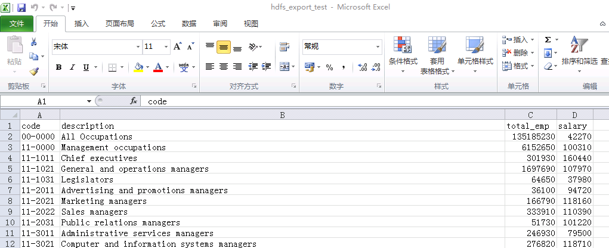
