# Kettle对接FusionInsight

## 适用场景

> Pentaho8.0.0  <--> FusionInsight HD V100R002C80SPC200
>
> 仅限POC使用 Pentaho8.1.0  <--> FusionInsight HD V100R002C80SPC200

## Windows平台

### 环境准备

* 安装JDK8

  

* 配置系统环境变量
  ```
  JAVA_HOME= C:\\Program Files\\Java\\jdk1.8.0_112
  ```

* 在PATH环境变量添加 `%JAVA_HOME%\bin;%JAVA_HOME%\jre\bin;`

* 获取Kerberos配置文件

  * 在FI管理界面下载集群用户的认证凭据，例如用户为`developuser`;

  * 解压后得到Kerberos配置文件krb5.conf和用户密钥文件user.keytab

* 将krb5.conf文件复制到本地某目录下，例如`C:`

## 配置并启动Kettle

* 软件获取
  打开以下地址[https://github.com/pentaho/pentaho-kettle/tree/8.0] (https://github.com/pentaho/pentaho-kettle/tree/8.0), 选择DownloadZip下载Kettle8.0版本

  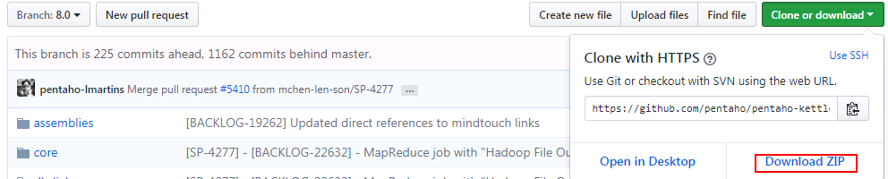

  * 解压得到pdi-ce-8.0.0.0-28;
  * 获取FusionInsight的适配包文件`pentaho-hadoop-shims-hdp26-8.1.0.0-SNAPSHOT.jar`和`pentaho-hadoop-shims-hdp26-hbase-comparators-8.1.0.0-SNAPSHOT.jar`,替换目录 `\data-integration\plugins\pentaho-big-data-plugin\hadoop-configurations\hdp26\` 下的原有文件;
  * 替换hdp26\lib目录下Hive相关的jar包以及hdp26\lib\client目录下hdfs相关的jar包

  

  

* 获取FusionInsightHD客户端配置文件

  * 下载FusionInsightHD客户端并解压

  * 解压后，进入HDFS，Hive，Hbase等组件的config目录，找到如下的配置文件，复制到Fi28适配包的文件夹里;

    

    修改core-site.xml文件中以下字段：
    ```
    <name>fs.defaultFS</name>
    <value>hdfs://hacluster</value>
    ```

* 获取用户keytab文件及配置

  * 在FI管理界面下载用户的keytab文件到本地
  * 修改Fi28适配包中`config.properties`文件:

    `pentaho.authentication.default.kerberos.keytabLocation=C:/kerberos/user.keytab`
    `pentaho.authentication.default.kerberos.conf=C:/kerberos/krb5.conf`
    `pentaho.authentication.default.kerberos.principal=developuser@HADOOP.COM`

* 启动kettle

  * Windows平台

    双击data-integration目录下的Spoon.bat,进入界面后，在上方菜单栏选择工具->Hadoop Distribution,选择`HortonWorks HDP 2.6.x`

### 对接Hive

#### 创建Hive连接

* 选择 **文件** -> **新建** -> **转换**

* 点击 **主对象树** 页签，在页签中选择 **转换** -> **DB连接**，右键选择 **新建**

* 为连接命名，连接类型选择Hive 2，填写主机名、端口号、数据库名

  

* 点击左侧 **选项**，填写以下参数：

  

* 点击测试，显示以下窗口，表明测试成功

  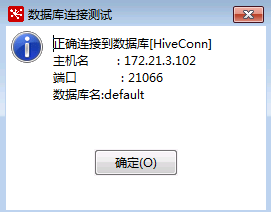

* 连接测试成功后，点击 **确认** 保存连接

#### 读取Hive数据

* 添加转换步骤

  在 **核心对象** 页签下，拖动  **表输入** 和 **文本文件输出** 两个步骤到工作区，并连接这两个步骤;

  

* 修改Hive表输入配置

  双击 **表输入** 步骤， **数据库连接** 选择前面创建的hive连接，点击 **获取SQL查询语句** ，选择需要导入的hive表

  

  选择`是`,该表的字段将会包含在SQL语句中，

  

  可以点击`预览`，并选择行数，预览Hive表中的数据

* 修改文本文件输出配置

  在文件选项卡中，设置输出文件名称，扩展名：

  

  在内容选项卡中，设置文件输出时属性
  

  在字段选项卡中，点击`获取字段`，获得文件字段内容，可以点击`最小宽度`,使字段宽度最小
  

  点击`确定`,保存设置。

* 运行转换，在主界面点击工具栏左侧的三角形运行按钮

  

  执行结果：

  

#### 写入Hive数据

以本地文本文件 -> hive为例

* 新建转换，保存为hive_out.ktr

* 添加转换步骤，将文本文件输入和表输出两个步骤拖入工作区，连接两个步骤;

  

* 双击文本文件输入，在文件选项卡中，点击`浏览`，选择需要上传的本地文件，点击`添加`，文件被添加至下方选中的文件;

  

  在内容选项卡中，设置文件类型、分隔符、限定符、编码等等

  

  在字段选项卡中，点击`获取字段`，获得字段后，可以点击`Minimal Width`使字段宽度最小

  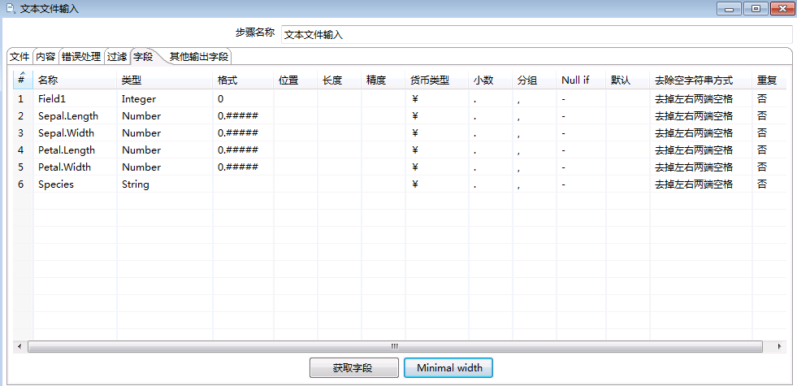

  点击`确定`,保存配置。

* 双击表输出，参考上面章节创建hive连接

  设置目标表，该表需要已经在Hive中创建好，并且字段与本地文件保持一致;

  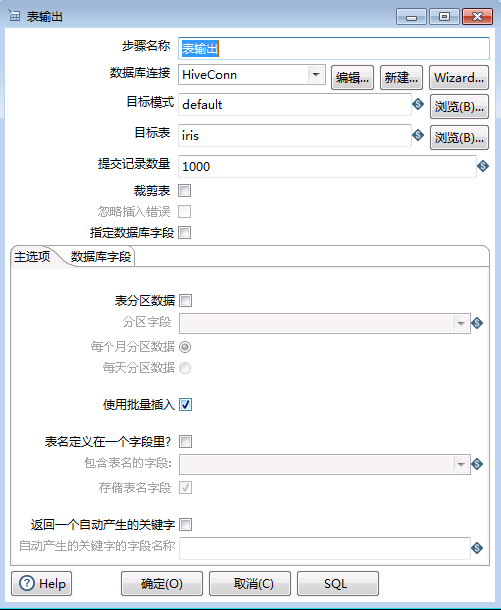

* 运行转换

  保存配置，点击 **执行** 按钮，

  执行结果：向Hive表写入10条数据，用时2min+

  

  查看Hive表数据：

  

  > 说明：向Hive表中写入数据，每插入一条数据会起一个MR任务，所以效率特别低，不推荐用这种方式，可以将数据写入HDFS文件之后再载入Hive表

### 对接HDFS

#### 创建Hadoop Cluster

* 选择 **文件** -> **新建** -> **转换**，点击 **主对象树** 页签，在 **Hadoop
Clusters** 右键选择 **New Cluster**

  * HDFS的Hostname填写hacluster;
  * JobTracker的Hostname 填写 Yarn ResourceManager主节点的IP，端口号是21066,如果ResourceManager发生主备切换，需要修改IP;
  * ZooKeeper的Hostname 填写ZooKeeper的主节点IP，端口号是24002，如果ResourceManager发生主备切换，需要修改IP;
  * Oozie的URL填写oozie WebUI的地址.

  

  点击 **测试**

  

#### 导入HDFS文件

以本地文件 -> HDFS为例

* 添加转换步骤

  在 `核心对象` 页签下，拖动 **输入** -> **文本文件输入** ，和 **Big Data** -> **Hadoop File Output** 两个步骤到工作区，并连接这两个步骤。

  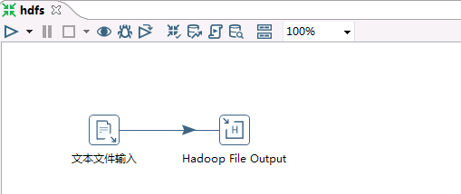

* 文本文件输入配置参考上面章节配置

* 修改Hadoop File Output配置

  双击 **Hadoop File Output** 步骤，在 **文件** 页签下，**Hadoop Cluster** 选择前面创建的集群，**Folder/File** 选择hdfs目录，文件名可以任意指定

  

* 点击 **内容** 页签，设置分隔符，勾选 **快速数据存储（无格式）**（否则保存的文件中会按字段长度填充空格）

  

* 点击 **字段** 页签，获取字段，并设置最小宽度

  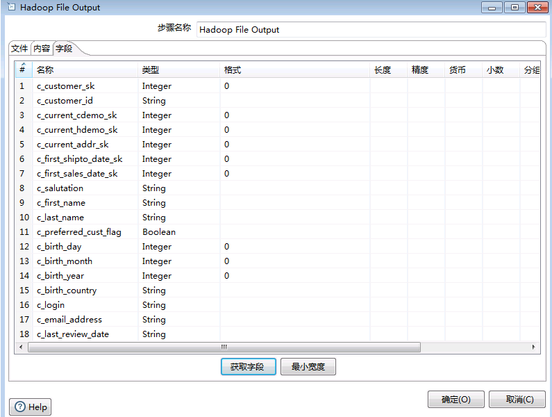

* 运行转换

  保存配置，点击 **执行** 按钮。

* 执行结果：

  

  查看HDFS文件

  

#### 读取HDFS文件
以HDFS -> Excel为例

* 新建转换，保存为hdfs2excel.ktr

* 添加转换步骤

  在 **核心对象** 页签下，拖动 **Big Data** -> **Hadoop File Input**
  和 **输出** -> **Microsoft Excel 输出**，两个步骤到工作区，并连接这两个步骤。

  

* 修改 Hadoop File Input配置

  双击 **Hadoop File Input** 步骤，**文件** 页签，选择待导出的文件，文件类型支持CSV（txt也可以）和Fixed（固定列宽）

  

  点击 **内容** 页签，选择文件类型、分隔符、编码方式等

  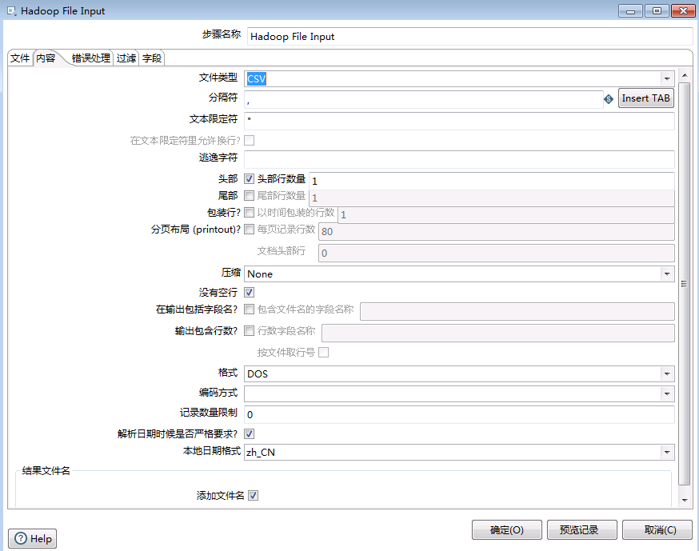

  点击 **字段** 页签，获取字段

  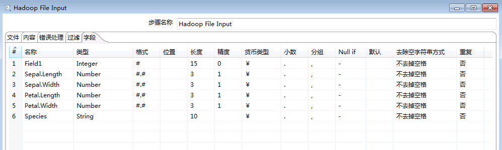

  点击 **确定** 按钮，保存配置

* 修改Microsoft Excel输出配置

  双击 **Microsoft Excel 输出** 步骤，选择文件保存位置和文件名

  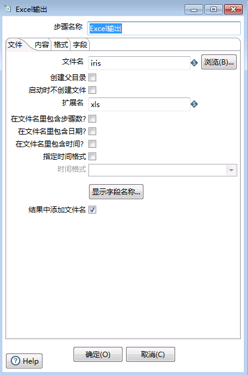

  点击 **字段** 页签，获取字段

  

* 运行转换

  保存配置，点击 **执行** 按钮，启动转换

* 执行结果

  

* 查看导出的excel文件

  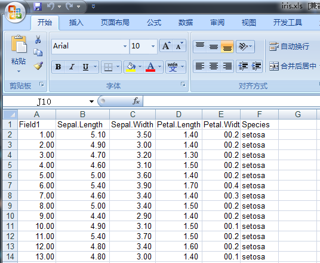

### 对接HBase

####导入HBASE文件

以本地文件 -> HBase为例

* 添加转换步骤

  在 `核心对象` 页签下，拖动 **输入** -> **文本文件输入** ，和 **Big Data** -> **HBase Output** 两个步骤到工作区，并连接这两个步骤。

  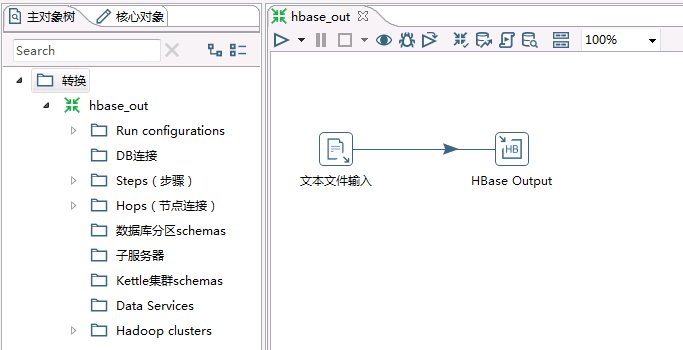

* 文本文件输入配置参考上面章节配置，注意在集群HBase中要有和导入的表相同的空表，指明字段和列簇.

* 修改 **HBase Output** 配置

  双击 **HBase Output** 步骤，在 **Configure connection** 页签下，选择已经配置好的Hadoop集群，点击`Get table name`，获取要输出的表,点击`Get mapping for specified table`获取该表对应的mapping.

  

* 若该表没有创建mapping,在 **Create/Edit Mappings** 页签创建mapping,指定各项属性

  

  点击 **确定** ，保存配置

* 运行转换

  保存配置，点击 **执行** 按钮,启动转换

* 执行结果：

  

  查看集群中的HBase文件

  执行
  ```
  hbase shell
  count 'customer'
  ```
  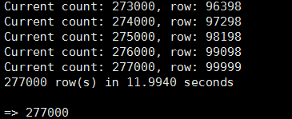


####读取HBASE文件
以HBase -> 文本文件为例

* 新建转换，保存为hbase.ktr

* 添加转换步骤

  在 **核心对象** 页签下，拖动 **Big Data** -> **HBase Input**
  和 **输出** -> **文本文件输出**，两个步骤到工作区，并连接这两个步骤。

  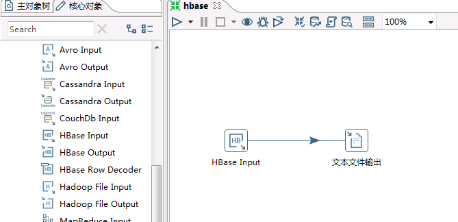

* 修改 HBase Input配置

  双击 **HBase Input** 步骤，在 **Configure query** 页签，选择已经连接好的Hadoop集群，若无已经连接的集群，点击`new`,参照上面章节Hadoop集群配置，配置连接集群;

  

  在 **Create/Edit Mappings** 页签，点击`Get table names`,获取集群中的Hbase表，选择要读取的表，在`Mapping name`下拉选择与该表关联的map，若没有，自定义一个map的名字，填写字段和列簇，并指定字段是否为key，字段类型.

  

  回到 **Configure query** 页签,点击`Get mapped table names`,选择要读取的表，点击`Get mappings for the specified table`获取该表对应的mapping，点击右下角`Get Key/Feilds Info`，获取对应的表的信息.

  

  点击 **确定** 按钮，保存配置

* 修改文本文件输出配置

  双击 **文本文件输出** 步骤，在 **文件** 页签，填写文件名和扩展名;

  

  点击 **字段** 页签，点击`获取字段`,设置最小宽度(可选)

  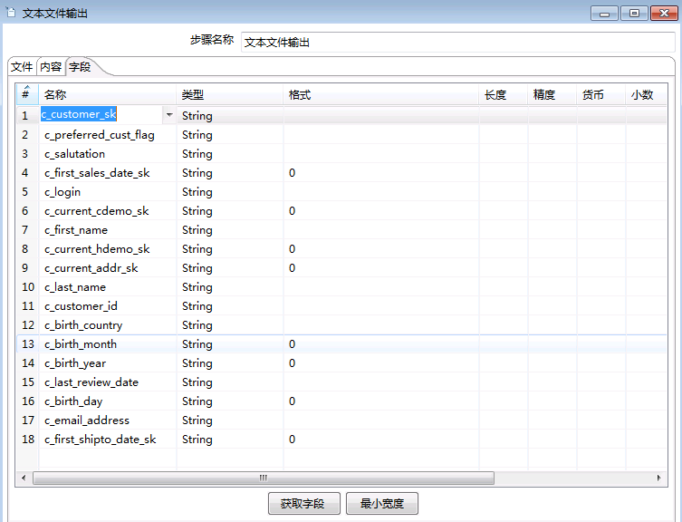

  点击 **确定** 按钮，保存配置

* 运行转换

  保存配置，点击 **执行** 按钮，启动转换

* 执行结果

  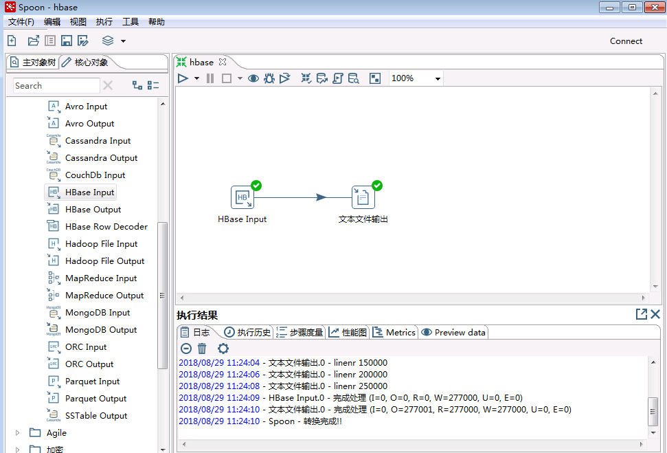

* 查看导出的文件

  


##Linux平台

###环境准备

* 安装操作系统

  * 安装RedHat 6.5

  * 禁用防火墙，SELinux

  * 添加本地主机名解析

  * 使用`vi /etc/hosts`添加本地主机名解析
    ```
    节点IP host1
    节点IP host2
    节点IP host3
    ```
>若是桌面版操作系统，Kettle对接参照上面章节Windows系统下的对接方式.

* 参考上面章节，在有图形界面的操作系统下，配置好Kettle与Fi集群的连接，测试连通性,将Kettle的`data-integration`目录以及其下所有文件上传至Linux系统的`opt`目录下.

* 安装FusionInsight HD客户端

  * 下载完整客户端，安装至目录`/opt/hadoopclient`

  * 使用`vi /etc/profile`编辑以下内容插入到文件末尾
    ```
    source /opt/hadoopclient/bigdata_env
    ```

  * 将krb5.conf放在/etc目录下
    ```
    cp /opt/hadoopclient/KrbClient/kerberos/var/krb5kdc/krb5.conf /etc/
    ```

###Hive对接

####导出Hive表
以Hive->文本文件为例

  * 在有图形界面的操作系统中，新建一个转换，在工作区中放入 `表输入` 和 `文本文件输出` ，保存为hive.ktr;

  * 点击`表输入`，参考上面章节中关于Hive连接的配置，只需修改连接选项中`user.keytab`文件所在路径，修改为`/etc/user.keytab`

  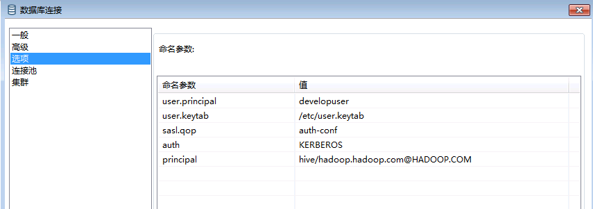

  * 将hive.ktr转换文件上传至Linux系统下Kettle的`data-integration`文件夹下，执行以下脚本清除cache（参见FAQ1）

    ```
    sed -i "s/^org.pentaho\.clean\.karaf\.cache=false/org\.pentaho\.clean\.karaf\.cache=true/g" /opt/data-integration/system/karaf/etc/custom.properties
    ```
    >可将其保存为脚本文件，每次执行命令前先执行该脚本

  * 根据Kettle版本执行以下命令
    ```
    cd /opt/data-integration/
    ```

    对于Kettle-8.0版本,执行

      ```
      ./kitchen.sh -file=hive.ktr
      ```
      对于Kettle-8.1版本,执行

      ```
      ./pan.sh -file=hive.ktr
      ```
  * 执行结果如下

    

  * 导出的表在`data-integration/`目录下

####上传文件至Hive

  * 同Windows操作系统下创建ktr文件操作，在选择需要上传的文件时，修改本地文件的路径，在Hive连接选项配置修改中`user.keytab`文件的路径为`/etc/user.keytab`即可，将ktr文件置于Linux系统中`data-integration`文件夹下，执行命令同上小节中操作。

####HDFS & HBase文件输出

* 将上面章节创建的ktr转换文件上传至Linux系统下Kettle的`data-integration`文件夹下，根据Kettle版本执行命令(同hive)即可

* 执行结果如下

  

* 导出的表在`data-integration/`目录下

####上传文件至HDFS & HBase
  同`上传文件至Hive`操作，修改本地文件路径即可。

##FAQ
  * 1.在Linux系统中，每执行一次转换或者任务，Kettle都会生成一些Cache文件，在执行下一次转换/任务之前，需要清除这些Cache，否在HDFS Hive 和HBase进行连接传输时会出错

    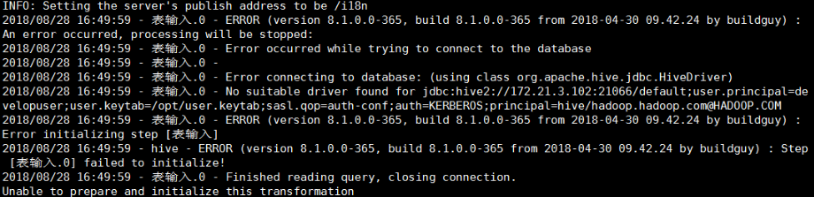
