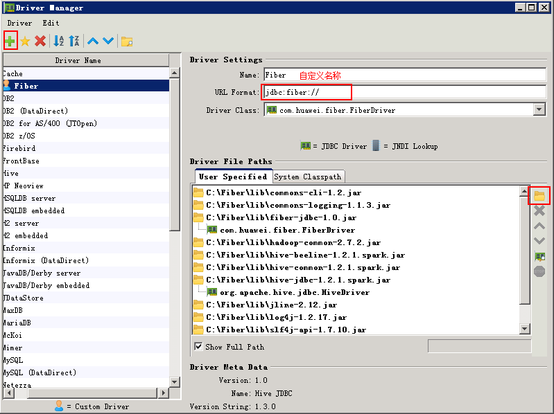
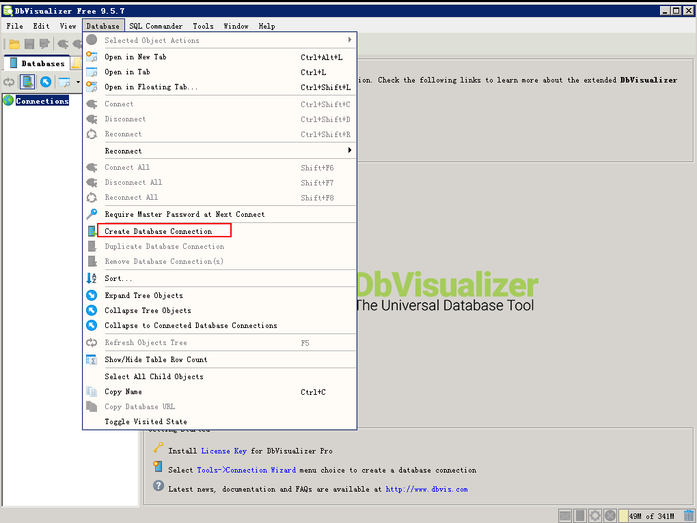
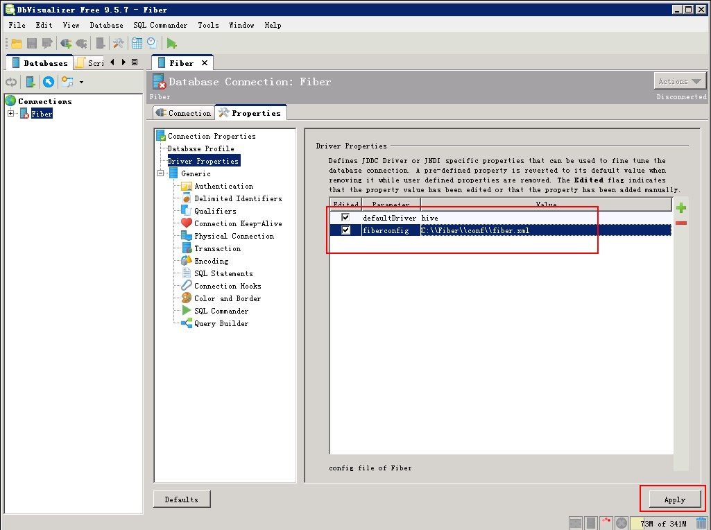
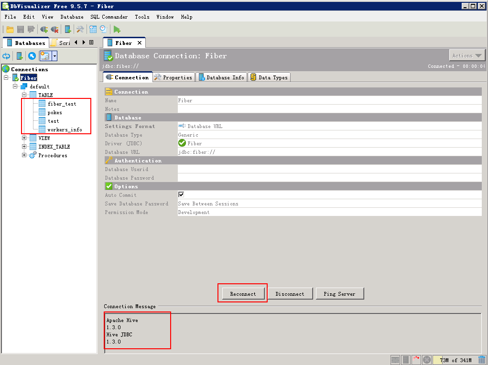
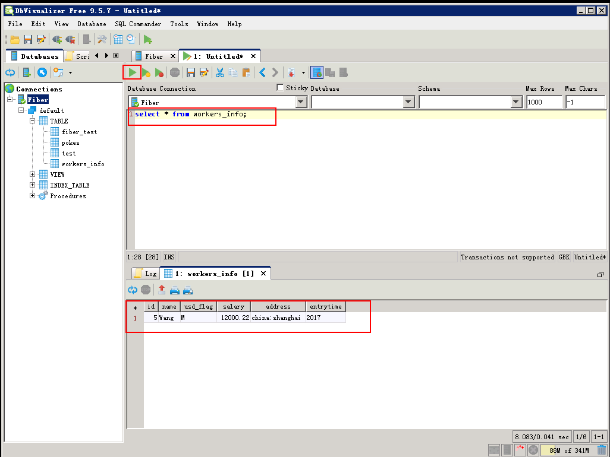
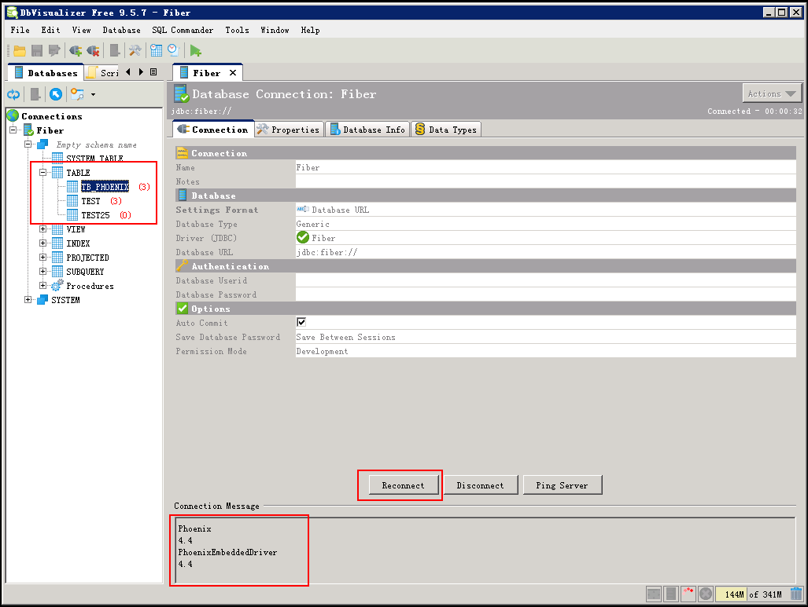

# DbVisualizer对接FusionInsight

## 适用场景

> DbVisualizer 9.5.7 <-> FusionInsight HD V100R002C60U20
>
> DbVisualizer 10.0.1 <-> FusionInsight HD V100R002C70SPC200

## 说明

SQL开发工具，如DbVisualizer、DBeaver、Squirrel是数据库开发的常用选择，虽然这些工具大多不提供原生Hive、SparkSQL、Phoenix的支持，但是通过它们支持的自定义JDBC的能力，我们可以与FusionInsignt提供的Fiber组件的JDBC接口进行对接，实现这Hive、SparkSQL、Phoenix组件的统一SQL查询。

* Fiber架构图

  

本文介绍了DbVisualizer与FusionInsight的Fiber对接的操作步骤

## DbVisualizer安装

* DbVisualizer9.5.7需要jdk1.8，下载安装jdk1.8，配置环境变量。

* 参考FusionInsight产品文档安装FusionInsight客户端，位置`/opt/hadoopclient`

* 修改C:\Windows\System32\drivers\etc\hosts文件，加入FusionInsight集群信息

  

* 在本地PC机上新建一个目录，将FusionInsight客户端下的fiber客户端文件夹Fiber拷贝至本地，例如C:\Fiber。

* 参考FusionInsight产品文档创建用户test，并赋予足够的权限，下载test的keytab文件user.keytab，拷贝到`C:\Fiber\conf\`文件夹下。

* 将FusionInsight客户端下jaas.conf文件和krb5.conf拷贝到`C:\Fiber\conf`目录下，文档内容如下，principal和keytab按实际填写：
  ```
  Client {
  com.sun.security.auth.module.Krb5LoginModule required
  useKeyTab=true
  keyTab="C:\\Fiber\\conf\\user.keytab"
  principal="test"
  useTicketCache=false
  storeKey=true
  debug=true;
  };
  ```

* 修改fiber.xml文件配置，位置`C:\Fiber\conf\fiber.xml`

  Hive的JDBC连接
  ```
  <jdbc>
    <identify>hive</identify>
    <describe>hive jdbc configuration</describe>
    <driverClass>org.apache.hive.jdbc.HiveDriver</driverClass>
    <securityClass>com.huawei.fiber.DefaultAuthenticationCallback</securityClass>
    <classPath>C:\\Fiber\\Hive\\config;C:\\Fiber\\Hive\\Beeline\\lib;C:\\Fiber\\Hive\\Beeline\\conf</classPath>
    <jdbcUrl>jdbc:hive2://162.1.93.103:24002,162.1.93.102:24002,162.1.93.101:24002/;serviceDiscoveryMode=zooKeeper;zooKeeperNamespace=hiveserver2;sasl.qop=auth-conf;auth=KERBEROS;principal=hive/hadoop.hadoop.com@HADOOP.COM;user.principal=test;user.keytab=C:/Fiber/conf/user.keytab</jdbcUrl>
    <properties>
      <property>
        <name>java.security.krb5.conf</name>
        <value>C:\\Fiber\\conf\\krb5.conf</value>
      </property>
      <property>
        <name>java.security.auth.login.config</name>
        <value>C:\\Fiber\\conf\\jaas.conf</value>
      </property>
      <property>
        <name>zookeeper.server.principal</name>
        <value>zookeeper/hadoop.hadoop.com</value>
      </property>
      <property>
        <name>zookeeper.kinit</name>
        <value>C:\\Program Files (x86)\\Java\\jdk1.8.0_112\\jre\\bin\\kinit.exe</value>
      </property>
    </properties>
  </jdbc>
  ```

  Spark的JDBC连接
  ```
  <jdbc>
    <identify>spark</identify>
    <describe>spark jdbc configuration</describe>
    <driverClass>org.apache.hive.jdbc.HiveDriver</driverClass>
    <securityClass>com.huawei.fiber.DefaultAuthenticationCallback</securityClass>
    <classPath>C:\\Fiber\\Spark\\spark\\conf;C:\\Fiber\\Spark\\spark\\lib</classPath>
    <jdbcUrl>jdbc:hive2://ha-cluster/default;saslQop=auth-conf;auth=KERBEROS;principal=spark/hadoop.hadoop.com@HADOOP.COM;user.principal=test;user.keytab=C:/Fiber/conf/user.keytab</jdbcUrl>
    <properties>
      <property>
        <name>java.security.krb5.conf</name>
        <value>C:\\Fiber\\conf\\krb5.conf</value>
      </property>
      <property>
        <name>java.security.auth.login.config</name>
        <value>C:\\Fiber\\conf\\jaas.conf</value>
      </property>
      <property>
        <name>zookeeper.server.principal</name>
        <value>zookeeper/hadoop.hadoop.com</value>
      </property>
      <property>
        <name>zookeeper.kinit</name>
        <value>C:\\Program Files (x86)\\Java\\jdk1.8.0_112\\jre\\bin\\kinit.exe</value>
      </property>
    </properties>
    </jdbc>
  ```

  Phoenix的JDBC连接，需要增加属性 **hbase.myclient.keytab** 和 **hbase.myclient.principal**
  ```
  <jdbc>
    <identify>phoenix</identify>
    <describe>phoenix jdbc configuration</describe>
    <driverClass>org.apache.phoenix.jdbc.PhoenixDriver</driverClass>
    <securityClass>com.huawei.fiber.DefaultAuthenticationCallback</securityClass>
    <classPath>C:\\Fiber\\HBase\\hbase\\lib;C:\\Fiber\\HBase\\hbase\\conf</classPath>
    <jdbcUrl>jdbc:phoenix:162.1.93.101,162.1.93.102,162.1.93.103:24002:/hbase</jdbcUrl>
    <properties>
      <property>
        <name>java.security.krb5.conf</name>
        <value>C:\\Fiber\\conf\\krb5.conf</value>
      </property>
      <property>
        <name>java.security.auth.login.config</name>
        <value>C:\\Fiber\\conf\\jaas.conf</value>
      </property>
  <property>
        <name>hbase.myclient.keytab</name>
        <value>C:\\Fiber\\conf\\user.keytab</value>
      </property>
  <property>
        <name>hbase.myclient.principal</name>
        <value>test</value>
      </property>
      <property>
        <name>zookeeper.server.principal</name>
        <value>zookeeper/hadoop.hadoop.com</value>
      </property>
      <property>
        <name>zookeeper.kinit</name>
        <value>C:\\Program Files (x86)\\Java\\jdk1.8.0_112\\jre\\bin\\kinit.exe</value>
      </property>
    </properties>
  </jdbc>
  ```

* 将Hive、Spark、Phoenix的JDBC配置中classPath中的文件拷贝至Fiber文件夹中。

  

* 下载DbVisualizer，地址：<http://www.dbvis.com/download/>，下载软件dbvis_windows-x64_9_5_7_jre.exe

  

* 双击dbvis_windows-x64_9_5_7_jre.exe安装

  

  

  

  

  

  

  

  

  

## DbVisualizer连接Fiber

配置DbVisualizer通过Fiber连接FusionInsight的Hive、Spark、Phoenix组件。

* 打开DbVisualizer9.5.7，点击 **Cancel**

  

* 菜单栏选择 **ToolsDriver Manager**

  

* 新建driver

  * Name：Fiber(自定义)

  * URL Format：jdbc:fiber://

  * User Specified：将C:\Fiber\lib\下所有的jar包加入

  * Driver Class：加入jar包后选择com.huawei.fiber.FiberDriver

  

  菜单栏 **Database** -> **Create Database Connection**

  

  选择 **Use Wizard**

  {width="4.2in" height="1.4in"}

  自定义连接名称，例如Fiber

  

  选择Driver Fiber

  

  填写URL：jdbc:fiber://

  

  点击 **Finish**

  

## 查询Hive表数据

* 打开 **Properties** 面板，填写defaultDriver和fiberconfig属性，点击 **Apply** 。

  

* 打开 **Connection** 面板，点击 **Connect** 按钮，可以在左侧看到hive数据表。

  

* 菜单栏选择 **File** -> **New SQL Commander** ，编辑SQL，点击 **执行** 按钮，查看查询结果。

  

## 查询SparkSQL中的数据

* 将defaultDriver切换为spark：将 **Properties** 中的defaultDriver值改为spark，点击 **Apply** 。

  

* 打开Connection面板，点击 **Reconnect** ，连接成功，可以看到SparkSQL中的数据表。

  

* 菜单栏选择 **File** -> **New SQL Commander**，编辑SQL，点击 **执行** 按钮，查看查询结果。

  

## 查询Phoenix中的数据

* 将defaultDriver切换为phoenix，将 **Properties** 中的defaultDriver值改为phoenix，点击 **Apply** 。

  

* 打开 **Connection** 面板，点击 **Reconnect**，连接成功，可以看到phoenix数据表

  

* 查看phoenix表TB_PHOENIX中的数据。

  

* 菜单栏选择 **File** -> **New SQL Commander**，编辑SQL，点击 **执行** 按钮，查看查询结果。

  

## Phoenix的增加删除更新数据

> Phoenix的增加删除更新数据，需要在Fiber中hbase的配置文件hbase-site.xml中加入如下参数，否则不会自动Commit

* 修改Hbase-site.xml文件，位置`C:\Fiber\HBase\hbase\conf\hbase-site.xml`，然后重启DbVisualizer。
  ```
  <property>
    <name>phoenix.connection.autoCommit</name>
    <value>true</value>
  </property>
  ```

  

* Phoenix表增加数据
  ```
  UPSERT into tb_phoenix(Id, Name,Company) values (104,'phoenix_user4','company4');
  select * from tb_phoenix;
  ```

  

* Phoenix表删除数据
  ```
  delete from tb_phoenix where id=104;
  select * from tb_phoenix;
  ```

  

* Phoenix表更新数据
  ```
  UPSERT into tb_phoenix(Id, Name,Company) values (102,'phoenix_user2_up','company2_up');
  select * from tb_phoenix;
  ```

  
