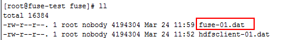

# FUSE对接FusionInsight HDFS

## 适用场景

> fuse 2.8.3 <-> FusionInsight HD V100R002C60U20（非安全模式）

## 说明

通过使用FUSE组件，可以使用将远端的HDFS文件系统mount到本端的Linux系统中使用

## 配置对接

* 安装jdk1.8
  ```
  tar -xvf jdk-8u112-linux-x64.tar.gz
  ```

* 配置环境变量`/etc/profile`，加入如下内容，source环境变量
  ```bash
  export JAVA_HOME=/opt/jdk1.8.0_112
  export CLASSPATH=.:$JAVA_HOME/lib/dt.jar:$JAVA_HOME/lib/tools.jar
  export PATH=$JAVA_HOME/bin:$PATH
  ```

  ```shell
  source /etc/profile
  ```


* 安装rpm包

  ```
  yum install fuse fuse-devel fuse-libs
  ```

* 安装FusionInsight客户端，具体请参见产品文档的 **安装客户端** 章节，例如客户端安装目录为`/opt/hadoopclient/`

* 下载Hadoop-2.7.2源码hadoop-2.7.2-src.tar.gz，编译fuse_dfs，将编译好的fuse_dfs拷贝到/opt目录下

* 将源码下的fuse_dfs_wrapper.sh脚本拷贝至`/opt`目录下，并根据实际情况作如下修改(修改HADOOP_PREFIX和JAVA_HOME的配置)：
  ```bash
  export HADOOP_PREFIX=/opt/hadoopclient/HDFS/hadoop
  if [ "$OS_ARCH" = "" ]; then
  export OS_ARCH=amd64
  fi

  if [ "$JAVA_HOME" = "" ]; then
  export  JAVA_HOME=/opt/jdk1.8.0_112
  fi

  if [ "$LD_LIBRARY_PATH" = "" ]; then
  export LD_LIBRARY_PATH=$JAVA_HOME/jre/lib/$OS_ARCH/server:$HADOOP_PREFIX/lib/native:/usr/local/lib
  fi

  # If dev build set paths accordingly
  if [ -d $HADOOP_PREFIX/share ]; then
    export HADOOP_PREFIX=$HADOOP_PREFIX
    for f in ${HADOOP_PREFIX}/share/hadoop/hdfs/*.jar ; do
      export CLASSPATH=$CLASSPATH:$f
    done
    for f in $HADOOP_PREFIX/share/hadoop/hdfs/lib/*.jar; do
      export CLASSPATH=$CLASSPATH:$f
    done
    for f in ${HADOOP_PREFIX}/share/hadoop/common/lib/*.jar; do
    export CLASSPATH=$CLASSPATH:$f
    done  

    for f in ${HADOOP_PREFIX}/share/hadoop/common/*.jar; do
    export CLASSPATH=$CLASSPATH:$f
    done

    export PATH=/opt:$PATH
    export LD_LIBRARY_PATH=$JAVA_HOME/jre/lib/$OS_ARCH/server:$HADOOP_PREFIX/lib/native:/usr/local/lib:$LD_LIBRARY_PATH
  fi

  fuse_dfs $@
  ```

* 更改文件权限

  ```
  chmod 755 fuse_dfs
  chmod 755 fuse_dfs_wrapper.sh
  ```


* Source环境变量

  ```
  source /opt/hadoopclient/bigdata_env
  ```

* 本地创建mount目录

  ```
  mkdir –p /mnt/hdfs
  ```

* 执行挂载脚本，其中162-1-95-196是HDFS的NameNode(hacluster,主)的主机名

  ```
  ./fuse_dfs_wrapper.sh dfs://162-1-95-196:25000 /mnt/hdfs/
  ```

  

* 查看/mnt/hdfs目录

  

* 如果需要卸载挂载点，执行umount /mnt/hdfs即可

## 验证对接

* hdfsclient写

  ```
  dd if=/dev/zero bs=4096 count=1024 | hadoop fs -put - /tmp/fuse/hdfsclient-01.dat
  ```

  

  

* hdfsclient读

  ```
  hadoop fs -get /tmp/fuse/hdfsclient-01.dat - > /dev/null
  ```

  

* fuse写

  ```
  dd if=/dev/zero bs=4096 count=1024  of=/mnt/hdfs/tmp/fuse/fuse-01.dat
  ```

  

  

* fuse读

  ```
  dd if=/mnt/hdfs/tmp/fuse/fuse-01.dat  bs=4096  of=/dev/null
  ```

  
