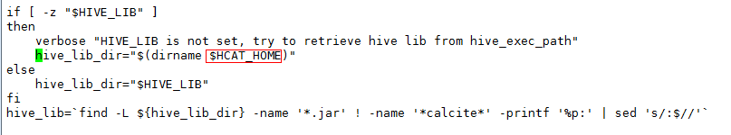
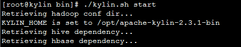
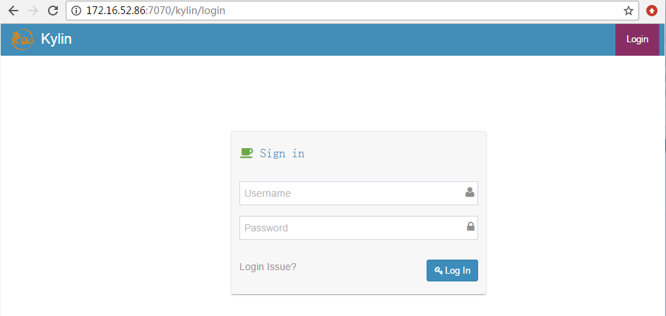
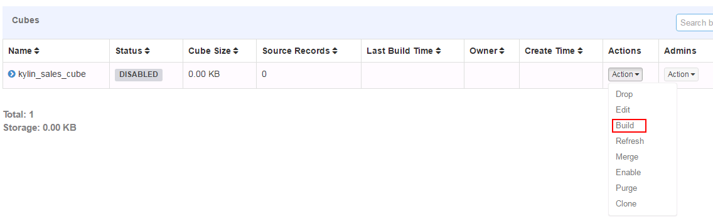
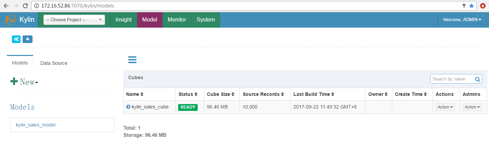

# Apache Kylin2.3.1对接FusionInsight_HD_C80

## 适用场景

> Apache Kylin 2.3.1 <-> FusionInsight HD V100R002C80SPC100

## 说明

Apache Kylin™是一个开源的分布式分析引擎，提供Hadoop之上的SQL查询接口及多维分析（OLAP）能力以支持超大规模数据，最初由eBay Inc. 开发并贡献至开源社区。它能在亚秒内查询巨大的Hive表。

Apache Kylin主要与FusionInsight的Hive和HBase进行对接


## 环境准备

* 修改/etc/hosts

  添加本机主机名解析
  ```
  172.16.52.86 kylin
  ```

* 配置NTP服务

  使用vi /etc/ntp.conf增加NTP服务的配置,时间与FusionInsight集群同步
  ```
  server 172.18.0.18 nomodify notrap nopeer noquery
  ```

  启动NTP服务
  ```
  service ntpd start
  chkconfig ntpd on
  ```

* 参考FusionInsight产品文档在Kylin节点安装FusionInsight客户端

  在FusionInsight Manager服务管理页面下载客户端，上传到kylin节点安装FusionInsight客户端到`/opt/hadoopclient`目录
  ```
  ./install.sh /opt/hadoopclient
  ```

* 安装JDK1.8
  ```
  rpm -Uvh jdk-8u112-linux-x64.rpm
  ```

## 下载Kylin

Fusioninsight配套的HBase是1.3.0，Apache Kylin可直接下载apache-kylin-2.3.1-hbase1x-bin.tar.gz主版本二进制包，无需编译Apache kylin

### 下载解压Kylin

* 下载Kylin-2.3.1基于HBase1.x版本的二进制包，
  [http://ftp.cuhk.edu.hk/pub/packages/apache.org/kylin/apache-kylin-2.3.1/apache-kylin-2.3.1-hbase1x-bin.tar.gz](http://ftp.cuhk.edu.hk/pub/packages/apache.org/kylin/apache-kylin-2.3.1/apache-kylin-2.3.1-hbase1x-bin.tar.gz)

* 上传apache-kylin-2.3.1-hbase1x-bin.tar.gz到Apache kylin节点的`/opt`目录

* 解压上一步骤的安装包
  ```
  cd /opt
  tar -zxvf apache-kylin-2.3.1-hbase1x-bin.tar.gz -C /opt
  ```

## 配置Kylin

### 配置环境变量

* 配置环境变量：`vi /etc/profile`，增加以下配置
  ```
  export KYLIN_HOME=/opt/apache-kylin-2.3.1-bin
  ```

* 导入环境变量
  ```
  source /etc/profile
  ```

* Kylin启动还需要配置HIVE_CONF、HCAT_HOME，使用`vi /opt/hadoopclient/Hive/component_env`，在文件最后增加
  ```
  export HIVE_CONF=/opt/hadoopclient/Hive/config
  export HCAT_HOME=/opt/hadoopclient/Hive/HCatalog
  ```

* 导入环境变量
  ```
  source /opt/hadoopclient/bigdata_env
  ```

* 进行kerberos认证
  ```
  kinit test
  ```

* Kylin检查环境设置：
  ```
  cd /opt/apache-kylin-2.3.1-bin/bin
  ./check-env.sh
  ```

  

### 修改FusionInsight的Hive配置项

* 在hive.security.authorization.sqlstd.confwhitelist.append参数最后追加一下参数配置，保存配置，重启影响的服务

  ```
  |mapreduce\.job\..*|dfs\..*
  ```

  

### 修改Kylin配置

* 获取Hive的JDBC字符串

  执行Beeline查看Hive的JDBC字符串

  ```
  source bigdata_env
  kinit test
  beeline
  ```

  

* 修改kylin.properties： `vi /opt/apache-kylin-2.3.1-bin/conf/kylin.properties`

  配置Hive client使用beeline：
  ```
  kylin.source.hive.client=beeline
  kylin.source.hive.beeline-shell=beeline
  kylin.source.hive.beeline-params=-n root -u 'jdbc:hive2://172.21.3.101:24002,172.21.3.102:24002,172.21.3.103:24002/;serviceDiscoveryMode=zooKeeper;zooKeeperNamespace=hiveserver2;sasl.qop=auth-conf;auth=KERBEROS;principal=hive/hadoop.hadoop.com@HADOOP.COM'
  ```
  JDBC字符串使用上一步骤获取的字符串
  

  > 注意：kylin.source.hive.beeline-params参数里面原有的 ``--hiveconf hive.security.authorization.sqlstd.confwhitelist.append='mapreduce.job.*|dfs.*'`` 要去掉

* 修改Hive/HBase配置

  将/opt/hadoopclient/Hive/config/hivemetastore-site.xml中的配置合并到hive-site.xml

  将/opt/hadoopclient/HBase/hbase/conf/hbase-site.xml中的配置合并到/opt/apache-kylin-2.3.1-bin/conf/kylin_job_conf.xml

* Hive lib路径

  kylin的/opt/apache-kylin-2.3.1-bin/bin/find-hive-dependency.sh默认Hive lib路径为大数据集群中Hive的安装路径，需要修改为客户端路径

  

### 启动Kylin

* 使用`./kylin.sh start`启动Kylin

  

  

  

  输入默认用户名密码：ADMIN/KYLIN登陆

  

## Demo测试

### 导入Demo数据

* 执行以下命令导入sample数据
  ```
  cd /opt/apache-kylin-2.3.1-bin/bin
  ./sample.sh
  ```

  

  选择菜单 **System** -> **Actions** -> **Reload Metadata**

  

  选择菜单 **System** -> **Model**

  

### 构建Cube

* 构建默认的kylin_sales_cube

  

* 选择End Data（Exclude）时间：

  

* 点击Monitor可以查看build状态：

  

* Build完成：

  

* Cube构建成功，状态变为READY

  

### 查询表数据

* 在Insight页面执行查询

  
