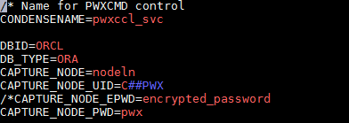
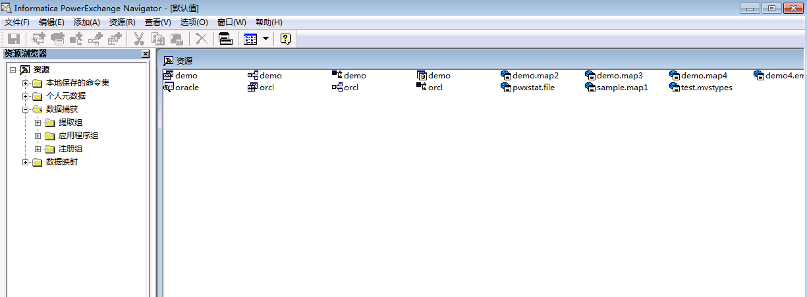
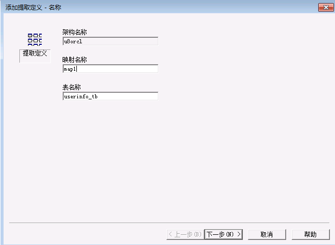
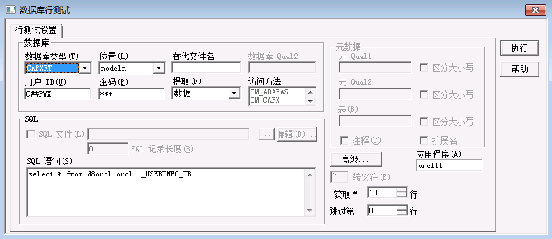
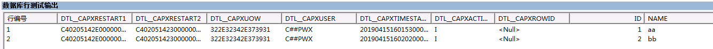
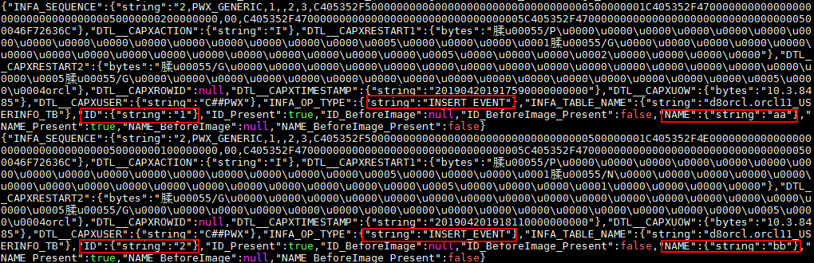
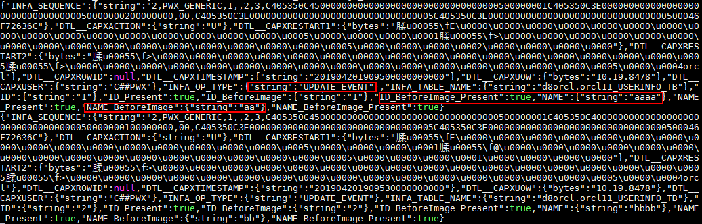

# Informatica PowerExchange CDC对接FusionInsight

## 适用场景

> Informatica PowerexChange CDC 10.2.0 <--> FusionInsight HD 6.5

## 环境信息

* Informatica PowerExchange CDC 10.2.0 Linux & Windows版本
* Informatica PowerExchange Publisher 1.2.0
* Oracle database 11g
* jdk-7u71-linux-x64.rpm
* FusionInsight HD Kafka客户端

## 部署方案
* 一台Linux服务器，部署oracle数据库，作为数据源，同时部署Informatica PWX CDC，并启用listener和logger进行日志监听，再安装PWX Publisher,将捕获到的日志数据传送到kafka的topic中。
* 一台Linux服务器，安装FusionInsight HD Kafka客户端，消费PWX Publisher传送过来的数据
* (可选)一台Windows机器，安装PWX CDC，启用listener，启动navigator图形化界面，查看PWX捕获到的数据.

### 数据库配置
      >此部分配置请参考Informatica PowerExchange CDC指导文档
      https://docs.informatica.com/data-integration/powerexchange-for-cdc-and-mainframe/10-2/_cdc-guide-for-linux-unix-and-windows_powerexchange-for-cdc-and-mainframe_10-2_ditamap/powerexchange_cdc_data_sources_1/oracle_cdc_with_logminer.html

  * 切换至oracle用户,使用Sqlplus / as sysdba登陆Oracle源端数据库后打开Archive Log:
    ```sql
    SHUTDOWN IMMEDIATE;
    STARTUP MOUNT;
    ALTER DATABASE ARCHIVELOG;
    ALTER DATABASE OPEN;
    SHUTDOWN IMMEDIATE:
    STARTUP;
    archive log list;
    ```
    >建议在两次SHUTDOWN操作之前备份数据库.

  * 源端数据库打开数据库级最小附加日志及force logging：
    ```sql
    SELECT supplemental_log_data_min, force_logging FROM v$database;
    alter database add supplemental log data;
    alter database force logging;
    ```

  * 切换日志以使附加日志生效：
    ```sql
    ALTER SYSTEM switch logfile;
    ```

  <!-- 创建LogMiner使用的表空间
     ```sql
     CREATE TABLESPACE "LOGMNRTS"
     NOLOGGING
     DATAFILE
     '/u01/app/oracle/oradata/orcl/LOGMNRTS.dbf' SIZE
     50M REUSE AUTOEXTEND
     ON NEXT  10M MAXSIZE  100M EXTENT MANAGEMENT LOCAL;

     EXECUTE SYS.DBMS_LOGMNR_D.SET_TABLESPACE('LOGMNRTS');
     ALTER PACKAGE SYS.DBMS_LOGMNR_D COMPILE BODY;
     ```
     -->

  * 拷贝Oracle Catalog 至归档日志中
    ```
      EXECUTE SYS.DBMS_LOGMNR_D.BUILD(options => sys.dbms_logmnr_d.store_in_redo_logs);
    ```
  * 创建普通用户C##PWX,赋予创建表的权限，连接至数据库

    

  * 创建测试表,向表中插入一些数据.

    


## Informatica PWX CDC & PWX Publisher 安装配置

### 在Linux上安装Informatica PWX CDC

  * 获取安装包`pwx1020_linux_em64t.tar`.
  * 解压安装包之后，执行`./install.sh`，根据提示设置安装路径即可,这里安装目录为`/opt/PowerExchange/10.2.0`.

## 配置环境变量

  * 打开配置文件
    ```
      vi ~/.bash_profile
      ```
      添加以下配置

      ```
        export PWX_CONFIG=/opt/PowerExchange10.2.0/dbmover.cfg
        export PWX_HOME=/opt/PowerExchange10.2.0
        PATH=$PATH:$HOME/bin:/usr/lib/oracle/12.1/client64/bin:/opt/PowerExchange10.2.0
        export LD_LIBRARY_PATH=$ORACLE_HOME/lib:/opt/PowerExchange10.2.0
        export  NLS_LANG=AMERICAN_AMERICA.ZHS16GBK
      ```
    * 执行`source ~/.bash_profile`,source环境变量
    * 执行`dtlinfo`,检查安装以及配置是否成功
  

## 配置dbmover.cfg与pwxccl.cfg文件
  * 修改PWX安装目录下的dbmover.cfg文件如下
    * nodeln 为自定义的监听节点名

      

    * ORACLEID中的第二个ORCL，为被监听的数据库名称，此处为默认的ORCL

      

    * CAPT_PATH指定了CDC的控制文件路径，需提前创建好相应目录

      

    * 指定SVCNODE和CMDNODE名称

      

  * 修改pwxccl.cfg文件如下
      - CONDENSENAME需要和dbmover.cfg文件中SVCNODE配置保持一致
      - DBID 为数据库名称
      - CAPTURE_NODE 为进行捕获节点名称
      - CAPTURE_NODE_UID 为登录数据库的用户名
      - CAPTURE_NODE_PWD 为对应数据库用户密码

        

  * 启动listener以及logger

    

    

## PWX CDC 捕获ORACLE日志数据

  ### 在Windows上安装Informatica PWX CDC
  >Windows上安装Informatica PWX CDC主要是可以使用Navigator界面,查看捕获到的日志数据.

  * 获取安装包之后双击进行安装,修改系统环境变量PATH,添加PWX安装目录.

    
  * 添加环境变量PWX_CONFIG,设置为PWX安装目录下的dbmover.cfg文件

    
  * 配置dbmover.cfg文件
    - 配置listener名称,添加服务端listener配置信息

      
    - 指定监听数据库名称

      
    - 设置控制文件路径

      
  * 启动listener

    
  * 从开始菜单栏启动Navigator

    
  * 在菜单栏资源->数据捕获->注册组，右键新建注册组，填写信息如下
    - 名称：自定义
    - 位置：Linux服务端监听节点名称
    - 类型：ORACLE
    - 用户ID和密码：数据库用户密码
    - 集合标志符：数据库名ORCL

    


  * 点击下一步
    - 名称：自定义
    - 架构：schema名称，即用户名

    

  * 点击下一步，会看到刚才创建的test表，双击表名，被选入右侧，选择所有列

    

  * 点击下一步，修改状态为`活动`，勾选`立即执行DDL`,点击完成

    


  * 在提取组，双击刚才创建的orcl12,进入提取组界面，右键，添加提取自定义，填写映射名称以及表名称

    
  * 点击下一步，可以看到刚才创建的注册

    

    点击添加，完成

    

  * 点击菜单栏图表，执行行测试,可看到捕获到的数据库日志记录

    

    

    

## 使用PWX CDC publisher对接Kafka
 ### 修改kafka配置文件
  * 修改producer.properties文件，添加如下配置
   ```
    sasl.mechanism = GSSAPI
    key.serializer = org.apache.kafka.common.serialization.StringSerializer
    value.serializer = org.apache.kafka.common.serialization.ByteArraySerializer
    key.deserializer = org.apache.kafka.common.serialization.StringDeserializer
    value.deserializer = org.apache.kafka.common.serialization.StringDeserializer
   ```
  * 修改jaas.conf文件如下

    
  * 创建一个kafka topic,`pwxtopic`
    ```
    cd /opt/hadoopclient/Kafka/kafka/bin
     kafka-topics.sh --create --zookeeper 172.16.4.21:24002/kafka --partitions 2 --replication-factor 2 --topic pwxtopic
    ```

 ### 安装配置Informatica PWX Publisher
  * 获取安装包`pwxcdcpub120_linux_x64.tar.gz`,以root用户身份解压至安装目录即可

  * 以root用户登录节点，在~/.bash_profile文件中添加以下配置
   ```
    export PWXPUB_HOME=/opt/pwxcdcpub120_linux_x64
    export KAFKA_CLIENT_LIBS=/opt/hadoopclient/Kafka/kafka/libs
    export PWX_LICENSE=/opt/pwx1020.key
   ```
  * 执行以下命令，source环境变量,进行kerberos认证
   ```
    source ~/.bash_profile
    source /opt/hadoopclien/bigdata_env
    kinit developuser
   ```
  * 将安装目录samples下的配置文件复制到instanceA/config目录下，并修改文件内容
    > 配置PWX Publisher可参考Informatica 官方文档 https://docs.informatica.com/data-integration/powerexchange-cdc-publisher/1-1/user-guide/configuring-powerexchange-cdc-publisher.html

    - cdcPublisherAvro.cfg文件配置如下

      
    - cdcPublisherCommon.cfg文件中指定端口

      
    - cdcPublisherKafka.cfg文件中指定kafka topic名称以及properties文件路径

      
    - cdcPowerExchange.cfg文件中配置如下
      * Extract.pwxCapiConnectionName为在dbmover.cfg中CAPI_CONNECTION配置的name
      * Extract.pwxExtractionMapSchemaName 为pwx 捕获映射中的schema名称，通常格式为`unninstance`或者`dnninstance`，这里为`u8orcl`
      * Extract.pwxNodeLocation 配置为pwx节点名称
      * Extract.pwxNodeUserId，Extract.pwxNodePwd为对应数据库用户密码
      * Extract.pwxXmapUserId为访问pwx提取映射的用户名密码
      
      
      
      
   * 修改安装路径bin目录下的PwxCDCPublisher.sh启动脚本文件,在以下位置加入一行`RUN="$RUN -Djava.security.auth.login.config=/opt/hadoopclient/Kafka/kafka/config/jaas.conf"`
   
   * 启动pwx CDC Publisher,在bin目录下执行`sh PwxCDCPublisher.sh`
   

### 启动kafka consumer，查看消费到的数据
  * 在oracle数据源中执行insert操作,在kafka中可以看到数据捕获如下

    

    

  * 在oracle数据源中执行update操作,在kafka中可以看到数据捕获如下

    

    

  * 在oracle数据源中执行delete操作,在kafka中可以看到数据捕获如下

    

    

### Q&A
1.若启动pwxccl报错如下

A:检查在oracle中是否执行过
```
exec SYS.DBMS_LOGMNR_D.BUILD(options => sys.dbms_logmnr_d.store_in_redo_logs);
```
若执行成功，仍然报错，给C##PWX用户赋予sysdba权限
```
grant sysdba to C##PWX
```
