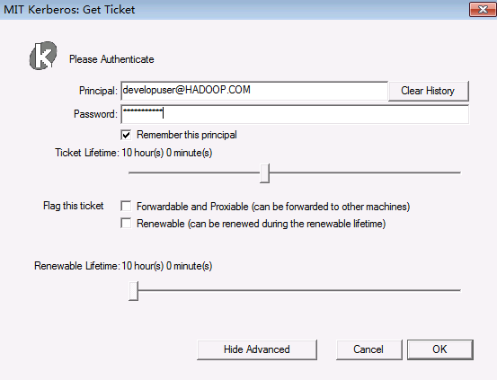

# Knime 对接FusionInsight

## 适用场景

>Knime 3.6.1 <--> FusionInsight HD V100R002C80SPC200

## 环境准备以及Knime下载

### 环境准备

  * 安装JDK8

    

  * 配置系统环境变量
    ```
    JAVA_HOME= C:\\Program Files\\Java\\jdk1.8.0_112
    ```

  * 在PATH环境变量添加 `%JAVA_HOME%\bin;%JAVA_HOME%\jre\bin;`

### 下载Knime

  * 在Knime官网`https://www.knime.com/downloads/download-knime`选择合适的安装包进行下载.

      

<!-- ## 配置Windows的kerberos认证

  * 下载并安装MIT Kerberos

      下载网址：<http://web.mit.edu/kerberos/dist/#kfw-4.0>

      版本与操作系统位数保持一致，本文版本kfw-4.1-amd64.msi。

    * 确认客户端机器的时间与FusionInsight HD集群的时间一致，时间差要小于5分钟

    * 设置Kerberos的配置文件

      在FusionInsight Manager创建一个角色与“人机”用户，具体请参见《FusionInsight HD 管理员指南》的创建用户章节。角色需要根据业务需要授予Spark，Hive，HDFS的访问权限，并将用户加入角色。下载该用户对应的Kerberos认证文件，包括user.keytab以及krb5.conf文件，保存在本地。

    * 设置Kerberos票据的缓存文件

      * 创建存放票据的目录，例如“C:\temp”。
      * 设置Windows的系统环境变量，变量名为“KRB5CCNAME”，变量值为“C:\temp\krb5cc_tmp”。

        

    * 重启机器

  * 在Windows上进行认证

      * 使用Kerbers认证的用户名密码登录，用户名的格式为：用户名@Kerberos域名。

      * 打开MIT Kerberos，单击“get Ticket”，在弹出的“MIT Kerberos: Get Ticket”窗口中，“Pricipal”输入用户名，“Password”输入密码，单击“OK”,获得票据。

      
-->
## 下载Knime extension
  * 在菜单栏`File->Install Knime extensions`
  * 搜索`big data`,在结果中选择`KNIME Big data Extensions`,然后`next`

  * `accept licence`,点击`finish`开始安装.

  * 在右下角可以看到安装进度
  
  * 安装完成后重启Knime
## 配置Knime
  * 获取集群的`hdfs-site.xml`和`core-site.xml`文件，保存在本地.

  * 在Knime的安装目录中，修改配置文件“knime.ini”,在末尾添加一行

        `Djava.security.krb5.conf=path\to\krb5.conf`

  * 双击`Knime.exe`，启动Knime

  * 在菜单栏选择`File->Preference->KNIME->Big Data->Hadoop`，在`Hadoop Configuration`中填入本地保存的HDFS的`hdfs-site.xml`和`core-site.xml`文件,点击`Apply and Close`保存配置。

    

  * 在菜单栏选择`File->Preference->KNIME->Big Data->Kerberos`，填入kerberos认证用户名和本地keytab文件的路径，并选择`Enable Kerberos Logging`,点击`Apply and Close`保存配置。

    

## Knime连接HDFS

### 前提条件

  - 已经完成Knime 3.6.1的安装

  - 已完成FusionInsight HD和客户端的安装，包含HDFS组件

  - 已完成本机的Kerberos认证

### 建立HDFS连接

  * 在Knime菜单栏中选择`File->New->New KNIME Workflow`,命名后保存。

    

    
  * 在Node Repository中搜索`HDFS`
    

  * 将`HDFS Connection` 节点拖入工作区

    

  * 双击`HDFS Connection` 节点，填写如下配置：
    - Host: NameNode主节点
    - Port: 25000
    - Authentication: Kerberos
    

    - 点击`Test connection`,显示如下，表示连接成功

    
    - 点击`Apply`，保存配置

### 读取HDFS文件

   * 在工作区中拖入`Download` 节点，将其与`HDFS Connection`相连

     

   * 双击`Download` 节点，选择要从HDFS文件系统下载的文件以及文件的本地保存路径

     

   * 点击`Apply`，保存配置

   * 点击菜单栏中的
     执行任务

   * 查看本地文件

      

### 上传文件至HDFS
  * 将要上传的文件放在本地的一个文件夹中，例如`C:\KnimeData`

    

  * 在工作区中拖入`List Files`,`String to URI` 以及`Upload` 节点，将其进行如下连接

    

  * 双击`List Files` 节点，选择要上传文件的本地路径，点击`Apply`，保存配置

    

  * 双击`Upload` 节点，选择在HDFS中文件保存的路径，点击`Apply`，保存配置

    

  * 点击菜单栏中的
    执行任务

  * 在服务器上查看HDFS文件系统中所上传的文件

    


## Knime连接Hive

### 前提条件

  - 已经完成Knime 3.6.1的安装

  - 已完成FusionInsight HD和客户端的安装，包含Hive组件

  - 已完成本机的Kerberos认证

### 建立Hive连接

  * 在Knime菜单栏中选择`File->New->New KNIME Workflow`,命名后保存。

    

  * 在工作区中拖入一个`Hive Connector` 节点

    

  * 双击`Hive Connector` 节点，填写如下配置：
    - Hostname: HIve主节点
    - Port: 21066
    - Parameter: `principal=hive/hadoop.hadoop.com@HADOOP.COM;saslQop=auth-conf;auth=KERBEROS;`
    - Authentication: Use Kerberos

    

    - 点击`Apply`，保存配置

### 写入Hive表
  * 在工作区中拖入以下几个节点，并进行如下连接
    

    - 其中`HDFS Connection` 节点配置参考上节中建立HDFS连接，点击`Apply`保存配置

      

    - `File Reader`节点中选择本地将要上传的文件，点击`Apply`保存配置

      

    - `Hive Loader`节点中选择文件要上传至服务器的路径以及表名，点击`Apply`保存配置

      

  * 点击菜单栏中的
        执行任务

  * 在服务器上查看导入Hive中的表

    

    


## Knime连接Spark

### 前提条件

  - 已经完成Knime 3.6.1的安装

  - 已完成FusionInsight HD和客户端的安装，包含Spark2x组件

  - 已完成本机的Kerberos认证

### 安装spark-job-server
  >此部分可参考KNIME官方文档<https://download.knime.org/store/3.6/knime_extension_for_apache_spark_2.3.0.pdf>

  * 打开`https://www.knime.com/knime-extension-for-apache-spark`，根据集群以及操作系统版本获取对应的`spark-job-server`安装包，上传至服务器节点，例如`/opt`目录下。
  >对于FusionInsight集群，spark版本为1.5和2.1，根据要使用的spark版本选择对应的spark-job-server进行安装，这里以spark2.1为例

  * 对于使用spark2x的集群，执行以下命令进行安装配置
    ```
    LINKNAME=spark2-job-server
    useradd -d /opt/${LINKNAME}/ -M -r -s /bin/false spark-job-server
    su -l -c "hdfs dfs -mkdir -p /user/spark-job-server ; hdfs dfs -chown -R spark-job-server /user/spark-job-server" hdfs
    cp /path/to/spark-job-server-xxx.tar.gz /opt
    cd /opt
    tar xzf spark-job-server-xxx.tar.gz
    ln -s spark-job-server-xxx ${LINKNAME}
    chown -R spark-job-server:spark-job-server ${LINKNAME} spark-job-server-xxx/
    ```
    - 对于`RHEL 6.x/CentOS 6.x`操作系统，执行：
      ```
      ln -s /opt/${LINKNAME}/spark-job-server-init.d /etc/init.d/${LINKNAME}
      chkconfig --levels 2345 ${LINKNAME} on
      ```

  <!--  - 若操作系统为`RHEL 7.x/CentOS 7.x`，执行：
      ```
      ln -s /opt/${LINKNAME}/spark-job-server-init.d /etc/init.d/${LINKNAME}
      systemctl daemon-reload
      systemctl enable ${LINKNAME}
      ```

    - 若操作系统为` Ubuntu 14.x`，执行：
      ```
      ln -s /opt/${LINKNAME}/spark-job-server-init.d-ubuntu-sysv /etc/init.d/${LINKNAME}
      update-rc.d ${LINKNAME} start 20 2 3 4 5 . stop 20 0 1 6 .
      ```-->
  * 修改`environment.conf`文件,设置 `master = yarn-client `，以yarn-client模式运行spark.

  * 修改`settings.sh`文件，设置`SPARK_HOME=/opt/hadoopclient/Spark2x/spark`

### 配置Kerberos安全认证
  * 将Kerberos用户的配置文件上传至服务器节点，并执行一下命令
    ```
    chown spark-job-server:spark-job-server /path/to/keytab
    chmod go= /path/to/keytab
    ```

  * 在`environment.conf`文件中，进行如下设置
    ```
    spark {
      jobserver {
      context-per-jvm = true
      }
    }
    shiro {
      authentication = on
      config.path = "shiro.ini"
      use-as-proxy-user = on
    }
    ```

  * 在`setting.sh`文件中，编辑以下几行
    ```
    export JOBSERVER_KEYTAB=/path/to/keytab
    export JOBSERVER_PRINCIPAL=user/host@REALM
    ```

  * 在FusionInsight的manager管理页面，修改HDFS的core-site.xml文件配置，主页面选择`服务管理->HDFS->服务配置`,参数配置选择`全部服务`，在左侧选择`HDFS->自定义`,添加以下两个参数
    ```
    hadoop.proxyuser.spark-job-server.hosts = *
    hadoop.proxyuser.spark-job-server.groups = *
    ```

    

    保存配置，重启相关服务。

### 启动和停止Spark-job-server

  * 启动Spark-job-server
    ```
    cd /etc/init.d
    ./spark2-job-server start
    ```

  * 停止Spark-job-server
    ```
    cd /etc/init.d
    ./spark2-job-server stop
    ```

### 建立Spark连接

  * 在Knime菜单栏中选择`File->New->New KNIME Workflow`,命名后保存,在工作区中拖入一个`Create Spark Context` 节点，双击后进行如下配置
    - 在Context Settings页面
      - Spark version:集群中使用的Spark版本
      - Context name：建立的Spark Context 名字

      

    - 在Connection Settings页面
      - Jobserver URL:http://ip:8090/
      - Authentication: None

      

    - 点击`Apply`，保存配置
    - 可点击菜单栏按钮，测试连接是否有错，若显示如下，表明节点配置无误。

      

    - 在浏览器中打开Jobserver URL中配置的地址，可以进入Spark Job Server UI界面，可以看到刚才建立的Spark Context，显示如下：

    

## Spark应用实例

* Spark应用实例下载地址<https://www.knime.com/nodeguide/big-data/spark-executor>

### Hive to Spark to Hive
  * 下载完成打开应用实例，配置`HDFS Connection`，`File Reader`，`Hive Connector`，`Hive Loader`，`Create Spark Context`和`Spark to Hive` 节点，具体配置如下：

    

    

    

    

    

    

  * 点击菜单栏中的
        执行任务

  * 登录节点，执行`beeline`进入Hive界面，执行`show tables;`查看导入的表.

    

    可以看到，通过`Hive Loader`节点导入的表`contactdata`以及`Spark to Hive`节点导入的表`sparktohivetable`均已导入Hive。
