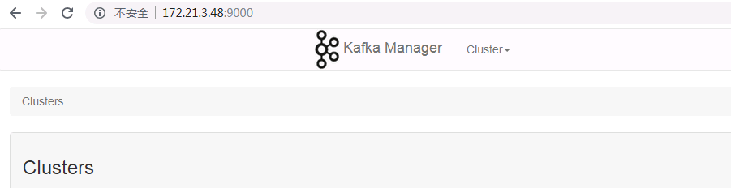
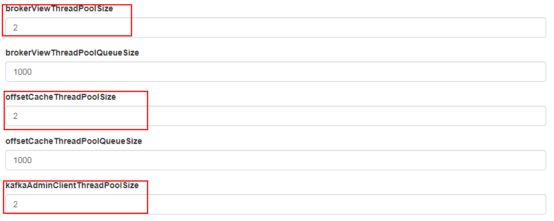
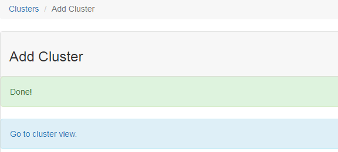
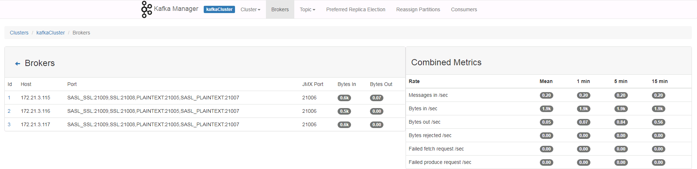

# kafka-manager 对接FusionInsight

## 适用场景

>/kafka-manager-1.3.3.21 <--> FusionInsight HD V100R002C80SPC200

## 环境准备
  * 安装JDK1.8及以上版本

  * 下载kafka-manager源码
    下载地址为 https://github.com/yahoo/kafka-manager
    解压后得到安装目录kafka-manager

  * yum安装sbt
      ```
      yum install sbt
      ```
  * 安装FusionInsight客户端，安装目录为/opt/hadoopclient

  * 获取kafka用户的认证文件,登录FusionInsight集群节点,将/opt/huawei/Bigdata/om-server_V100R002C80SPC200/apache-tomcat-8.5.28/conf/security/kafka.keytab文件下载到本地，并上传至客户端节点/opt/hadoopclient/目录下

    通过FusionInsight HD的管理页面创建一个“机机”用户，具体请参见《FusionInsight HD管理员指南》的 **创建用户** 章节。例如，创建用户kafkauser，并选择kafka和kafkaadmin用户组，下载对应的秘钥文件,将krb5.conf文件上传到客户端节点的`/opt/hadoopclient/`目录下

## kafka-manager编译及配置

  * 修改源码
    进入安装目录/kafka-manager/app/kafka/manager/jmx，修改KafkaJMX.scala文件中写死的jmx连接字符串，将'jmxrmi'修改为'kafka',如下图：

    

  * 编译kafka-manager,获取压缩包
      ```
      cd /opt/kafka-manager
      ./sbt clean dist
      cp /opt/kafka-manager/target/universal/kafka-manager-1.3.3.21.zip /opt
      cd /opt
      uzip kafka-manager-1.3.3.21.zip
      cd /opt/kafka-manager-1.3.3.21      
      ```
  * 修改配置文件
    - 修改配置文件conf/application.conf,'kafka-manager.zkhosts'修改为zookeeper集群节点IP:端口,FI集群默认端口为24002
    ```
      kafka-manager.zkhosts="172.21.3.115:24002"
    ```
<<<<<<< HEAD
    - 新建conf/jaas.conf文件，配置如下：
    ```
      Client {
      com.sun.security.auth.module.Krb5LoginModule required
      useKeyTab=true
      keyTab="/opt/hadoopclient/kafka.keytab"
      principal="kafka/hadoop.hadoop.com@HADOOP.COM"
=======
    - 新建conf/jaas.conf文件，配置如下,其中：
      - keyTab为kafka用户的keytab文件路径;
      - principal为kafka用户的principal
      ```
      Client {
      com.sun.security.auth.module.Krb5LoginModule required
      useKeyTab=true
      keyTab="/opt/hadoopclient/kafkauser.keytab"
      principal="kafkauser/hadoop.hadoop.com@HADOOP.COM"
>>>>>>> 90051fdb395e29e3a933d5bcd4847578fb60eda3
      storeKey=true
      useTicketCache=false;
      };

      KafkaClient {
      com.sun.security.auth.module.Krb5LoginModule required
      useKeyTab=true
<<<<<<< HEAD
      keyTab="/opt/hadoopclient/kafka.keytab"
      principal="kafka/hadoop.hadoop.com@HADOOP.COM"
      storeKey=true
      useTicketCache=false;
      };
    ```
=======
      keyTab="/opt/hadoopclient/kafkauser.keytab"
      principal="kafkauser/hadoop.hadoop.com@HADOOP.COM"
      storeKey=true
      useTicketCache=false;
      };
      ```
>>>>>>> 90051fdb395e29e3a933d5bcd4847578fb60eda3

  * 将kafka-manager的lib库中zookeeper的jar包替换为FusionInsight客户端中zookeeper的jar包,并重命名
    ```
      cp /opt/hadoopclient/ZooKeeper/zookeeper/zookeeper-3.5.1.jar /opt/kafka-manager-1.3.3.21/lib
      cd /opt/kafka-manager-1.3.3.21/lib
      rm org.apache.zookeeper.zookeeper-3.4.10.jar
      mv zookeeper-3.5.1.jar org.apache.zookeeper.zookeeper-3.4.10.jar
    ```

## kafka-manager使用
  * 启动kafka-manager
  ```
    cd /opt/kafka-manager-1.3.3.21
    nohup bin/kafka-manager -Dconfig.file=conf/application.conf -Djava.security.auth.login.config=conf/jaas.conf -Djava.security.krb5.conf=/opt/hadoopclient/krb5.conf -Dzookeeper.server.principal=zookeeper/hadoop.hadoop.com &
  ```
    > 可通过-Dhttp.port=port指定访问端口,默认为9000

  * 在浏览器地址栏输入172.21.3.48:9000，即可访问kafka-manager

  

  * 点击cluster->Add Cluster，进行如下填写
    - Cluster Name:自定义
    - Cluster Zookeeper Hosts:ZooKeeper集群节点信息,可写多个或者一个节点,一定要加上kafka后缀
    - Kafka Version:当前FI集群中使用的是0.11.0.1，选择最接近的0.11.0.2即可
    - 勾选Enable JMX复选框

    

    将以下几个size大小设置为大于等于2
    

    其他设置可以保持默认或者根据需要修改,点击Save可以看到集群创建成功

    

    点击Go to cluster view，可以看到集群相关信息

    

 * 在Brokers菜单栏可以看到当前集群的brokers情况
    

 * 在Topic->Create菜单栏可以创建新的topic
<<<<<<< HEAD

=======
 
>>>>>>> 90051fdb395e29e3a933d5bcd4847578fb60eda3
    

    

 * 在Topic->List菜单栏可以看到当前集群所有的topic
    
