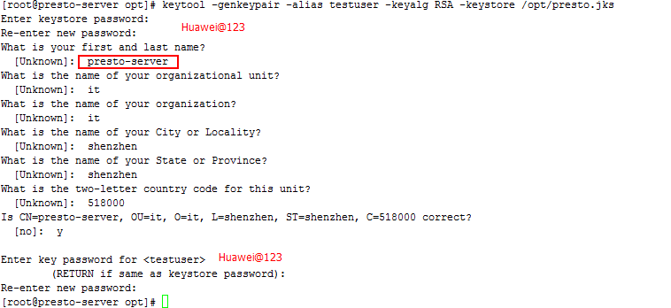
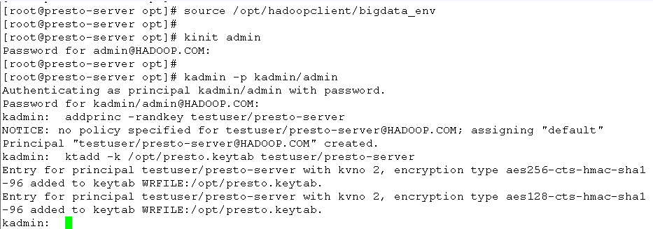
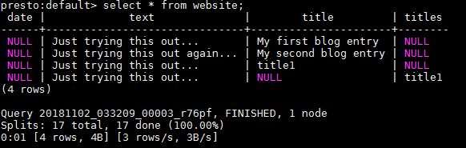

# Apache Presto对接FusionInsight

## 适用场景

> Presto0.210 <-> FusionInsight HD V100R002C80SPC200

## 说明

  Presto是一个开源的分布式SQL查询引擎，适用于交互式分析查询，数据量支持GB到PB字节。

  Presto的设计和编写完全是为了解决像Facebook这样规模的商业数据仓库的交互式分析和处理速度的问题

  Presto主要与FusionInsight的Hive进行对接,在Presto0.210版本中支持与FusionInsight的ES进行对接。

  

<<<<<<< HEAD
## 获取并配置presto server
=======
## 配置Hive Connector
>>>>>>> 90051fdb395e29e3a933d5bcd4847578fb60eda3
  Presto集群包括coordinator节点和不限数量的worker节点(coordinator节点也可同时为worker节点)，其中只需要在coordinator节点上配置Hive Connector即可。
  本文档中配置coordinator节点同时也是worker节点。

  * 从该链接下载presto-server的安装包，并上传到presto coordinator的节点

      <https://repo1.maven.org/maven2/com/facebook/presto/presto-server/0.210/presto-server-0.210.tar.gz>

      将该压缩包解压缩后得到目录`/opt/presto-server-0.210`。

  * 在presto节点上安装华为FusionInsight HD V100R002C80SPC200的客户端，默认安装目录`/opt/hadoopclient`

<<<<<<< HEAD
  * presto-0.210版本要求jdk至少在1.8u60+以上，修改`/etc/profile`文件方式配置系统默认的java为FusionInsight HD客户端的jdk，并source环境变量，命令参考如下
=======
  * presto该0.210版本要求jdk至少在1.8u60+以上，修改`/etc/profile`文件方式配置系统默认的java为FusionInsight HD客户端的jdk，并source环境变量，命令参考如下
>>>>>>> 90051fdb395e29e3a933d5bcd4847578fb60eda3

    在`/etc/profile`中增加以下行
    ```
    export JAVA_HOME=/opt/hadoopclient/JDK/jdk
    export JREHOME=/opt/hadoopclient/JDK/jdk/jre
    export PATH=$JAVA_HOME/bin:$PATH
    ```

    source 环境变量
    ```
    source /etc/profile
    ```

  * 创建Java keystore File for TLS，(后续步骤默认都在presto节点上执行)参考如下命令
    ```
    source /opt/hadoopclient/bigdata_env
<<<<<<< HEAD
    keytool -genkeypair -alias testuser -keyalg RSA –keystore /opt/presto.jks
=======
    keytool –genkeypair –alias testuser –keyalg RSA –keystore /opt/presto.jks
>>>>>>> 90051fdb395e29e3a933d5bcd4847578fb60eda3
    ```

    > alias后的值必须要跟后面创建的用户名称一致
    >
    > first and last name必须写成presto节点的主机名

    

<<<<<<< HEAD
  * 通过FusionInsight HD的管理页面创建一个“机机”用户，具体请参见《FusionInsight HD管理员指南》的 **创建用户** 章节。例如，创建用户testuser，并根据业务需求选择用户组(hadoop和hive组)，下载对应的秘钥文件user.keytab以及krb5.conf文件，并上传到presto节点的`/opt/hadoopclient`目录下，将user.keytab改名为testuser.keytab。
=======
  * 通过FusionInsight HD的管理页面创建一个“机机”用户，具体请参见《FusionInsight HD管理员指南》的 **创建用户** 章节。例如，创建用户testuser，并选择hadoop和hive用户组，下载对应的秘钥文件user.keytab以及krb5.conf文件，并上传到presto节点的`/opt/hadoopclient`目录下，将user.keytab改名为testuser.keytab。
>>>>>>> 90051fdb395e29e3a933d5bcd4847578fb60eda3

  * 参考如下命令在Huawei FusionInsight HD的Kerberos中创建一个新的principal，其名称为“testuser/presto-server”，其中presto-server为presto的coordinator节点的主机名，导出该principal的秘钥文件为`/opt/presto.keytab`。

    

    > 执行kadmin –p kadmin/admin命令时初始密码Admin@123，修改后需严格牢记新密码。

  * 创建目录/opt/presto-server-0.210/etc，在该目录下创建如下文件

    config.properties参考如下
    ```
    coordinator=true
    node-scheduler.include-coordinator=true
    http-server.http.port=8080
    query.max-memory=50GB
    query.max-memory-per-node=1GB
    discovery-server.enabled=true
    discovery.uri=http://presto-server:8080
    http-server.authentication.type=KERBEROS
    http.server.authentication.krb5.service-name=testuser
    http.server.authentication.krb5.keytab=/opt/presto.keytab
    http.authentication.krb5.config=/opt/hadoopclient/KrbClient/kerberos/var/krb5kdc/krb5.conf
    http-server.https.enabled=true
    http-server.https.port=7778
    http-server.https.keystore.path=/opt/presto.jks
    http-server.https.keystore.key=Huawei@123
    ```

    jvm.config参考如下内容
    ```
    -server
    -Xmx16G
    -XX:+UseG1GC
    -XX:G1HeapRegionSize=32M
    -XX:+UseGCOverheadLimit
    -XX:+ExplicitGCInvokesConcurrent
    -XX:+HeapDumpOnOutOfMemoryError
    -XX:OnOutOfMemoryError=kill -9 %p
    -Djava.security.krb5.conf=/opt/hadoopclient/KrbClient/kerberos/var/krb5kdc/krb5.conf
    ```

    node.properties参考如下内容
    ```
    node.environment=production
    node.id=ffffffff-ffff-ffff-ffff-ffffffffffff
    node.data-dir=/var/presto/data
    ```

    log.properties参考如下内容
    ```
    com.facebook.presto=INFO
    ```

<<<<<<< HEAD

  * 创建目录/opt/presto-server-0.210/etc/catalog,将FusionInsight HD客户端中的core-site.xml和hdfs-site.xml复制到`/opt/presto-server-0.210/etc/catalog`中
=======
  * 创建目录/opt/presto-server-0.210/etc/catalog，在该目录下创建hive.properties文件
    ```
    connector.name=hive-hadoop2
    hive.metastore.uri=thrift://172.21.3.115:21088,thrift://172.21.3.116:21088
    hive.metastore.service.principal=hive/hadoop.hadoop.com@HADOOP.COM
    hive.metastore.authentication.type=KERBEROS
    hive.metastore.client.principal=testuser/presto-server
    hive.metastore.client.keytab=/opt/presto.keytab
    hive.hdfs.authentication.type=KERBEROS
    hive.hdfs.impersonation.enabled=false
    hive.hdfs.presto.principal=testuser
    hive.hdfs.presto.keytab=/opt/hadoopclient/testuser.keytab
    hive.config.resources=/opt/presto-server-0.210/etc/catalog/core-site.xml,/opt/presto-server-0.210/etc/catalog/hdfs-site.xml
    ```

    > 其中hive.metastore.uri的值从/opt/hadoopclient/Hive/config/hive-site.xml中查找

  * 将FusionInsight HD客户端中的core-site.xml和hdfs-site.xml复制到`/opt/presto-server-0.210/etc/catalog`中
>>>>>>> 90051fdb395e29e3a933d5bcd4847578fb60eda3

    ```
    cp /opt/hadoopclient/HDFS/hadoop/etc/hadoop/core-site.xml /opt/presto-server-0.210/etc/catalog/
    cp /opt/hadoopclient/HDFS/hadoop/etc/hadoop/hdfs-site.xml /opt/presto-server-0.210/etc/catalog/
    ```

  * 将hdfs-site.xml文件中的dfs.client.failover.proxy.provider.hacluster属性修改为org.apache.hadoop.hdfs.server.namenode.ha.ConfiguredFailoverProxyProvider
    ```
    vi /opt/presto-server-0.210/etc/catalog/hdfs-site.xml
    ```
    

  * 修改/etc/hosts文件，将本机的IP与主机名解析以及Huawei FusionInsight HD集群节点的IP与主机名解析添加进去，例如

    

  * 安装maven：
    ```
    wget http://apache.osuosl.org/maven/maven-3/3.3.9/binaries/apache-maven-3.3.9-bin.tar.gz
    tar -xzvf apache-maven-3.3.9-bin.tar.gz -C /opt/
    ```

    修改profile文件`vi /etc/profile`,增加以下配置
    ```
    export PATH=$PATH:/opt/apache-maven-3.3.9/bin
    ```

    导入环境变量
    ```
    source /etc/profile
    ```

    执行`mvn -v`可以正确输出mvn版本

  * 安装git
    ```
    yum install -y git
    ```

  * 参考如下命令，下载presto-server-0.210的源码
    ```
    git clone https://github.com/prestodb/presto.git
    git checkout 0.210
    ```

<<<<<<< HEAD
    ## 获取Presto CLI启动包

        使用Presto CLI连接Huawei FusionInsight HD的Hive，使用presto自带的命令行工具执行SQL语句。

        * 通过如下链接下载presto cli启动的jar包

          <https://repo1.maven.org/maven2/com/facebook/presto/presto-cli/0.210/presto-cli-0.210-executable.jar>

        * 并将该jar包上传到可与presto节点网络互通的节点上(也可将presto coordinator节点作为cli使用节点)。

        * 配置cli节点的jdk为1.8u60+以上版本

        * 配置cli节点的/etc/hosts文件，将FI集群和presto coordinator节点的IP与主机名关系配置到cli节点

        * 从presto节点拷贝presto.jks、presto.keytab、krb5.conf以及连接HDFS所需的core-site.xml和hdfs-site.xml文件到cli节点

        * 将presto-cli-0.210-executable.jar包改为可执行文件
          ```
          mv presto-cli-0.184-executable.jar presto
          chmod u+x presto
          ./presto -h
          ```

## 配置Hive Connector

  * 进入目录/opt/presto-server-0.210/etc/catalog,在该目录下创建hive.properties文件
  ```
  connector.name=hive-hadoop2
  hive.metastore.uri=thrift://172.21.3.115:21088,thrift://172.21.3.116:21088
  hive.metastore.service.principal=hive/hadoop.hadoop.com@HADOOP.COM
  hive.metastore.authentication.type=KERBEROS
  hive.metastore.client.principal=testuser/presto-server
  hive.metastore.client.keytab=/opt/presto.keytab
  hive.hdfs.authentication.type=KERBEROS
  hive.hdfs.impersonation.enabled=false
  hive.hdfs.presto.principal=testuser
  hive.hdfs.presto.keytab=/opt/hadoopclient/testuser.keytab
  hive.config.resources=/opt/presto-server-0.210/etc/catalog/core-site.xml,/opt/presto-server-0.210/etc/catalog/hdfs-site.xml
  ```

  > 其中hive.metastore.uri的值从/opt/hadoopclient/Hive/config/hive-site.xml中查找

=======
>>>>>>> 90051fdb395e29e3a933d5bcd4847578fb60eda3
  * 修改presto-hive/src/main/java/com/facebook/presto/hive/authentication/KerberosHiveMetastoreAuthentication.java的代码，将代码中"Sasl.QOP"的值修改为固定的"auth-conf"

    

  * 重新编译presto
    ```
    cd presto-hive
    mvn clean install -DskipTests
    ```

  * 将编译后target目录下的presto-hive-0.210.jar文件替换/opt/presto-server-0.210/plugin/hive-hadoop2/presto-hive-0.210.jar文件

  * 启动presto server，跟踪/var/presto/data/var/log/server.log查看启动日志
  ```
  sh /opt/presto-server-0.210/bin/launcher start
  tailf /var/presto/data/var/log/server.log
  ```

## 通过Presto CLI连接Hive

<<<<<<< HEAD
  * 进入Presto CLI启动包所在目录，例如/opt，创建presto cli启动脚本，类似如下，注意将相关文件的路径按实际位置替换
  ```
  ./presto210 \
  --server https://presto-server:7778 \
  --krb5-config-path /opt/hadoopclient/krb5.conf \
  --krb5-principal testuser/presto-server \
  --krb5-keytab-path /opt/testuser.keytab \
  --krb5-remote-service-name testuser \
  --keystore-path /opt/presto.jks \
  --keystore-password Huawei@123 \
  --catalog hive \
  --schema default \
  --;
  ```
=======
  使用Presto CLI连接Huawei FusionInsight HD的Hive，使用presto自带的命令行工具执行SQL语句。

  * 通过如下链接下载presto cli启动的jar包

    <https://repo1.maven.org/maven2/com/facebook/presto/presto-cli/0.210/presto-cli-0.210-executable.jar>

  * 并将该jar包上传到可与presto节点网络互通的节点上(也可将presto coordinator节点作为cli使用节点)。

  * 配置cli节点的jdk为1.8u60+以上版本

  * 配置cli节点的/etc/hosts文件，将FI集群和presto coordinator节点的IP与主机名关系配置到cli节点

  * 从presto节点拷贝presto.jks、presto.keytab、krb5.conf以及连接HDFS所需的core-site.xml和hdfs-site.xml文件到cli节点

  * 将presto-cli-0.210-executable.jar包改为可执行文件
    ```
    mv presto-cli-0.184-executable.jar presto
    chmod u+x presto
    ./presto -h
    ```

  * 创建presto cli启动脚本，类似如下，注意将相关文件的路径按实际位置替换
    ```
    ./presto \
    --server https://presto-server:7778 \
    --enable-authentication \
    --krb5-config-path /opt/hadoopclient/krb5.conf \
    --krb5-principal testuser/presto-server \
    --krb5-keytab-path /opt/presto.keytab \
    --krb5-remote-service-name testuser \
    --keystore-path /opt/presto.jks \
    --keystore-password Huawei@123 \
    --catalog hive \
    --schema default \
    ```
>>>>>>> 90051fdb395e29e3a933d5bcd4847578fb60eda3

    > catalog后面的hive是和presto coordinator节点配置的hive.properties的文件名匹配的，如果hive.properties改名为hivetest.properties，则这里改为hivetest

  * 通过cli执行SQL语句，其他SQL语法请参考<https://prestodb.io/docs/0.210/sql.html>

    

    查询表workers_info中数据：

    

## 通过Presto JDBC连接Hive

  使用Presto JDBC接口连接Huawei FusionInsight HD Hive

  * 从如下链接下载jdbc的驱动包

    <https://repo1.maven.org/maven2/com/facebook/presto/presto-jdbc/0.210/presto-jdbc-0.210.jar>

  * 参考<https://prestodb.io/docs/0.210/installation/jdbc.html>设置JDBC URL，用户名为任意字符，密码为空，在eclipse中调通的示例如下:
    ```java
    import java.sql.Connection;
    import java.sql.DriverManager;
    import java.sql.ResultSet;
    import java.sql.SQLException;
    import java.sql.Statement;

    public class PrestoTest {
    	public static void main(String[] args) throws SQLException, ClassNotFoundException {
    		Class.forName("com.facebook.presto.jdbc.PrestoDriver");
    		Connection connection =DriverManager.getConnection
                    ("jdbc:presto://172.21.3.48:8080/hive/default","root",null);
    		Statement stmt =connection.createStatement();
    		ResultSet rs = stmt.executeQuery("select * from adult limit 10");
    		int col = rs.getMetaData().getColumnCount();
    		while(rs.next())
    		{
    			for (int i = 1; i <= col; i++) {
            System.out.print(rs.getString(i) + "\t");
            if ((i == 2) && (rs.getString(i).length() < 8)) {
              System.out.print("\t");
            }
          }
          System.out.println("");
    		}
    		rs.close();
    		connection.close();
    	}
    }
    ```

  * 测试结果：

    

## 配置ElasticSearch Connector

  presto和ES官方都没有给出适配的文档介绍，这里我们采用开源的适配包进行适配。在https://github.com/harbby/presto-connectors下载适配包源码，上传至服务器，解压。

  * 修改presto-elasticsearch-connectors源码以及配置

    * 进入/opt/presto-connectors-master/presto-elasticsearch6/src/main/java/com/facebook/presto/elasticsearch6/functions目录，参考下图，修改MatchQueryFunction.java文件，添加构造函数，将函数声明为public

    

    * 进入presto-connectors-master目录，修改pom.xml文件
      ```
       cd presto-connectors-master
       vi pom.xml
      ```
      在最后的'</project>'之前，添加以下plugin依赖
      ```
      <build>
            <pluginManagement>
    			<plugins>
    				<plugin>
    					<groupId>pl.project13.maven</groupId>
    					<artifactId>git-commit-id-plugin</artifactId>
    					<configuration>
    						<skip>true</skip>
    					</configuration>
    				</plugin>
    			</plugins>
    		</pluginManagement>
        </build>
      ```    
    * （可选操作）在modules中，去掉除presto-base-elasticsearch和presto-elasticsearch6以外的module，其他的module这里并不需要，可以减少编译时间

    * 进入presto-elasticsearch6目录，修改pom.xml文件
      ```
       cd presto-elasticsearch6
       vi pom.xml
      ```  
      将'elasticsearch.version'修改为6.1.3

      

      将'elasticsearch-x-content'和'elasticsearch-core'的依赖注释掉

      

  * 回到presto-connectors-master目录，编译presto-connectors
    ```
      mvn clean install -DskipTests
    ```
    编译成功后，显示如下：

    

  * 获取'presto-connectors-master/presto-elasticsearch6/target'目录下的'presto-elasticsearch6-0.210'文件夹，将其复制到presto-server的plugin目录下
  ```
    cp -r /opt/presto-connectors-master/presto-elasticsearch6/target/presto-elasticsearch6-0.210 /opt/presto-server-0.210/plugin
  ```

  * 登录集群manager管理页面，在'服务管理->Elasticsearch 服务配置'页面，选择全部配置，搜索'port'关键词,查看'SERVER_PORT'配置为24100，'TRANSPORT_TCP_PORT'配置为24101

    

  * 在集群客户端节点执行如下命令
    ```
    source /opt/hadoopclient/bigdata_evn
    curl -XGET http://172.21.3.115:24100/_cluster/health?pretty
    ```
    其中172.21.3.115是elasticsearch集群节点，24100为SERVER_PORT，看到返回如下结果
    ```
      {
        "cluster_name" : "elasticsearch_cluster",
        "status" : "green",
        "timed_out" : false,
        "number_of_nodes" : 6,
        "number_of_data_nodes" : 3,
        "active_primary_shards" : 33,
        "active_shards" : 66,
        "relocating_shards" : 0,
        "initializing_shards" : 0,
        "unassigned_shards" : 0,
        "delayed_unassigned_shards" : 0,
        "number_of_pending_tasks" : 0,
        "number_of_in_flight_fetch" : 0,
        "task_max_waiting_in_queue_millis" : 0,
        "active_shards_percent_as_number" : 100.0
      }
    ```

  * 在/opt/presto-server-0.210/etc/catalog目录下创建es.properties文件
    ```
      connector.name=elasticsearch6
      elasticsearch.cluster.name=elasticsearch_cluster
      elasticsearch.transport.hosts=172.21.3.115:24101
    ```
    其中'elasticsearch.cluster.name'是刚才获取的ES集群的名字，'elasticsearch.transport.hosts'为EsNode节点IP，端口为'TRANSPORT_TCP_PORT'

  * 重启presto-server
<<<<<<< HEAD
  ```
  sh /opt/presto-server-0.210/bin/launcher restart
  ```

## 通过Presto CLI连接ElasticSearch

  * 进入Presto CLI启动包所在目录,例如/opt
  * 创建presto cli启动脚本，类似如下，注意将相关文件的路径按实际位置替换
    ```
    ./presto \
    --server https://presto-server:7778 \
    --krb5-config-path /opt/hadoopclient/krb5.conf \
    --krb5-principal testuser/presto-server \
    --krb5-keytab-path /opt/presto.keytab \
    --krb5-remote-service-name testuser \
    --keystore-path /opt/presto.jks \
    --keystore-password Huawei@123 \
    --catalog es \
    --schema default \
    --;
    ```

    > catalog后面的es是和presto coordinator节点配置的es.properties的文件名匹配

  * 通过cli执行SQL语句查询ES中的索引信息
=======
  *

## 通过Presto CLI连接ElasticSearch

* 创建presto cli启动脚本，类似如下，注意将相关文件的路径按实际位置替换
  ```
  ./presto \
  --server https://presto-server:7778 \
  --enable-authentication \
  --krb5-config-path /opt/hadoopclient/krb5.conf \
  --krb5-principal testuser/presto-server \
  --krb5-keytab-path /opt/presto.keytab \
  --krb5-remote-service-name testuser \
  --keystore-path /opt/presto.jks \
  --keystore-password Huawei@123 \
  --catalog es \
  --schema default \
  ```

  > catalog后面的es是和presto coordinator节点配置的es.properties的文件名匹配

* 通过cli执行SQL语句查询ES中的索引信息
>>>>>>> 90051fdb395e29e3a933d5bcd4847578fb60eda3

    

    

  >当前connector支持show,create,select,insert,drop操作，暂不支持delete,update,alter等操作
